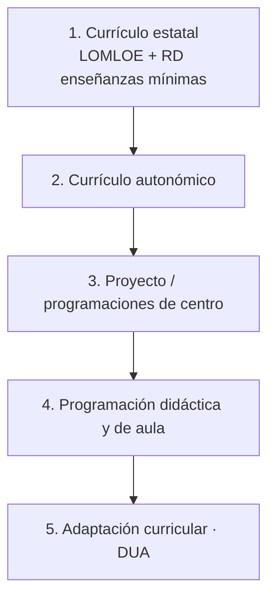

# Bloque 2 · Evolución curricular (LGE → LOGSE → LOE → LOMCE → LOMLOE) y normativa

**Asignatura:** Diseño curricular e instruccional de Matemáticas  
**Programa:** evolución curricular y marco normativo

---


## 1. Matemáticas escolares, educación matemática y currículo

| Concepto | Definición operativa |
|----------|----------------------|
| **Matemáticas escolares** | Matemáticas como objeto de **enseñanza, aprendizaje y evaluación**: el conocimiento que el sistema educativo transmite y valida. En ESO y Bachillerato, lo que el alumnado debe aprender y de lo que es evaluado. |
| **Educación matemática** | Conjunto de ideas, conceptos, procedimientos, procesos y actitudes implicados en la construcción, representación, uso, transmisión, aplicación y valoración del conocimiento matemático de forma intencional. |
| **Currículo educativo** | No es un simple listado de temas. Es una **propuesta de actuación educativa** que concreta principios ideológicos, pedagógicos, psicológicos y sociales y orienta el sistema. |

### Cuatro preguntas fundamentales del currículo matemático

| Pregunta | Qué determina |
|----------|---------------|
| ¿Para qué formar matemáticamente? | Finalidades y aprendizajes que se persiguen |
| ¿Qué formación? | Conocimientos y formación necesarios |
| ¿Cómo llevar a cabo la formación? | Organización y desarrollo de la enseñanza |
| ¿Cuánta formación y qué resultados? | Evaluación de la formación y de los resultados |

---

## 2. Organización curricular de las matemáticas en ESO

| Curso / ámbito | Materia | Carácter |
|----------------|---------|----------|
| 1.º ESO | Matemáticas | Obligatoria |
| 2.º ESO | Matemáticas | Obligatoria |
| 3.º ESO | Matemáticas | Obligatoria |
| 4.º ESO | Matemáticas A o Matemáticas B | Obligatoria |
| 4.º ESO | Matemáticas para la toma de decisiones | Optativa (configuración autonómica) |
| 1.º–2.º ESO | Laboratorio de refuerzo de competencias clave | Optativa / excepcional |
| 3.º–4.º ESO | Ámbito científico-tecnológico | Diversificación curricular |

### Matemáticas A y Matemáticas B (4.º ESO)

- **Matemáticas A:** resolución de problemas, investigación y análisis de situaciones de la **vida cotidiana**; carácter más aplicado y terminal/laboral.
- **Matemáticas B:** además, profundiza en procedimientos algebraicos, geométricos, analíticos y estadísticos; contextos matemáticos, científicos y sociales; orientación hacia itinerarios académicos.

### Matemáticas para la toma de decisiones

Optativa de 4.º. Saberes básicos orientativos en tres bloques: **aritmética modular**, **teoría de grafos** y **teoría de juegos** (enlace natural con fichas del repo: Euler–Königsberg, dilema del prisionero).

### Laboratorio de refuerzo y diversificación

- **Laboratorio de refuerzo (1.º–2.º):** alumnado con desfase o dificultades generales; competencias clave y saberes de varios sentidos.
- **Ámbito científico-tecnológico:** programa de diversificación; integra procesos y saberes matemáticos con otras materias del ámbito.

---

## 3. Matemáticas en Bachillerato

| Curso | Modalidad | Materia |
|-------|-----------|---------|
| 1.º | Ciencias y Tecnología | Matemáticas I |
| 1.º | Humanidades y Ciencias Sociales | Matemáticas Aplicadas a las CCSS I |
| 1.º | General | Matemáticas Generales |
| 2.º | Ciencias y Tecnología | Matemáticas II |
| 2.º | Humanidades y Ciencias Sociales | Matemáticas Aplicadas a las CCSS II |

También hay contenidos matemáticos en otras enseñanzas (p. ej. Ámbito de Ciencias Aplicadas en FP básica).

---

## 4. Modelos de implementación del currículo

El currículo no se reduce al programa oficial: incluye libros de texto, métodos, formación del profesorado y evaluación.

| Nivel | Significado |
|-------|-------------|
| **Currículo previsto** | Lo que el sistema declara (decretos, órdenes) |
| **Currículo implementado / operativo** | Lo que ocurre en el aula (decisiones del docente, tareas, interacciones) |
| **Currículo alcanzado** | Lo que el alumnado efectivamente aprende |
| **Currículo evaluado** | Lo que las pruebas y la calificación acaban priorizando |

### Currículo oficial y currículo operativo (Remillard y Heck)

- **Oficial:** objetivos y fines; contenido de evaluaciones importantes; currículo **designado** (planes autorizados).
- **Operativo:** interpretación docente, materiales (libros, etc.), interacciones en torno a las tareas, aprendizaje logrado.

El profesor es el eslabón crítico entre lo designado y lo alcanzado.

---

## 5. Niveles de concreción curricular



*Figura. Niveles de concreción curricular (de la norma general al ajuste individual).*

| Nivel | Función |
|-------|---------|
| Currículo estatal | Marco general (LOE/LOMLOE + reales decretos de enseñanzas mínimas) |
| Currículo autonómico | Concreción de la comunidad autónoma |
| Proyecto curricular de centro | Adaptación y organización en el centro |
| Programación didáctica / de aula | Concreción con un grupo concreto |
| Adaptación curricular | Ajuste a necesidades educativas específicas |

---

## 6. Normativa de referencia (marco estatal)

- **Ley Orgánica 2/2006** (LOE), modificada por la **LOMLOE** (LO 3/2020).
- **Real Decreto 217/2022**, de 29 de marzo: ordenación y enseñanzas mínimas de la **ESO**.
- **Real Decreto 243/2022**, de 5 de abril: ordenación y enseñanzas mínimas de **Bachillerato**.

Cada comunidad desarrolla su currículo (órdenes o decretos autonómicos). Hay que trabajar siempre con el documento **autonómico vigente**, no solo con el real decreto básico.

---

## 7. Esquema de estudio

```text
Matemáticas escolares → conocimiento que se enseña, aprende y evalúa
        ↓
Currículo → propuesta de actuación educativa
        ↓
Concreción → estatal → autonómica → centro → programación/aula → adaptación
        ↓
Implementación → previsto → implementado/operativo → alcanzado
        ↓
Evaluación → resultados y currículo evaluado
```

---

## 8. Ideas clave

1. El currículo expresa principios, no solo una lista de temas.
2. Las matemáticas escolares incluyen procesos, actitudes y competencias, no solo el índice del libro.
3. Las cuatro preguntas (para qué, qué, cómo, qué resultados) organizan el análisis curricular.
4. Previsto ≠ implementado ≠ alcanzado; el docente media entre ellos.
5. La oferta de materias (A/B, I/II, Aplicadas, optativas) condiciona la formación matemática posible.

---

## Material relacionado

- [01 — Finalidades educativas](01-finalidades-ensenanza-matematicas.md)
- [03 — Elementos del currículo LOMLOE](03-elementos-curriculo-lomloe.md)
- [Asignaturas ESO/Bachillerato](../materiales/asignaturas-eso-bachillerato/)
- [Programa](../programa.md)


---

## Parte adicional · Evolución del currículo de Matemáticas en España (detalle)

## Parte A · Evolución del currículo de Matemáticas en España (LGE → LOMLOE)

Transformación de un enfoque **enciclopédico y formal** hacia un modelo **funcional, inclusivo y competencial**.

```text
LGE (1970)          LOGSE (1990)         LOE / LOMCE           LOMLOE (2020)
Matemática moderna  Constructivismo      Competencias +        Competencias específicas,
Abstracción,        Procedimientos y     estándares (LOMCE)    DUA, sentidos matemáticos
conjuntos           significatividad
```

### A.1. LGE (1970) — Matemática moderna

- Contexto: consolidación de valores morales y políticos tras conflictos internacionales; España se acerca al desarrollo europeo en el final de la dictadura.
- Influencia internacional de la **New Mathematics / Matemática moderna** (post-Sputnik, Bourbaki).
- Programas fundamentados en enseñanza **formalista y estructuralista**:
  - Estructuras algebraicas (grupo, anillo, cuerpo…).
  - Noción formal de función.
  - Construcción de conjuntos numéricos desde teoría de conjuntos (aplicaciones, relaciones de equivalencia).
  - Geometría a través de grupos de transformaciones.
- En las *Nuevas Orientaciones para la EGB* (1971): organización por **objetivos operativos** y contenidos; se realza el papel **cultural y formativo** de las matemáticas como “materia de expresión”.
- Problema: abstracción temprana y poca anclaje en la realidad del alumnado de EGB → **fracaso escolar** elevado y crítica internacional (Kline, 1976).

### A.2. LOGSE (1990) — Del formalismo al “saber hacer”

- Tras la Constitución: Diseño Curricular Base (DCB, 1989) y LOGSE.
- Fracaso de las New Mathematics → contrarreforma ya visible en Programas Renovados (1982) en los dos primeros ciclos de EGB.
- Grupos de renovación de la enseñanza de las matemáticas y posterior creación de sociedades de profesores.
- Enfoque: alejamiento del formalismo; énfasis en **destrezas procedimentales**, **resolución de problemas**, calculadora y Nuevas Tecnologías.
- Elementos curriculares estatales LOGSE:
  - Objetivos generales
  - Contenidos (conceptos / procedimientos / actitudes)
  - Criterios de evaluación
  - Orientaciones metodológicas
- Transferencia de competencias a las CCAA → currículos autonómicos diferenciados.

### A.3. LOE (2006) y LOMCE (2013) — Competencias y estándares

**LOE (2006)**  
- Globalización, tecnologías y responsabilidad social → pruebas PISA y noción de **competencia**.
- Referente: proyecto danés **KOM** (Niss, 2003): competencia matemática = habilidad para entender, juzgar, hacer y usar las matemáticas en contextos intra- y extramatemáticos. Ocho subcompetencias (pensar, plantear/resolver problemas, modelar, razonar, representar, manipular símbolos, comunicar, usar herramientas).
- Definición PISA de competencia matemática (marco 2015): capacidad de **formular, emplear e interpretar** las matemáticas en distintos contextos.
- En España: ocho **competencias básicas** (una de ellas, matemática). Elementos: objetivos, competencias básicas, contenidos, métodos pedagógicos / orientaciones didácticas, criterios de evaluación.

**LOMCE (2013)**  
- Modifica (no deroga) la LOE. Competencias clave (siete); una de ellas es *Competencia matemática y competencias básicas en ciencia y tecnología*.
- Énfasis en evaluación y reválidas (no llegaron a aplicarse plenamente).
- Novedades: **estándares de aprendizaje evaluables** vinculados a cada criterio; criterios ligados a bloques de contenidos; mayor autonomía de CCAA y centros (asignaturas troncales / específicas / libre configuración).
- En matemáticas: doble oferta Matemáticas A/B adelantada a 3.º ESO.
- Problema detectado: distancia excesiva entre competencias clave y desarrollo por materias; atomización de la evaluación por el elevado número de estándares.

### A.4. LOMLOE (2020) — Competencias específicas, sentidos y DUA

- Deroga la LOMCE. Propósitos principales:
  - Revertir cambios de evaluación, autonomía del director y trayectorias.
  - Enfoque inclusivo (DUA) y condiciones de titulación.
  - Modernizar el currículo (redefinición de elementos).
  - Más modalidades de Bachillerato (incluida la general).
  - Flexibilización de primeros cursos de Secundaria por **ámbitos**.
- Cambios de calado en matemáticas (Contreras, 2022: “el primer cambio relevante del siglo XXI… en la dirección apropiada”).
- Críticas recibidas: reducción inicial de obligatoriedad de matemáticas en Humanidades y Ciencias Sociales; implementación precipitada de ámbitos (RSME, Quílez Pardo, 2021) por falta de co-docencia real, riesgo de instrumentalizar las matemáticas, evaluación centrada en el producto y formación docente insuficiente.
- Desaparecen los estándares de aprendizaje → menos fragmentación.
- Aparecen: **perfil de salida**, **competencias específicas**, **saberes básicos** organizados en **sentidos**, **situaciones de aprendizaje**, orientaciones didácticas y metodológicas más desarrolladas.
- Marco inclusivo: DUA, equidad, sostenibilidad, perspectiva de género.

### A.5. Cuadro comparativo de elementos curriculares

| Ley | Elementos principales |
|-----|------------------------|
| **LGE** | Objetivos operativos, contenidos (estructura formal) |
| **LOGSE** | Objetivos, contenidos (conceptos / procedimientos / actitudes), criterios de evaluación, orientaciones metodológicas |
| **LOE** | Objetivos, **competencias básicas**, contenidos, métodos pedagógicos, criterios de evaluación |
| **LOMCE** | Objetivos, **competencias clave**, contenidos por bloques, criterios de evaluación, **estándares de aprendizaje evaluables**, metodología |
| **LOMLOE** | Objetivos de etapa, **competencias clave** + descriptores operativos, **perfil de salida**, **competencias específicas**, criterios de evaluación, **saberes básicos** (sentidos), **situaciones de aprendizaje**, orientaciones didácticas y metodológicas |

### A.6. ¿Qué contenidos se eliminaron, trasladaron o reformularon?

No todo lo que “ya no se explica como antes” está **eliminado**. Conviene clasificar: eliminado · trasladado de curso · solo en cierta modalidad · simplificado o reformulado (p. ej. regla de tres → proporcionalidad con sentido; Ruffini; conjuntos; cálculo mental vs. sentido numérico; cónicas; técnicas de integración).

Análisis y tablas: **[Contenidos eliminados, trasladados y simplificados](../materiales/contenidos-eliminados-trasladados-evolucion-curricular.md)**.

---

