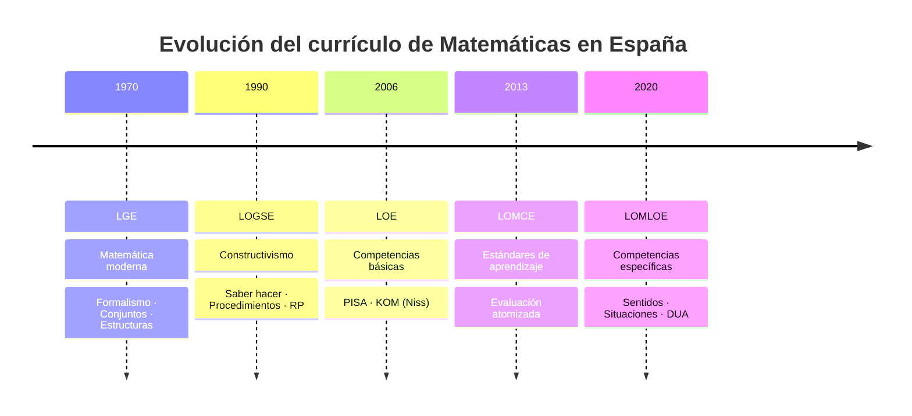
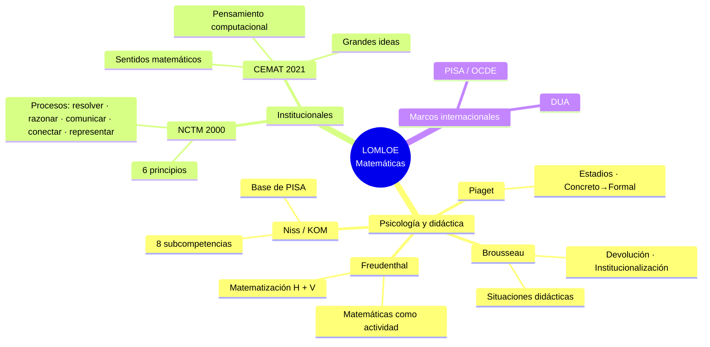
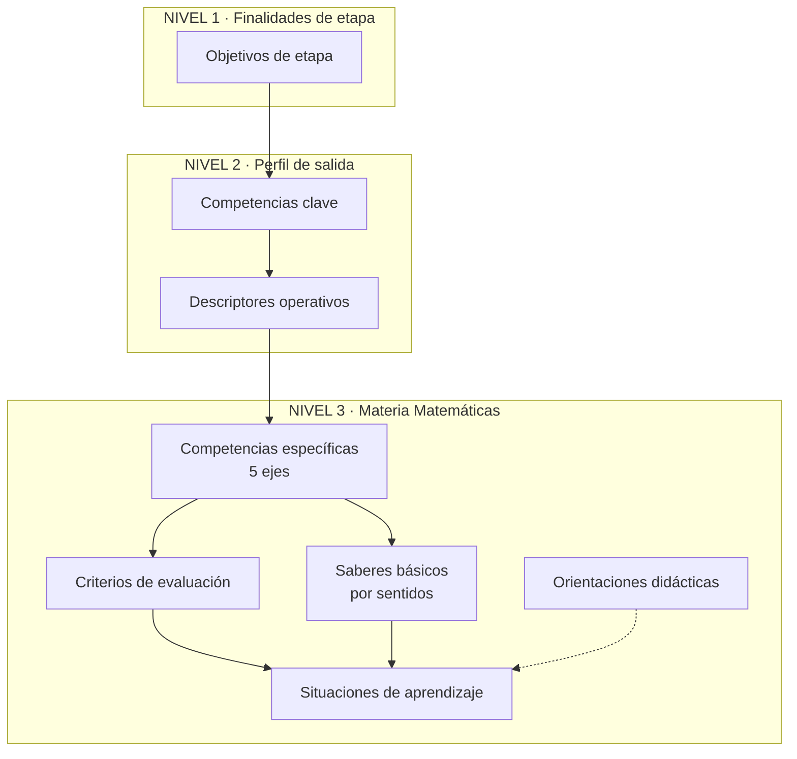
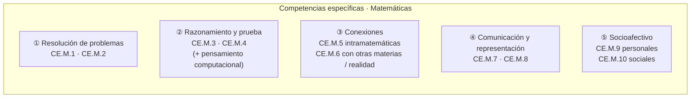
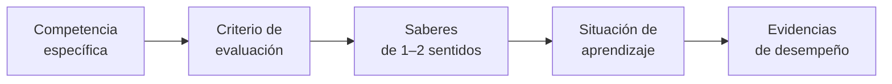
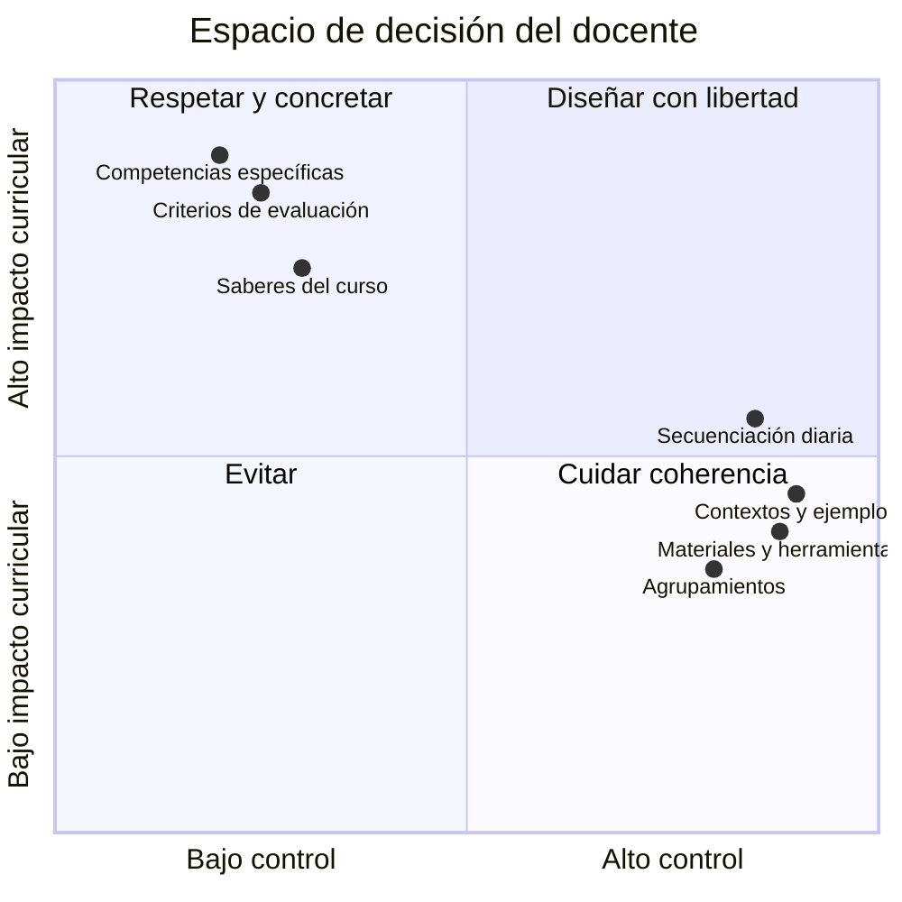

# Bloque 3 · Currículo LOMLOE de Matemáticas (CE, criterios, saberes, orientaciones)

**Asignatura:** Diseño curricular e instruccional de Matemáticas  
**Programa:** elementos del currículo LOMLOE de Matemáticas

> Currículo básico estatal: RD 217/2022 (ESO), RD 243/2022 (Bachillerato).  
> Desarrollo autonómico Aragón (vigente a 2024–25): Orden ECD/1172/2022 (modificada por ECD/867/2024) para ESO y Orden ECD/1173/2022 (modificada por ECD/886/2024) para Bachillerato.  
> Consulta siempre el BOA / sede electrónica del Gobierno de Aragón.

---

## Parte B · Referentes teóricos e institucionales

### B.1. Psicología y didáctica de la matemática

| Autor / corriente | Aportación clave | Eco en el currículo LOMLOE |
|-------------------|------------------|----------------------------|
| **Piaget** | Estadios del desarrollo; de lo concreto a lo formal; construcción activa del conocimiento | Ritmos, manipulación, material concreto, respeto al progreso cognitivo |
| **Brousseau (Teoría de Situaciones Didácticas)** | Situaciones didácticas / adidácticas; devolución; institucionalización; contrato didáctico | Situaciones de aprendizaje con sentido; el alumno se responsabiliza de la resolución |
| **Freudenthal (Realistic Mathematics Education)** | Matemáticas como **actividad humana**; matematización **horizontal** (del mundo real a las matemáticas) y **vertical** (dentro de las matemáticas, hacia mayor abstracción) | Problemas de contexto real como punto de partida y de llegada; sentidos matemáticos |
| **Niss (proyecto KOM)** | Competencia matemática = entender, juzgar, hacer y usar las matemáticas en una variedad de contextos. Ocho subcompetencias | Base conceptual de PISA y de las competencias específicas (resolver, razonar, modelar, comunicar, representar…) |

### B.2. Referentes institucionales

**NCTM — *Principles and Standards for School Mathematics* (2000 / trad. 2003)**  
- Seis principios: igualdad, currículo, enseñanza, aprendizaje, evaluación, tecnología.  
- Estándares de **contenido** (números y operaciones, álgebra, geometría, medida, análisis de datos y probabilidad).  
- Estándares de **procesos**: resolución de problemas, razonamiento y prueba, conexiones, comunicación, representación.  
- En LOMLOE la relación es explícita: los ejes de las competencias específicas (salvo el socioafectivo) se vinculan directamente a estos procesos.

**CEMAT — *Bases para la elaboración de un currículo de Matemáticas en Educación no Universitaria* (Calvo Pesce et al., 2021)**  
- Documento elaborado por el Comité Español de Matemáticas (RSME, FESPM, SEIEM…) en diálogo con el Ministerio.  
- Organización de la matemática escolar en torno a **sentidos matemáticos** (capacidades para emplear de forma funcional y con confianza los contenidos numéricos, algebraicos, geométricos, métricos y estocásticos).  
- Grandes ideas matemáticas (patrones, modelo, variable, relaciones y funciones, movimientos y transformaciones, distribución, incertidumbre, magnitud…) que vertebran la continuidad y las conexiones intramatemáticas.  
- Introducción del **pensamiento computacional** en la enseñanza de las matemáticas.

### B.3. Otros ecos presentes

- **PISA / OCDE** y marco DeSeCo → definición operativa de competencia y descriptores.
- **Diseño Universal para el Aprendizaje (DUA)** → inclusión y múltiples formas de implicación, representación y acción/expresión.
- Tradición de grupos de renovación españoles y sociedades de profesores de matemáticas.

---

## Parte C · Arquitectura LOMLOE (niveles de concreción)

```text
NIVEL 1 – Finalidades educativas de etapa
        → Objetivos de etapa

NIVEL 2 – Perfil de salida
        → Competencias clave + descriptores operativos

NIVEL 3 – Desarrollo curricular de la materia
        → Competencias específicas
        → Criterios de evaluación
        → Saberes básicos / sentidos matemáticos
        → Orientaciones didácticas y metodológicas
        → Situaciones de aprendizaje (ejemplos)
```

*Figura conceptual (basada en la Fig. 3.2 de los apuntes de la asignatura).*

Algunos elementos son **prescriptivos** (competencias clave y específicas, criterios, saberes básicos) y proceden de la norma estatal; otros (orientaciones didácticas, ejemplos de situaciones de aprendizaje) se desarrollan en el currículo autonómico y forman parte del “currículo oficial designado” (Remillard & Heck, 2014).

---

## Parte D · Competencias clave y perfil de salida

Las ocho competencias clave definen el **perfil de salida** del alumnado al terminar la enseñanza básica (y se adaptan al terminar Bachillerato):

1. Competencia en comunicación lingüística  
2. Competencia plurilingüe  
3. **Competencia matemática y competencia en ciencia, tecnología e ingeniería (STEM)**  
4. Competencia digital  
5. Competencia personal, social y de aprender a aprender  
6. Competencia ciudadana  
7. Competencia emprendedora  
8. Competencia en conciencia y expresión culturales  

### Descriptores operativos STEM (síntesis)

| Descriptor | Enseñanza básica (ESO) | Bachillerato |
|------------|------------------------|--------------|
| **STEM1** | Métodos inductivos/deductivos; estrategias de resolución de problemas; análisis crítico de soluciones | Idem, en situaciones propias de la modalidad |
| **STEM2** | Pensamiento científico; preguntas e hipótesis; experimentación; actitud crítica | Idem, centrado en la modalidad |
| **STEM3** | Proyectos, prototipos, trabajo en equipo, sostenibilidad | Idem + evaluación del impacto transformador |
| **STEM4** | Interpretar y transmitir resultados científicos/matemáticos/tecnológicos en diversos formatos; lenguaje matemático-formal | Idem + valoración crítica de la contribución de ciencia y tecnología |
| **STEM5** | Acciones para salud, medio ambiente y consumo responsable | Idem + compromisos ciudadanos locales y globales |

Las matemáticas aparecen de forma explícita sobre todo en **STEM1** (resolución de problemas y razonamiento) y **STEM4** (comunicación y representaciones). La integración en una competencia STEM más amplia cambia el papel de las matemáticas escolares: riesgo de instrumentalización si los proyectos son transdisciplinares centrados en el producto; potencial enriquecedor si se mantienen conexiones explícitas y se preserva la matematización vertical (Diego-Mantecón et al., 2022).

---

## Parte E · Competencias específicas de Matemáticas

Definición oficial: *desempeños que el alumnado debe poder desplegar en actividades o situaciones cuyo abordaje requiere de los saberes básicos de cada área o ámbito*.

Proporcionan continuidad con Educación Primaria y permiten un verdadero desarrollo competencial **por materia**.

### Cinco ejes (ESO)

| Eje | Competencias específicas |
|-----|--------------------------|
| **Resolución de problemas** | **CE.M.1** Interpretar, modelizar y resolver problemas de la vida cotidiana y propios de las matemáticas…  
**CE.M.2** Analizar las soluciones… verificando validez e idoneidad |
| **Razonamiento y prueba** | **CE.M.3** Formular y comprobar conjeturas… o plantear problemas de forma autónoma  
**CE.M.4** Pensamiento computacional: organizar datos, descomponer, reconocer patrones, crear algoritmos |
| **Conexiones** | **CE.M.5** Conexiones intramatemáticas (visión de las matemáticas como un todo)  
**CE.M.6** Matemáticas en otras materias y situaciones reales |
| **Comunicación y representación** | **CE.M.7** Representar conceptos, procedimientos e información con diferentes tecnologías  
**CE.M.8** Comunicar con lenguaje oral, escrito o gráfico y terminología apropiada |
| **Socioafectivo** | **CE.M.9** Destrezas personales: gestionar emociones, aceptar el error, adaptarse a la incertidumbre  
**CE.M.10** Destrezas sociales: respeto, trabajo en equipos heterogéneos, identidad positiva como estudiante de matemáticas |

En **Bachillerato** se mantienen los cinco ejes; el socioafectivo se agrupa en una sola competencia específica (CE.M.9).

### Novedad del eje socioafectivo

Dos componentes claros:
1. Gestión de emociones y su influencia en actitudes y creencias hacia las matemáticas.
2. Destrezas sociales orientadas a la participación en igualdad y respeto.

No se reduce a “emociones positivas”. Gómez-Chacón y Marbán (2019) advierten del riesgo de considerar positiva una actitud que ve las matemáticas solo como reglas a memorizar. Hay que atender también a las **actitudes matemáticas** (procesos, epistemología).

Las situaciones de aprendizaje que vive el alumnado influyen directamente en sus creencias. Conviene reservar momentos de reflexión sobre cómo se afrontan las emociones (ansiedad, etc.) y potenciar la interacción en condiciones de igualdad.

---

## Parte F · Criterios de evaluación

Son los **referentes que indican los niveles de desempeño esperados** en las situaciones o actividades a las que se refieren las competencias específicas, en un momento determinado del proceso de aprendizaje.

- Están vinculados a cada competencia específica.
- Deben evaluarse de forma **criterial** (no solo con exámenes algorítmicos).
- Orientan el diseño de instrumentos y de evidencias de aprendizaje.

---

## Parte G · Saberes básicos y sentidos matemáticos

Los saberes básicos son los **conocimientos, destrezas y actitudes** que se movilizan para el desarrollo de las competencias específicas. No constituyen un “temario a dar” lineal.

### Sentidos matemáticos (organización LOMLOE / CEMAT)

| Sentido | Contenidos y capacidades asociadas (síntesis) |
|---------|-----------------------------------------------|
| **Numérico** | Cantidad, sentido de las operaciones, relaciones, razonamiento proporcional, estimación, cálculo… |
| **De la medida** | Magnitud, medición, estimación, relaciones entre magnitudes… |
| **Espacial** | Figuras, localización, movimientos, visualización, razonamiento geométrico… |
| **Algebraico** | Patrones, modelo matemático, variable, igualdad y desigualdad, relaciones y funciones… |
| **Estocástico** | Distribución, incertidumbre, inferencia… |
| **Socioafectivo** | Creencias, actitudes, emociones, trabajo en equipo, gestión del error… |

**Grandes ideas** (patrones, modelo, variable, relaciones y funciones, movimientos y transformaciones, distribución, incertidumbre, magnitud…) vertebrán la continuidad entre cursos y las conexiones intramatemáticas.

**Pensamiento computacional** aparece integrado (especialmente en CE.M.4 y en orientaciones).

### Ejemplo de un mismo objeto en varios sentidos — función lineal \(y = mx + n\)

- Algebraico: significado de \(m\) y \(n\), equivalencia de expresiones.
- Espacial / gráfico: cómo cambia la recta al modificar parámetros.
- Numérico: qué ocurre si \(x\) se duplica; proporcionalidad.
- Estocástico: ajuste a datos reales.
- Socioafectivo: desacuerdo entre gráficas, argumentación, perseverancia ante el error.

---

## Parte H · Situaciones de aprendizaje y orientaciones didácticas

**Situación de aprendizaje**: situación compleja y abierta, contextualizada, que moviliza saberes de uno o varios sentidos y permite evidenciar el desempeño de una o varias competencias específicas.

Características deseables:
- Parten de un problema o reto con sentido.
- Exigen matematización (horizontal y, cuando proceda, vertical).
- Admiten varias estrategias y representaciones.
- Incluyen momentos de comunicación, argumentación y reflexión (también socioafectiva).
- Son coherentes con el DUA (múltiples formas de acceso, expresión e implicación).

En el currículo aragonés se desarrollan **orientaciones didácticas y metodológicas** y se proponen ejemplos de situaciones de aprendizaje. Estos elementos no son tan prescriptivos como las competencias específicas o los saberes, pero orientan la práctica y forman parte del currículo oficial designado.

---

## Parte I · Preceptivo vs margen docente

| Preceptivo (norma) | Margen docente (diseño propio) |
|--------------------|--------------------------------|
| Competencias específicas y criterios de evaluación | Secuenciación día a día y temporalización fina |
| Saberes básicos del curso / etapa | Contextos, ejemplos, materiales y herramientas concretas |
| Evaluación criterial (evidencias alineadas con criterios) | Metodología concreta coherente con las orientaciones |
| Atención a la diversidad (DUA, medidas de inclusión) | Agrupamientos, ritmos, tipología exacta de tareas |

No se puede vaciar un sentido entero (p. ej. nunca comunicar, nunca socioafectivo). Sí se puede decidir **cómo** trabajarlo y con qué énfasis relativo.

---

## Parte J · ESO vs Bachillerato (síntesis)

| Aspecto | ESO | Bachillerato |
|---------|-----|--------------|
| Finalidad | Alfabetización matemática, itinerarios, perfil de salida | Preparación académica más específica según modalidad |
| Formalización | Gradual; varios significados de los objetos | Mayor peso de la justificación simbólica y formal |
| Materias | Matemáticas 1.º–3.º; 4.º A / B | Matemáticas I–II o Matemáticas Aplicadas a las CCSS I–II |
| Socioafectivo | Explícito (dos CE) | Presente (una CE); más peso formal en muchas tareas |
| Situaciones de aprendizaje | Eje central del diseño | También, con mayor exigencia de modelización y prueba |

---

## Parte K · Orientaciones metodológicas (síntesis práctica)

- Situaciones de aprendizaje como unidad de diseño.
- Resolución de problemas como eje (no solo aplicación final).
- Variedad de representaciones y conversiones entre ellas.
- Herramientas digitales pertinentes (calculadora, software dinámico, hojas de cálculo…) al servicio de la comprensión, no como fin.
- Trabajo individual y cooperativo; roles en equipos heterogéneos.
- Error como oportunidad de aprendizaje (eje socioafectivo).
- Atención a la diversidad desde el DUA.

Ver también: [DUA](../../procesos-y-contextos-educativos/materiales/dua-diseno-universal-aprendizaje.md).

---

## Glosario rápido

**Perfil de salida** · **Competencia clave** · **Descriptor operativo** · **Competencia específica** · **Criterio de evaluación** · **Saber básico** · **Sentido matemático** · **Situación de aprendizaje** · **DUA** · **Matematización horizontal / vertical (Freudenthal)** · **Elemento preceptivo / margen docente** · **Pensamiento computacional**

---

## Dudas frecuentes

1. ¿Saberes = temario a “dar” entero? → No: se movilizan para **competencias**.  
2. ¿Solo examen algorítmico? → Insuficiente para muchos criterios.  
3. ¿Socioafectivo = test de personalidad? → No: conductas de aprendizaje observables y actitudes matemáticas.  
4. ¿Misma competencia en todas las CCAA? → Base estatal común; criterios y saberes se concretan en la autonomía.  
5. ¿A vs B en 4.º? → Mismo marco competencial, distinto énfasis y saberes.  
6. ¿GeoGebra “quita” mates? → No si el criterio exige interpretación, estrategia y argumentación.  
7. ¿Han “eliminado” la regla de tres o el cálculo mental? → Ver [material de evolución de contenidos](../materiales/contenidos-eliminados-trasladados-evolucion-curricular.md).

---

## Test A/B (elige la más alineada con LOMLOE)

1. Programar fracciones: **A)** todos los algoritmos del libro **B)** criterios de sentido numérico y representación con tareas variadas  
2. Resultado bien, sin interpretar el contexto: **A)** suficiente **B)** falta comunicación/análisis  
3. Socioafectivo: **A)** opcional **B)** parte del currículo  
4. Competencia específica: **A)** un tema **B)** capacidad de la materia a lo largo de la etapa  
5. Bachillerato: **A)** solo selectividad **B)** competencias con más formalización  
6. Orden de unidades: **A)** libre total **B)** margen con garantía de criterios y saberes  
7. Actividad rica: **A)** un procedimiento aislado **B)** varios criterios  
8. Criterios: **A)** los inventa el profesor **B)** fijados en el currículo y concretados en instrumentos  

**Soluciones:** 1B 2B 3B 4B 5B 6B 7B 8B

---

## Tarea del bloque

1. Elige una competencia específica en tu normativa autonómica.  
2. Copia dos criterios asociados.  
3. Selecciona saberes de al menos dos sentidos.  
4. Diseña una situación de aprendizaje breve (contexto, pregunta/reto, posibles estrategias, evidencias).  
5. Marca qué es preceptivo y qué decides tú.

---

## Material relacionado

- **[Contenidos eliminados, trasladados y simplificados](../materiales/contenidos-eliminados-trasladados-evolucion-curricular.md)**
- **[DUA](../../procesos-y-contextos-educativos/materiales/dua-diseno-universal-aprendizaje.md)**
- [01 — Currículo y normativa](01-curriculo-educativo-y-normativa.md)
- [02 — Finalidades](02-finalidades-ensenanza-matematicas.md)
- [04 — Programación didáctica](04-programacion-didactica.md)
- [Asignaturas ESO/Bachillerato](../materiales/asignaturas-eso-bachillerato/)
- [Mapa competencias–criterios](../materiales/curriculo-lomloe/)
- [Temarios Matemáticas Aragón](../materiales/temarios-matematicas-aragon/)
- [Programa de la asignatura](../programa.md)

---

*Apunte actualizado integrando el Tema 3 de los apuntes DCI (evolución histórica LGE–LOMLOE, referentes Piaget / Brousseau / Freudenthal / Niss / NCTM / CEMAT y elementos curriculares LOMLOE).*


---

# Resumen visual · Tema 3 (complemento)


**Asignatura:** Diseño curricular e instruccional de Matemáticas  
**Bloques del programa:** 2 (cambios curriculares) + 3 (elementos LOMLOE)

---

## 1. Línea temporal de leyes y enfoques



| Ley | Enfoque dominante | Elementos clave | Problema / límite |
|-----|-------------------|-----------------|-------------------|
| **LGE** | Estructural / New Math | Objetivos operativos, conjuntos | Fracaso escolar, lejanía de la realidad |
| **LOGSE** | Constructivista | Conceptos / procedimientos / actitudes | — |
| **LOE** | Competencial (básicas) | 8 competencias básicas | Distancia competencia ↔ materia |
| **LOMCE** | Competencial + estándares | Estándares evaluables | Atomización de la evaluación |
| **LOMLOE** | Competencial + sentidos | CE, criterios, saberes, situaciones | Implementación (ámbitos, formación) |

---

## 2. Referentes que alimentan la LOMLOE



### Eco curricular de cada referente

| Referente | Idea nuclear | Huella en LOMLOE |
|-----------|--------------|------------------|
| **Piaget** | Construcción activa, estadios | Ritmos, manipulación, respeto cognitivo |
| **Brousseau** | Situación adidáctica + devolución | Situaciones de aprendizaje con sentido |
| **Freudenthal** | Matematización horizontal y vertical | Contexto real ↔ abstracción; sentidos |
| **Niss** | Competencia = usar matemáticas en contextos | Competencias específicas |
| **NCTM** | Procesos matemáticos | Ejes de las CE (salvo socioafectivo) |
| **CEMAT** | Sentidos + grandes ideas | Organización de saberes básicos |

---

## 3. Arquitectura curricular LOMLOE



**Prescriptivo (norma estatal):** CE, criterios, saberes.  
**Margen docente / currículo designado (CCAA + centro):** orientaciones, ejemplos de situaciones, secuenciación fina, materiales.

---

## 4. Los cinco ejes de las competencias específicas



> En Bachillerato el eje ⑤ se agrupa en una sola CE.

**Novedad del socioafectivo:** no es solo “emociones positivas”. Incluye:
- Gestión del error y la incertidumbre
- Actitudes matemáticas (procesos, epistemología)
- Trabajo en equipos heterogéneos e identidad positiva como estudiante de matemáticas

---

## 5. Saberes básicos organizados en sentidos


*Los pesos son orientativos para visualización; en el currículo no hay jerarquía numérica fija.*

| Sentido | Ideas clave |
|---------|-------------|
| **Numérico** | Cantidad, operaciones, proporcionalidad, estimación |
| **Medida** | Magnitud, medición, relaciones entre magnitudes |
| **Espacial** | Figuras, localización, movimientos, visualización |
| **Algebraico** | Patrones, variable, modelo, funciones, equivalencia |
| **Estocástico** | Distribución, incertidumbre, inferencia |
| **Socioafectivo** | Creencias, emociones, error, trabajo colaborativo |

**Grandes ideas** (CEMAT): patrones, modelo, variable, relaciones y funciones, movimientos, distribución, incertidumbre, magnitud…

---

## 6. De la competencia a la tarea (cadena de diseño)



**Regla práctica:** una situación de aprendizaje rica moviliza **varios criterios** y **al menos dos sentidos**.

---

## 7. Preceptivo vs margen docente



| No se puede | Sí se puede |
|-------------|-------------|
| Vaciar un sentido entero | Decidir *cómo* trabajarlo |
| Ignorar criterios de evaluación | Elegir instrumentos y evidencias |
| Sustituir CE por “temario del libro” | Secuenciar y contextualizar |

---

## 8. Mapa mental de una sola página (síntesis extrema)

```text
                    LOMLOE Matemáticas
                           │
         ┌─────────────────┼─────────────────┐
         │                 │                 │
    EVOLUCIÓN         REFERENTES        ELEMENTOS
    LGE→…→LOMLOE    Piaget·Brousseau    Perfil de salida
    Formal →        Freudenthal·Niss    Competencias clave
    Competencial    NCTM·CEMAT          Competencias específicas
                                        Criterios
                                        Saberes / sentidos
                                        Situaciones de aprendizaje
                           │
                    DISEÑO DOCENTE
                    CE → Criterio → Saberes → Situación → Evidencia
```

---

## 9. Checklist rápido para programar

- [ ] ¿Qué **competencia(s) específica(s)** trabajo?
- [ ] ¿Qué **criterios** voy a evidenciar?
- [ ] ¿Qué **saberes** de qué **sentidos** movilizo? (≥2 recomendable)
- [ ] ¿La tarea es una **situación de aprendizaje** (abierta, contextualizada) o solo un ejercicio?
- [ ] ¿Hay espacio para **comunicación, argumentación y error** (socioafectivo)?
- [ ] ¿Qué es **preceptivo** y qué decido yo?

---

*Resumen visual del Tema 3 · Diseño curricular e instruccional de Matemáticas · Universidad de Zaragoza*
