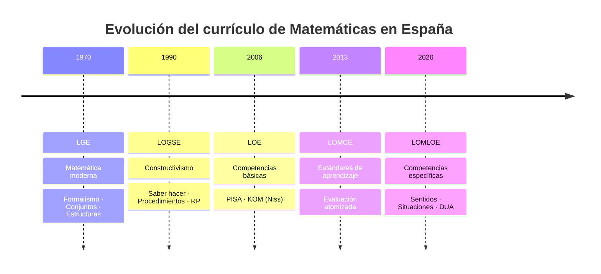
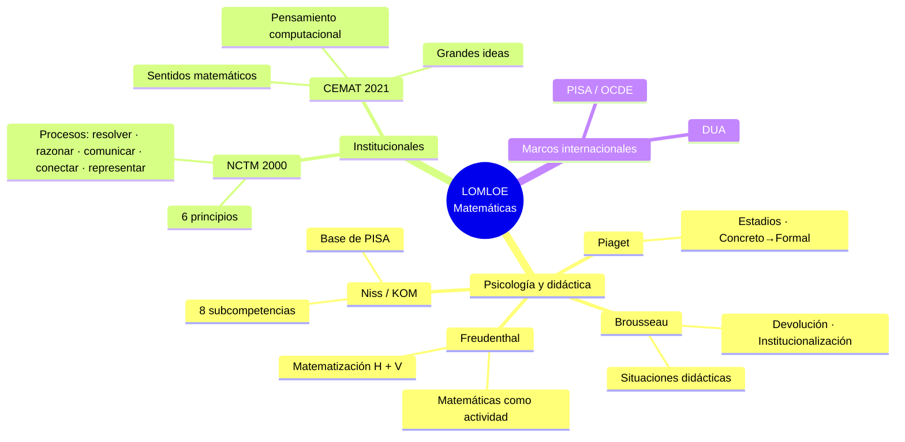
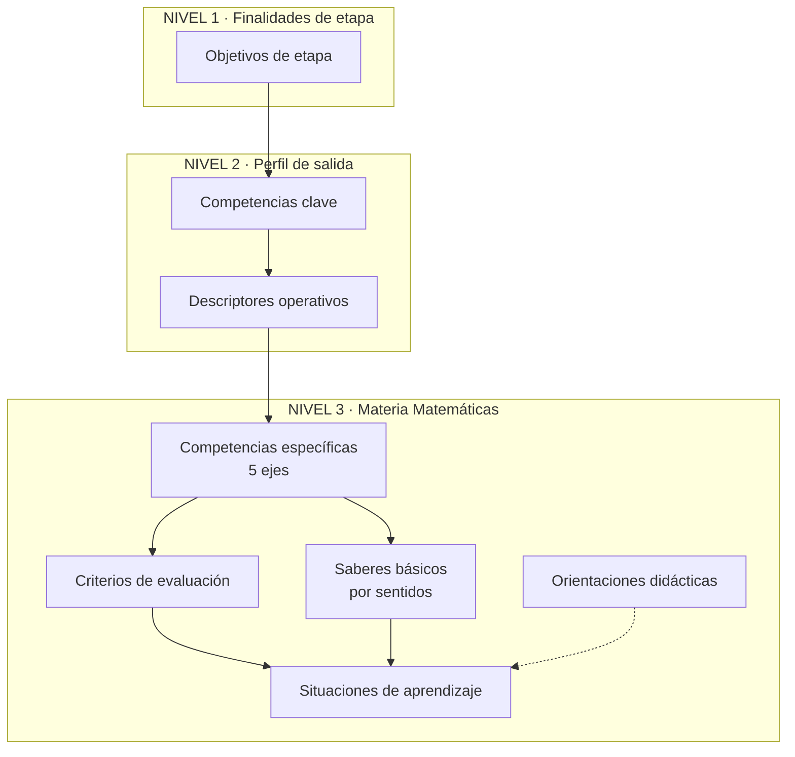
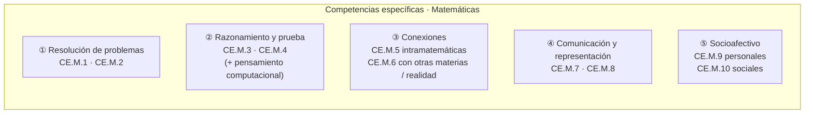
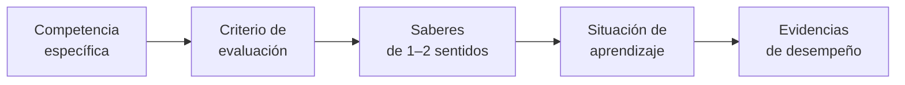
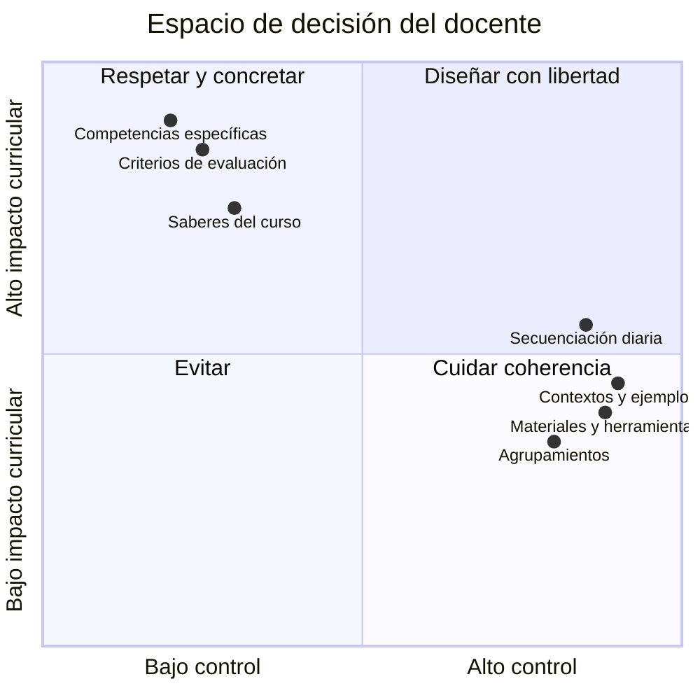

# Resumen visual · Tema 3  
## Elementos curriculares LOMLOE y evolución histórica

**Asignatura:** Diseño curricular e instruccional de Matemáticas  
**Bloques del programa:** 2 (cambios curriculares) + 3 (elementos LOMLOE)

---

## 1. Línea temporal de leyes y enfoques



| Ley | Enfoque dominante | Elementos clave | Problema / límite |
|-----|-------------------|-----------------|-------------------|
| **LGE** | Estructural / New Math | Objetivos operativos, conjuntos | Fracaso escolar, lejanía de la realidad |
| **LOGSE** | Constructivista | Conceptos / procedimientos / actitudes | — |
| **LOE** | Competencial (básicas) | 8 competencias básicas | Distancia competencia ↔ materia |
| **LOMCE** | Competencial + estándares | Estándares evaluables | Atomización de la evaluación |
| **LOMLOE** | Competencial + sentidos | CE, criterios, saberes, situaciones | Implementación (ámbitos, formación) |

---

## 2. Referentes que alimentan la LOMLOE



### Eco curricular de cada referente

| Referente | Idea nuclear | Huella en LOMLOE |
|-----------|--------------|------------------|
| **Piaget** | Construcción activa, estadios | Ritmos, manipulación, respeto cognitivo |
| **Brousseau** | Situación adidáctica + devolución | Situaciones de aprendizaje con sentido |
| **Freudenthal** | Matematización horizontal y vertical | Contexto real ↔ abstracción; sentidos |
| **Niss** | Competencia = usar matemáticas en contextos | Competencias específicas |
| **NCTM** | Procesos matemáticos | Ejes de las CE (salvo socioafectivo) |
| **CEMAT** | Sentidos + grandes ideas | Organización de saberes básicos |

---

## 3. Arquitectura curricular LOMLOE



**Prescriptivo (norma estatal):** CE, criterios, saberes.  
**Margen docente / currículo designado (CCAA + centro):** orientaciones, ejemplos de situaciones, secuenciación fina, materiales.

---

## 4. Los cinco ejes de las competencias específicas



> En Bachillerato el eje ⑤ se agrupa en una sola CE.

**Novedad del socioafectivo:** no es solo “emociones positivas”. Incluye:
- Gestión del error y la incertidumbre
- Actitudes matemáticas (procesos, epistemología)
- Trabajo en equipos heterogéneos e identidad positiva como estudiante de matemáticas

---

## 5. Saberes básicos organizados en sentidos


*Los pesos son orientativos para visualización; en el currículo no hay jerarquía numérica fija.*

| Sentido | Ideas clave |
|---------|-------------|
| **Numérico** | Cantidad, operaciones, proporcionalidad, estimación |
| **Medida** | Magnitud, medición, relaciones entre magnitudes |
| **Espacial** | Figuras, localización, movimientos, visualización |
| **Algebraico** | Patrones, variable, modelo, funciones, equivalencia |
| **Estocástico** | Distribución, incertidumbre, inferencia |
| **Socioafectivo** | Creencias, emociones, error, trabajo colaborativo |

**Grandes ideas** (CEMAT): patrones, modelo, variable, relaciones y funciones, movimientos, distribución, incertidumbre, magnitud…

---

## 6. De la competencia a la tarea (cadena de diseño)



**Regla práctica:** una situación de aprendizaje rica moviliza **varios criterios** y **al menos dos sentidos**.

---

## 7. Preceptivo vs margen docente



| No se puede | Sí se puede |
|-------------|-------------|
| Vaciar un sentido entero | Decidir *cómo* trabajarlo |
| Ignorar criterios de evaluación | Elegir instrumentos y evidencias |
| Sustituir CE por “temario del libro” | Secuenciar y contextualizar |

---

## 8. Mapa mental de una sola página (síntesis extrema)

```text
                    LOMLOE Matemáticas
                           │
         ┌─────────────────┼─────────────────┐
         │                 │                 │
    EVOLUCIÓN         REFERENTES        ELEMENTOS
    LGE→…→LOMLOE    Piaget·Brousseau    Perfil de salida
    Formal →        Freudenthal·Niss    Competencias clave
    Competencial    NCTM·CEMAT          Competencias específicas
                                        Criterios
                                        Saberes / sentidos
                                        Situaciones de aprendizaje
                           │
                    DISEÑO DOCENTE
                    CE → Criterio → Saberes → Situación → Evidencia
```

---

## 9. Checklist rápido para programar

- [ ] ¿Qué **competencia(s) específica(s)** trabajo?
- [ ] ¿Qué **criterios** voy a evidenciar?
- [ ] ¿Qué **saberes** de qué **sentidos** movilizo? (≥2 recomendable)
- [ ] ¿La tarea es una **situación de aprendizaje** (abierta, contextualizada) o solo un ejercicio?
- [ ] ¿Hay espacio para **comunicación, argumentación y error** (socioafectivo)?
- [ ] ¿Qué es **preceptivo** y qué decido yo?

---

*Resumen visual del Tema 3 · Diseño curricular e instruccional de Matemáticas · Universidad de Zaragoza*
