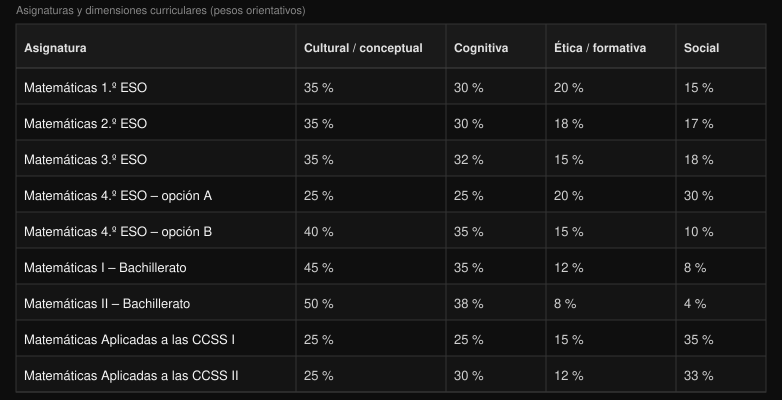

# Asignaturas de Matemáticas en ESO y Bachillerato

Material de apoyo para **Diseño curricular e instruccional de Matemáticas**: mapa de las materias de la etapa y una lectura de sus **dimensiones curriculares**.

> Los porcentajes de la tabla son una **propuesta de peso relativo orientativo** de cuatro dimensiones (no sustituyen los porcentajes oficiales de evaluación de una comunidad autónoma ni de un centro). Sirven para comparar el *énfasis formativo* de cada asignatura al diseñar programaciones, unidades y actividades.



*Figura: peso orientativo de las dimensiones cultural/conceptual, cognitiva, ética/formativa y social en cada asignatura.*

---

## 1. Las asignaturas de la etapa

### Educación Secundaria Obligatoria (ESO)

| Curso | Asignatura | Notas de diseño curricular |
|-------|-----------|----------------------------|
| 1.º ESO | **Matemáticas** | Troncal común; base de números, álgebra inicial, geometría, magnitudes y probabilidad elemental |
| 2.º ESO | **Matemáticas** | Continúa el itinerario común; se consolida el lenguaje algebraico y la geometría |
| 3.º ESO | **Matemáticas** | Último curso del tronco común antes de la bifurcación de 4.º |
| 4.º ESO | **Matemáticas A** | Orientada a un perfil más aplicado / continuidad hacia itinerarios menos formales en Bachillerato |
| 4.º ESO | **Matemáticas B** | Orientada a mayor formalización y a la continuidad hacia Matemáticas de Bachillerato de Ciencias |

*(La denominación exacta «A / B» o «Académicas / Aplicadas» puede variar según la normativa autonómica; la lógica de dos opciones en 4.º se mantiene en el diseño LOMLOE.)*

### Bachillerato

| Curso | Asignatura | Itinerario típico |
|-------|-----------|-------------------|
| 1.º | **Matemáticas I** | Bachillerato de Ciencias (y tecnología) |
| 2.º | **Matemáticas II** | Continuación; máxima formalización y preparación de acceso a grados científico-técnicos |
| 1.º | **Matemáticas Aplicadas a las Ciencias Sociales I** | Bachillerato de Ciencias Sociales / Humanidades (vía CCSS) |
| 2.º | **Matemáticas Aplicadas a las Ciencias Sociales II** | Continuación; estadística, optimización y modelización ligadas a lo social y económico |

---

## 2. Significado de las cuatro dimensiones

| Dimensión | Qué enfatiza en el diseño de la materia |
|-----------|----------------------------------------|
| **Cultural / conceptual** | Construcción del significado matemático, vocabulario, representaciones, hechos y conceptos de la disciplina; «qué es» el objeto de estudio y cómo se articula culturalmente el saber matemático |
| **Cognitiva** | Procesos de pensamiento: razonar, argumentar, resolver problemas, modelizar, conectar, demostrar; carga de exigencia intelectual y de procedimientos |
| **Ética / formativa** | Valores, actitudes, rigor intelectual, responsabilidad ante el error, perseverancia, uso honesto de datos; formación de la persona más allá del resultado numérico |
| **Social** | Uso de las matemáticas en contextos ciudadanos, mediáticos, económicos o comunitarios; trabajo cooperativo; lectura crítica de información cuantitativa |

Los porcentajes de cada fila **suman 100 %** y expresan un *reparto de énfasis*, no horas lectivas oficiales ni rúbricas de un decreto concreto.

### Tabla de pesos orientativos

| Asignatura | Cultural / conceptual | Cognitiva | Ética / formativa | Social |
|-----------|----------------------:|----------:|------------------:|-------:|
| Matemáticas 1.º ESO | 35 % | 30 % | 20 % | 15 % |
| Matemáticas 2.º ESO | 35 % | 30 % | 18 % | 17 % |
| Matemáticas 3.º ESO | 35 % | 32 % | 15 % | 18 % |
| Matemáticas 4.º ESO — opción A | 25 % | 25 % | 20 % | **30 %** |
| Matemáticas 4.º ESO — opción B | **40 %** | **35 %** | 15 % | 10 % |
| Matemáticas I — Bachillerato | **45 %** | **35 %** | 12 % | 8 % |
| Matemáticas II — Bachillerato | **50 %** | **38 %** | 8 % | 4 % |
| Matemáticas Aplicadas a las CCSS I | 25 % | 25 % | 15 % | **35 %** |
| Matemáticas Aplicadas a las CCSS II | 25 % | 30 % | 12 % | **33 %** |

---

## 3. Diferencias más importantes entre asignaturas

### 3.1. ESO 1.º–3.º: tronco común, equilibrio estable

- El peso **cultural/conceptual (~35 %)** y **cognitivo (~30–32 %)** se mantiene estable: se construye el lenguaje y los procedimientos básicos de la etapa.
- La dimensión **ética/formativa** baja ligeramente de 1.º a 3.º (20 % → 15 %) y la **social** sube un poco (15 % → 18 %): el alumnado gana capacidad para contextos más amplios, pero el centro sigue siendo el dominio conceptual y cognitivo.
- **Implicación didáctica:** en estos cursos conviene no descuidar ni el significado de los objetos matemáticos ni los procesos (resolver, argumentar), e ir introduciendo situaciones con lectura social de datos sin convertir la materia en solo «aplicaciones».

### 3.2. El corte de 4.º ESO: opción A vs opción B

Es el **cambio más nítido** de la etapa obligatoria:

| | **Opción A** | **Opción B** |
|---|--------------|--------------|
| Social | **30 %** (máximo de la ESO) | 10 % |
| Cultural / conceptual | 25 % | **40 %** |
| Cognitiva | 25 % | **35 %** |
| Ética / formativa | 20 % | 15 % |

- **A** se desplaza hacia lo **social y aplicado**: más peso de contextos, interpretación de información y utilidad percibida; menos formalización relativa.
- **B** se desplaza hacia lo **conceptual y cognitivo**: más formalización, mayor exigencia de razonamiento estructurado y preparación del itinerario científico.
- **Implicación:** no es «la misma materia con distinto nombre». Las actividades, el tipo de problemas, el rigor de la notación y el papel de la modelización social deben diseñarse de forma distinta. Orientar mal al alumnado en 4.º tiene consecuencias en Bachillerato.

### 3.3. Matemáticas I y II (Bachillerato científico)

- Progresión clara hacia el **máximo peso cultural/conceptual** (45 % → **50 %**) y **cognitivo** (35 % → **38 %**).
- Las dimensiones **ética/formativa** y **social** se reducen de forma notable (hasta 8 % y 4 % en II).
- **No significa** que dejen de importar el rigor ético o el uso social del conocimiento; significa que el *diseño dominante* de la materia prioriza la estructura formal de la disciplina y la potencia de cálculo/razonamiento exigidos en la etapa y en la selectividad / acceso a grados.
- **Implicación:** el profesorado debe **explicitar** de vez en cuando valores (honestidad con los datos, perseverancia, error como parte del razonamiento) porque el currículum «no los carga» en el mismo porcentaje que en ESO o en Aplicadas.

### 3.4. Matemáticas Aplicadas a las Ciencias Sociales I y II

- El peso **social** es el más alto del mapa (**35 %** y **33 %**).
- Cultural/conceptual se mantiene en **25 %**; lo cognitivo sube ligeramente en II (25 % → 30 %).
- Comparadas con Matemáticas I/II, aquí la modelización, la estadística, la interpretación de medios y la toma de decisiones con datos tienen **prioridad de diseño**.
- **Implicación:** no son «Matemáticas fáciles», sino **otra arquitectura de énfasis**: menos formalización abstracta por sí misma, más competencia para leer el mundo cuantitativo social y económico.

### 3.5. Comparación global (lectura rápida)

```text
Más formal / disciplinar  ────────────────────────  Más contextual / social

  Mat. II  Mat. I  Mat. B (4.º)  Mat. 1.º–3.º  Mat. A (4.º)  Aplicadas CCSS
```

- **Máximo polo disciplinar:** Matemáticas II.  
- **Máximo polo social:** Aplicadas a las CCSS (y, en ESO, Matemáticas A de 4.º).  
- **Puente de decisión:** 4.º ESO A/B.

---

## 4. Cómo usar esta tabla al diseñar instrucción

1. **Programación de aula:** si impartes Matemáticas II, planifica actividades que *explícitamente* recuperen lo social o ético (debate breve sobre un uso sesgado de un gráfico, normas de trabajo en equipo), porque el peso «natural» de la materia no lo garantiza.
2. **4.º ESO:** alinea rúbricas y tipos de problema con A o B; evita usar el mismo examen con distinta nota de corte.
3. **Atención a la diversidad:** un mismo contenido (p. ej. funciones) puede enseñarse con énfasis social (Aplicadas, Mat. A) o con énfasis de formalización y demostración (Mat. B, I, II).
4. **Coherencia vertical:** de 1.º ESO a Bachillerato, la dimensión cognitiva no «aparece de golpe» en I; se prepara desde el razonamiento en ESO, pero el salto A/B y el de Bachillerato científico hay que **comunicarlo** a familias y alumnado.

---

## 5. Precauciones

- Los porcentajes son **heurísticos de diseño**, no prescripción legal.
- Consulta siempre el currículo autonómico vigente (saberes básicos, competencias específicas, criterios de evaluación) al redactar la programación de departamento.
- Una dimensión con poco porcentaje **no se elimina**; se integra de forma más puntual y consciente.

---

## Ver también

- [README de la asignatura](../../README.md)
- Bibliografía de didáctica y currículo en [`09-bibliografia/didactica-matematicas/`](../../../../09-bibliografia/didactica-matematicas/)
