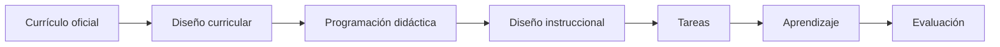
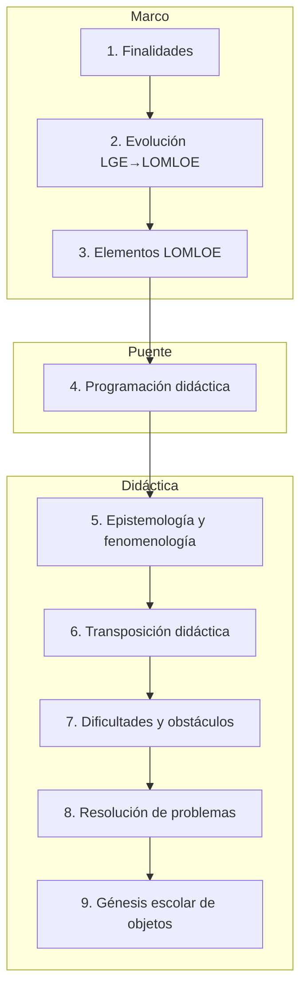
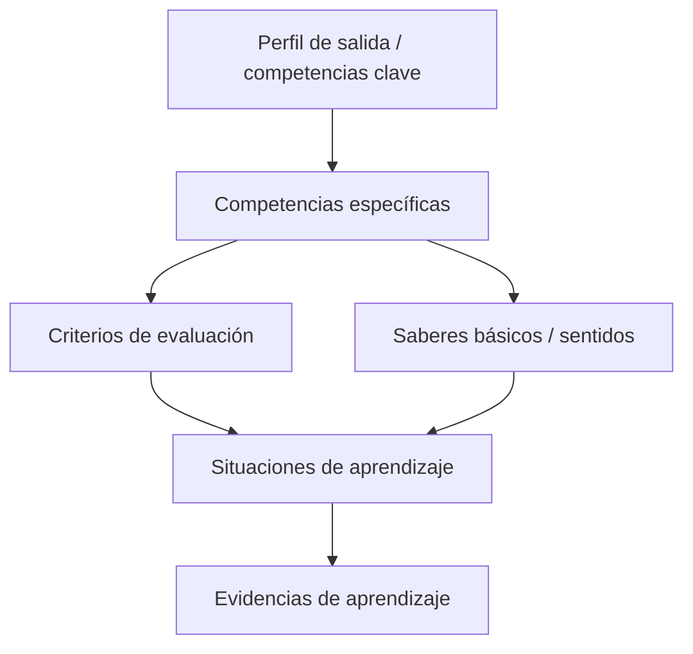
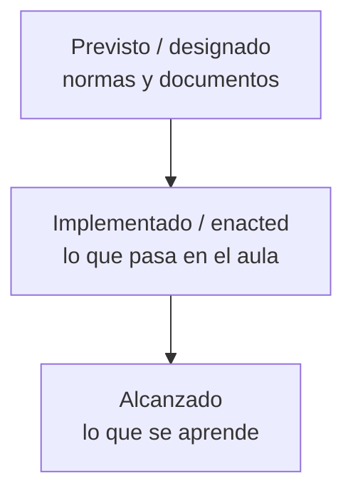
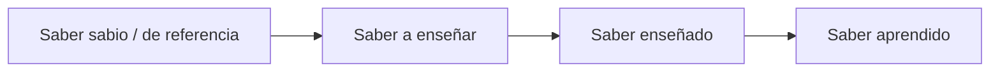

# Infografía — Diseño curricular e instruccional de Matemáticas

Resumen visual de la asignatura (compatible con Mermaid en el sitio del repositorio).

---

## 1. Hilo conductor



---

## 2. Nueve bloques del programa



---

## 3. Piezas del currículo LOMLOE (Matemáticas)



**Cinco ejes de las CE (ESO):** resolución de problemas · razonamiento y prueba · conexiones · comunicación y representación · socioafectivo.

**Sentidos:** numérico · medida · espacial · algebraico · estocástico · socioafectivo.

---

## 4. Tres capas del currículo (Remillard & Heck)



El trabajo docente está sobre todo en el paso del **previsto** al **implementado** (tareas, contrato didáctico, evaluación).

---

## 5. Transposición didáctica (idea central)



---

## 6. De la norma al aula (checklist mental)

```text
□ ¿Qué competencia(s) específica(s) trabajo?
□ ¿Qué criterios voy a evidenciar?
□ ¿Qué saberes / sentidos movilizo?
□ ¿La tarea es situación de aprendizaje o solo ejercicio cerrado?
□ ¿Qué es preceptivo y qué decido yo?
□ ¿Cómo veré el aprendizaje (no solo la respuesta final)?
```

---

## 7. Versión ASCII (una pantalla)

```text
┌─────────────────────────────────────────────────────────┐
│  DISEÑO CURRICULAR E INSTRUCCIONAL DE MATEMÁTICAS       │
├─────────────────────────────────────────────────────────┤
│  Currículo → PD → Unidades → Tareas → Evaluación        │
├──────────────┬──────────────┬───────────────────────────┤
│  MARCO       │  PUENTE      │  DIDÁCTICA DE OBJETOS     │
│  Finalidades │  Programación│  Epistemología            │
│  Evolución   │  didáctica   │  Transposición            │
│  LOMLOE      │              │  Obstáculos / contrato    │
│              │              │  RP · Génesis escolar     │
└──────────────┴──────────────┴───────────────────────────┘
│  CE → Criterios → Saberes/sentidos → SA → Evidencias    │
└─────────────────────────────────────────────────────────┘
```

---

*Relacionado: [introducción for dummies](../introduccion-for-dummies.md) · [glosario](../glosario.md) · [apuntes](../apuntes/).*
