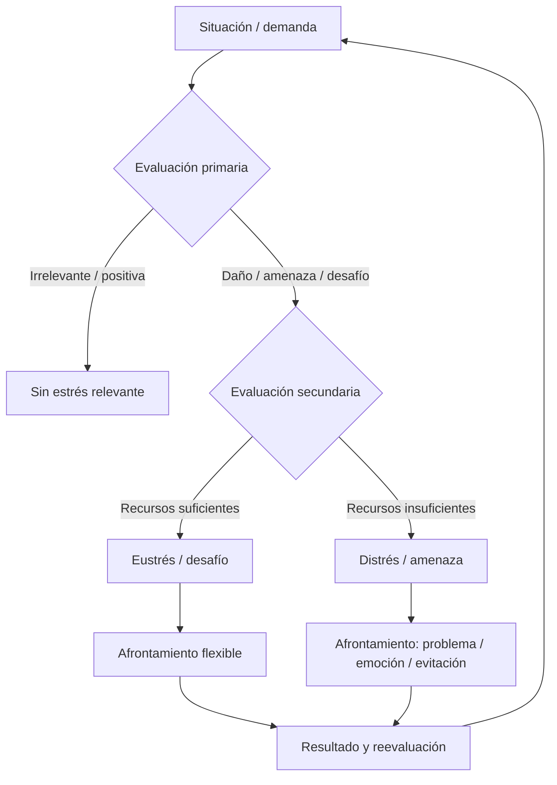

# Estrés: impacto y gestión emocional

**Bloque transversal (fundamentos + salud profesional)**  
Optativa: *Educación emocional en el profesorado*  
Pregunta guía: *¿Cómo distinguir eustrés de distrés y qué puede hacer el docente sin convertirse en terapeuta?*

> Complementa el [Tema 2 — Naturaleza de la emoción](02-naturaleza-de-la-emocion.md) (eustrés/distrés, frustración, ansiedad) y el [Tema 9 — Salud del profesorado](09-emociones-salud-profesorado.md) (burnout, derivación).  
> Desarrollo teórico ampliado: [material modelo transaccional](../materiales/01-modelo-transaccional-estres.md) · [síntesis modelo transaccional](11-modelo-transaccional-educacion-emocional.md).

---

## 1. Por qué un tema completo sobre estrés

En los materiales oficiales de la optativa el estrés ocupa un **tema propio** (definición, evaluación cognitiva, eustrés/distrés, respuesta fisiológica, factores, variables personales, apoyo social, afrontamiento, consecuencias y técnicas). En el repositorio conviene explicitarlo también en los apuntes: no basta con mencionarlo al hablar de emociones o de burnout.

El estrés es la «plaga del siglo XXI» en el discurso popular, lo que genera **mitos**. Usarlo con precisión es parte de la competencia profesional del docente. Además, en Secundaria y en la especialidad de Matemáticas el estrés aparece de forma recurrente:

- en el **alumnado** (ansiedad matemática, bloqueo en examen, vergüenza en la pizarra, frustración ante el error);
- en el **profesorado** (sobrecarga, burocracia, demandas emocionales, clima de aula tenso, desequilibrio vida–trabajo).

Un docente que no reconoce su propia activación ni la del grupo tiende a escalar conflictos, a dar feedback más punitivo o a desconectar. Por eso este apunte es transversal a los bloques A y C.

---

## 2. Mitos frecuentes (y lecturas más útiles)

| Mito | Lectura profesional |
|------|---------------------|
| «El estrés siempre es malo; hay que eliminarlo.» | La activación moderada (eustrés) moviliza atención y esfuerzo. El objetivo es la zona de eficacia, no el cero absoluto. |
| «Si no tengo mucho que hacer, no puedo estar estresado.» | La **infraexigencia** (aburrimiento, potencial no usado, falta de sentido) también genera distrés. |
| «El estrés es solo una reacción del cuerpo.» | Es fisiológico, cognitivo y conductual; la **evaluación** de la situación es mediadora clave (Lazarus y Folkman). |
| «Aguantar en silencio demuestra vocación.» | El estrés crónico sin recuperación deteriora el trato al alumnado y la salud; pedir ayuda y derivar es profesionalidad. |
| «Hablar de estrés en clase de mates es perder tiempo de contenidos.» | Un minuto de regulación y un clima seguro suelen recuperar más tiempo de aprendizaje del que «gastan». |
| «Si el alumno se estresa es porque no ha estudiado.» | La ansiedad matemática puede interferir con la memoria de trabajo incluso en alumnado preparado; la amenaza social (pizarra, ridículo) multiplica el efecto. |
| «El burnout se cura con más resiliencia individual.» | El burnout tiene componentes organizativos (carga, apoyo, ratios); la resiliencia individual no sustituye condiciones laborales dignas. |

---

## 3. Definición y tres enfoques

El estrés es una **respuesta adaptativa** del organismo ante demandas del entorno. Evolutivamente preparaba para peligros físicos (lucha o huida); hoy predominan amenazas **psicológicas** (autoestima, roles, relaciones, sobrecarga, hiperconectividad).

| Enfoque | Idea central | Limitación |
|---------|--------------|------------|
| **Centrado en el estímulo** | El estrés *es* el acontecimiento (Holmes y Rahe, escala de estresores) | Ignora diferencias individuales |
| **Centrado en la respuesta** | El estrés *es* la reacción fisiológica (Selye, Síndrome General de Adaptación) | No explica por qué el mismo estímulo afecta de forma distinta |
| **Transaccional** (Lazarus y Folkman) | El estrés es una **relación** persona–entorno mediada por evaluación cognitiva y afrontamiento | — |

El modelo transaccional es el más útil para la educación emocional: sitúa el acento en procesos **entrenables** (valoración y coping). El docente no puede eliminar todos los estresores del sistema, pero sí puede influir en cómo se interpretan las demandas y en qué recursos se perciben disponibles.

---

## 4. Modelo transaccional (síntesis operativa)

El estrés surge cuando la persona evalúa que las demandas **superan** (o amenazan con superar) sus recursos.

### 4.1. Evaluación cognitiva

1. **Primaria** — ¿Qué significa esto para mí?  
   Irrelevante · Benigna-positiva · Estresante (daño/pérdida, **amenaza** o **desafío**).

2. **Secundaria** — ¿Tengo recursos?  
   Opciones, probabilidad de éxito, utilidad percibida.

3. **Reevaluación** — Se actualiza cuando cambia la situación o los recursos.

**Ejemplo docente:** una inspección anunciada puede leerse como amenaza («no estoy preparado») o como desafío («tengo materiales y apoyo del departamento»). La misma situación, distinta transacción.

**Ejemplo alumnado (Matemáticas):** el anuncio de un examen de sistemas.  
- Alumno A: «He practicado los tipos de sistemas; sé por dónde empezar» → desafío.  
- Alumno B: «Siempre suspendo; si salgo a la pizarra me van a reír» → amenaza (académica + social).

### 4.2. Tipos de estresores

| Tipo | Descripción | Ejemplos en educación |
|------|-------------|------------------------|
| **Eventos vitales** | Cambios mayores que exigen ajuste | Cambio de centro, duelo, transición de etapa, mudanza familiar |
| **Hassles** (molestias cotidianas) | Microestresores del día a día | Disrupción puntual, papeleo, ruido, retraso de un bus, un comentario hiriente |
| **Estrés crónico** | Demandas continuadas sin recursos suficientes | Sobrecarga, burocracia permanente, demandas emocionales sostenidas, falta de control |

**Estresores crónicos del profesorado** (frecuentes en Secundaria):

| Categoría | Ejemplos concretos |
|-----------|-------------------|
| Carga de trabajo | Corrección masiva, preparación de materiales, guardias |
| Burocracia | Informes, plataformas, actas, plazos superpuestos |
| Relaciones | Conflictos con alumnado, familias o compañeros |
| Evaluación y control | Inspección, resultados, rankings internos |
| Reconocimiento | Bajo feedback positivo, sensación de invisibilidad |
| Demandas emocionales | Contención de crisis, mediación, carga afectiva del grupo |
| Autonomía | Poco control sobre horarios, ratios o diseño de la evaluación |
| Vida–trabajo | Correos fuera de horario, dificultad para desconectar |

### 4.3. Afrontamiento (*coping*)

Esfuerzos cognitivos y conductuales para gestionar lo evaluado como estresante.

| Dimensión | Categorías |
|-----------|------------|
| **Foco** | Centrado en el **problema** (cambiar la situación) · Centrado en la **emoción** (regular la respuesta) |
| **Dirección** | **Aproximación** (hacia el estresor) · **Evitación** (alejarse) |

Ninguna categoría es intrínsecamente «buena». La eficacia depende de la **controlabilidad**: si la situación se puede modificar, suele ayudar el afrontamiento centrado en el problema; si no, el centrado en la emoción (reinterpretación, apoyo, relajación) puede ser adaptativo a corto plazo. La **evitación exclusiva** reiterada se asocia a más problemas de salud.

**Ejemplo (calificación baja en un examen de mates):**

| Tipo | Conductas |
|------|-----------|
| Problema | Pedir tutoría, plan de estudio, ayuda de un compañero, revisar errores con rúbrica |
| Emoción adaptativa | Hablar con alguien de confianza, reevaluar («puedo mejorar estos tres tipos de ítem»), respirar y volver a la tarea |
| Emoción desadaptativa / evitación | No ir a clase, estallar, culpabilizarse en bucle, distraerse horas sin abordar la tarea, abandonar la asignatura |

### 4.4. Emoción y resultado

No hay estrés sin emoción en el modelo: la valoración genera emociones (ansiedad, ira, tristeza, esperanza…) que orientan el coping y la reevaluación. Secuencia orientativa:

```text
evento → appraisal (daño / amenaza / desafío) → coping → resultado del evento → resultado emocional
```

Diagrama de flujo (visión rápida):



---

## 5. Eustrés, distrés y zona de activación

| | **Eustrés** | **Distrés** |
|---|-------------|-------------|
| **Percepción** | Desafío manejable; recursos ≥ demandas | Amenaza o sobrecarga; demandas ≫ recursos |
| **Efecto** | Energía, atención, aprendizaje | Bloqueo, malestar, deterioro si se cronifica |
| **También** | — | Infraexigencia (pocas demandas, potencial desaprovechado) |

La activación fisiológica de base puede ser similar; cambia la **evaluación** y la **duración**. El objetivo educativo no es eliminar el estrés, sino permanecer en la zona donde el reto moviliza sin paralizar.

### 5.1. La curva de Yerkes–Dodson (idea operativa)

La relación entre activación y rendimiento no es lineal: demasiado poca activación (aburrimiento, desconexión) y demasiada (pánico, bloqueo) empeoran el rendimiento. El punto óptimo depende de la complejidad de la tarea y de la experiencia del alumno.

**Implicación en Matemáticas:** un problema rico con andamiaje puede situar al alumnado en eustrés; el mismo problema anunciado como «imposible» o expuesto sin red genera distrés. El diseño de la tarea y el clima de aula mueven al alumno a lo largo de esa curva.

### 5.2. Infraexigencia como distrés

A menudo se olvida: el alumnado con alta capacidad o con tareas rutinarias puede experimentar distrés por **falta de sentido y de reto**. Señales: aburrimiento crónico, disrupción por desconexión, «paso de todo». La respuesta no es solo «más de lo mismo», sino reto ajustado (ZDP), elección limitada y sentido de la actividad.

---

## 6. Respuesta fisiológica (Selye, SGA)

1. **Alarma** — activación rápida (simpático / adrenalina): atención, ritmo cardíaco, tensión. Útil para reaccionar; en el aula se traduce en «estoy en alerta».  
2. **Resistencia** — esfuerzo mantenido (cortisol); útil a corto-medio plazo, costoso si se prolonga. El docente o el alumno «aguantan» varias semanas en esta fase.  
3. **Agotamiento** — recursos insuficientes; reaparecen síntomas; riesgo para inmunidad, órganos y salud mental.

En el aula y en la profesión, la mayoría de amenazas no son físicas sino de **seguridad y bienestar** prolongadas: sin recuperación, la fase de resistencia desemboca en agotamiento (y, en el docente, en terreno del burnout — ver Tema 9).

### 6.1. Señales de alarma en el docente (observables)

| Ámbito | Señales frecuentes |
|--------|-------------------|
| Físico | Cansancio al despertar, tensión cervical, sueño irregular, dolores de cabeza |
| Emocional | Irritabilidad creciente, cinismo, sensación de «vacío» tras las clases |
| Cognitivo | Dificultad para concentrarse en la preparación, rumiación, olvidos |
| Conductual | Evitar el claustro, retrasar correcciones, estallar por minucias, aislamiento |

Ninguna señal por sí sola es diagnóstico. El patrón sostenido y el impacto en el trato al alumnado sí deben activar reflexión y, si procede, apoyo.

### 6.2. Señales de alarma en el alumnado (aula de Matemáticas)

| Señal | Posible lectura transaccional |
|-------|------------------------------|
| Bloqueo en examen pese a haber estudiado | Amenaza + interferencia en memoria de trabajo |
| Negativa reiterada a la pizarra | Amenaza social (vergüenza) > recursos percibidos |
| «Yo no sirvo para las mates» | Atribución global + baja autoeficacia |
| Evitación de la materia / absentismo selectivo | Coping de evitación ante distrés crónico |
| Irritabilidad al corregir un error | Frustración + percepción de amenaza al yo |

El docente **observa y describe** (hechos), no diagnostica. Ante patrones intensos o de riesgo: protocolo del centro.

---

## 7. Variables personales y apoyo social

**Moduladores de vulnerabilidad / protección:**

- Estilo atribucional y locus de control  
- Autoeficacia percibida  
- Optimismo realista vs. pesimismo  
- Habilidades de regulación emocional  
- Experiencias previas de afrontamiento exitoso  
- **Patrón de conducta Tipo A** (urgencia crónica, competitividad, hostilidad, perfeccionismo rígido): predispone al distrés  
- **Apoyo social** (emocional e instrumental): amortiguador potente; en el profesorado, el apoyo entre compañeros y el departamento protegen más que el «aguante individual»

### 7.1. Tipo A en el aula y en el docente

El patrón Tipo A no es un trastorno; es un estilo. En el docente puede traducirse en:

- prisa permanente y corrección «a destajo»;
- dificultad para tolerar el error del alumnado;
- hostilidad sutil (ironía, comparaciones);
- sensación de que «nunca es suficiente».

En el alumnado puede aparecer como competitividad tóxica o ansiedad de rendimiento. El antídoto no es «ser más flojo», sino **límites realistas, feedback de proceso y clima de maestría** (ver Tema 5).

### 7.2. Apoyo social: qué funciona en el centro

| Tipo de apoyo | Ejemplo útil |
|---------------|--------------|
| Emocional | Un compañero que escucha sin juzgar tras una clase difícil |
| Instrumental | Compartir materiales, desdobles, co-docencia en un grupo conflictivo |
| Informativo | Orientación clara sobre protocolos de convivencia o de derivación |
| De pertenencia | Departamento que se reúne con sentido pedagógico, no solo administrativo |

El aislamiento profesional es un factor de riesgo. Pedir ayuda concreta («¿puedes mirar esta rúbrica?» / «necesito cubrir 20 minutos el jueves») es más eficaz que el lamento genérico.

---

## 8. Evidencia en adolescentes (orientativa)

Estudios que aplican el modelo de Lazarus y Folkman en adolescentes (p. ej. Berra Ruiz et al., cuestionario CEEA) encuentran de forma recurrente:

- Situaciones **escolares y familiares** como estresores más reportados.  
- Predominio de estrategias centradas en la **emoción**.  
- Correlación entre nivel de estrés, tipo de afrontamiento y tono emocional (ansiedad/miedo asociados a coping más emocional; menor estrés asociado a coping más activo).

Implicación: entrenar de forma explícita evaluación realista y afrontamiento centrado en el problema desde la ESO (tutoría, PAT, también *dentro* de la materia).

### 8.1. Ansiedad matemática y estrés

La ansiedad matemática es un caso particular de distrés asociado a situaciones de matemáticas (tareas, exámenes, exposición). Meta-análisis (Barroso et al., 2021) confirman la relación negativa con el rendimiento; estudios sobre sensibilidad docente (Aldrup et al.) sugieren que el profesor puede moderar esa relación.  

Conexión con el modelo transaccional: la ansiedad matemática suele implicar evaluación primaria de **amenaza** y evaluación secundaria de **recursos bajos** (autoeficacia, estrategias, apoyo). El diseño de tarea, el clima y el feedback pueden desplazar esa valoración hacia el desafío.

Ver [glosario](../glosario.md) y [bibliografía](../bibliografia.md) §2.3.

---

## 9. Consecuencias del estrés crónico

| Ámbito | Efectos posibles |
|--------|------------------|
| Físico | Fatiga, sueño, tensión muscular, mayor vulnerabilidad |
| Emocional | Irritabilidad, ansiedad, desánimo, agotamiento |
| Cognitivo | Concentración, decisiones impulsivas o evitativas |
| Profesional | Burnout, distanciamiento del alumnado, peor calidad de la relación educativa |
| Académico (alumnado) | Descenso de rendimiento, desmotivación, conflicto |

### 9.1. Del estrés crónico al burnout (puente con Tema 9)

El **burnout** (Maslach) no es «una semana mala». Componentes clásicos:

1. **Agotamiento emocional** — «estoy vacío».  
2. **Despersonalización / cinismo** — distancia fría o irritada hacia el alumnado.  
3. **Baja realización personal** — sensación de no servir o de no lograr nada.

El estrés crónico sin recuperación es el terreno en el que crece el burnout. La respuesta profesional combina:

- **nivel individual:** límites, regulación, pedir ayuda;
- **nivel de equipo:** apoyo, acuerdos de departamento;
- **nivel de centro:** plan de convivencia real, ratios, reconocimiento;
- **nivel sanitario** (si el malestar es intenso): recursos de salud laboral / profesionales de la salud.

La educación emocional del máster trabaja sobre todo el nivel individual y de aula; **no sustituye** condiciones laborales dignas.

---

## 10. Estrategias para prevenir y reducir (marco docente)

### 10.1. Cognitivas

- Identificar estresores y **distorsiones** («todo el grupo me odia», «si no controlo cada detalle, fracaso»).  
- Reevaluación: cuando sea realista, pasar de amenaza a desafío.  
- Separar «lo que controlé hoy» de «lo estructural del sistema».  
- Pregunta útil al final de la jornada: «¿Qué dependía de mí y qué no?».

### 10.2. Fisiológicas / de regulación breve

- Respiración diafragmática (3–5 ciclos) entre clases o antes de una situación tensa.  
- Grounding: 5 cosas que veo, 4 que oigo, 3 que toco (útil también con alumnado en bloqueo).  
- Sueño y actividad física como base (no negociable a medio plazo).  
- Micro-pausas: 2 minutos de silencio o de estiramiento antes de la siguiente hora.

### 10.3. Conductuales

- **Límites** de horario de corrección y de disponibilidad digital (p. ej. no responder correos después de las 19:00 al menos 3 días/semana).  
- **Habilidades sociales** y asertividad (pedir ayuda, decir no con respeto).  
- **Solución de problemas** (D’Zurilla y Goldfried, esquema orientativo):
  1. Definir el problema en términos de conducta propia.  
  2. Generar varias alternativas (evitar la respuesta impulsiva única).  
  3. Ponderar y elegir.  
  4. Planificar pasos y ejecutar.  
- **Autocontrol:** regular antecedentes y consecuencias de la propia conducta (qué dispara el estallido; qué refuerza la evitación).

### 10.4. Con el alumnado (sin clínica)

- Explicitar el lenguaje del modelo (amenaza vs. desafío; problema vs. emoción).  
- Modelar: «esto es difícil y tengo un primer paso».  
- Dinámicas breves: situación estresante reciente → evaluación → coping usado → alternativa.  
- Mapa colectivo de recursos del centro (a quién pedir ayuda).  
- Ante malestar intenso o de riesgo: **protocolo del centro y derivación** (no improvisar terapia).

### 10.5. Técnicas de aula en 5–10 minutos (Matemáticas)

| Técnica | Cómo | Objetivo |
|---------|------|----------|
| **Pausa de reevaluación** | Tras anunciar un examen o un problema difícil: «¿Qué es amenaza y qué es desafío aquí? ¿Qué recursos tienes?» | Desplazar la valoración primaria |
| **Primer paso visible** | Antes de la pizarra o del examen: «Escribe solo el primer paso que sí sabes» | Aumentar recursos percibidos |
| **Norma de error** | «El error se critica el *paso*, no a la persona» (practicada, no solo carteles) | Reducir amenaza social |
| **Ticket de salida emocional** | «Hoy me bloqueé en… y lo resolví con…» | Metacognición + coping centrado en el problema |
| **Exposición gradual** | Pareja → explicación oral breve → pizarra con andamiaje | Entrenar competencia sin forzar el nivel alto el día 1 |

---

## 11. Puente al aula de Matemáticas

| Situación | Lectura transaccional | Respuesta docente posible |
|-----------|----------------------|---------------------------|
| «Yo no sirvo para las mates» al anunciar un examen | Evaluación primaria de amenaza + posible baja autoeficacia | Validación breve + mapa de contenidos + seguimiento en pequeño grupo; no diagnóstico |
| Bloqueo en la pizarra | Amenaza social (vergüenza) + demanda percibida > recursos | Andamiaje, exposición gradual, norma anti-ridículo |
| El docente a punto de gritar ante un conflicto | Activación propia en fase de alarma | Notar → bajar tono → norma → recuperar tarea; procesar después |
| Infraexigencia / aburrimiento crónico | Distrés por demanda insuficiente | Reto ajustado (ZDP), sentido de la tarea, no solo «más de lo mismo» |
| Corrección que escala | Amenaza al yo del alumno + activación del docente | Separar conducta y contenido matemático; aplazar el debate de respeto a un momento privado |
| Ansiedad colectiva ante un examen | Amenaza compartida + recursos percibidos bajos | Criterios claros, ensayo formativo, plan de estudio realista, clima de maestría |

### 11.1. Secuencia de intervención breve (conflicto o bloqueo)

```text
1. Notar la propia activación (¿estoy en alarma?).
2. Bajar el tono y el volumen.
3. Describir el hecho (no la intención): «Has cerrado el cuaderno y no escribes».
4. Ofrecer un primer paso o una opción limitada.
5. Recuperar el foco en la tarea o en la norma.
6. Si se repite o hay riesgo → registrar y activar protocolo / tutoría.
```

### 11.2. Qué no hacer (errores frecuentes)

- Usar la nota como castigo de conducta.  
- Forzar la exposición pública sin red.  
- Ironía o sarcasmo ante el error.  
- Prometer confidencialidad absoluta ante riesgo.  
- Diagnosticar («tienes ansiedad», «eres agresivo») en lugar de describir conductas.  
- Cargar en privado con lo que corresponde a orientación o jefatura.

---

## 12. Autocuidado profesional: plan mínimo viable

Un plan realista no exige «meditar una hora al día». Sí exige **consistencia** en lo pequeño:

| Acción | Frecuencia orientativa |
|--------|------------------------|
| Cerrar la corrección a una hora límite | ≥ 3 días/semana |
| Micro-pausa entre clases (respiración o estiramiento) | Diaria |
| Pedir una ayuda concreta a un compañero o a jefatura | Quincenal |
| Revisar «lo controlable vs. lo estructural» | Tras jornadas difíciles |
| Actividad física o sueño prioritario | Semanal (mínimo no negociable) |
| Conversación de descarga con alguien de confianza | Según necesidad |

Si el agotamiento no cede, si aparece cinismo estable o si el trato al alumnado se deteriora, el siguiente paso no es «más resiliencia»: es **activar recursos del centro y, si procede, de salud laboral**.

---

## 13. Respuesta a la pregunta guía

> *¿Cómo distinguir eustrés de distrés y qué puede hacer el docente sin convertirse en terapeuta?*

El eustrés se percibe como desafío manejable y moviliza aprendizaje; el distrés, como amenaza o sobrecarga (o vacío de sentido) y, si se cronifica, daña. El docente **observa** estresores y patrones de afrontamiento, **regula** su propia activación, **diseña** tareas y clima para reducir amenaza innecesaria sin bajar la exigencia, **enseña** lenguaje y estrategias básicas de evaluación y coping, y **deriva** cuando el caso supera el marco escolar.

### Idea central

> El estrés no es solo un estímulo ni solo un síntoma corporal: es una **transacción** evaluada.  
> La educación emocional del profesorado trabaja evaluación, afrontamiento y límites de rol — no la eliminación total de la activación ni el diagnóstico clínico.

---

## 14. Para seguir

| Recurso | Ruta |
|---------|------|
| Modelo transaccional (ficha ampliada) | [materiales/01-modelo-transaccional-estres.md](../materiales/01-modelo-transaccional-estres.md) |
| Síntesis del modelo en EE | [11-modelo-transaccional-educacion-emocional.md](11-modelo-transaccional-educacion-emocional.md) |
| Naturaleza de la emoción (eustrés, frustración, ansiedad mates) | [02-naturaleza-de-la-emocion.md](02-naturaleza-de-la-emocion.md) |
| Salud del profesorado, burnout, derivación | [09-emociones-salud-profesorado.md](09-emociones-salud-profesorado.md) |
| Emoción y motivación | [05-emocion-y-motivacion.md](05-emocion-y-motivacion.md) |
| Casos aplicados en Matemáticas | [10-sintesis-casos-matematicas.md](10-sintesis-casos-matematicas.md) |
| Glosario | [glosario.md](../glosario.md) — *eustrés, distrés, coping, burnout, regulación, ansiedad matemática* |
| Bibliografía | [bibliografia.md](../bibliografia.md) |
| Exámenes (autoevaluación) | [examen/](../examen/) |

---

## 15. Preguntas de autoevaluación

1. Resume en tres frases el modelo transaccional y por qué es más útil en educación que el enfoque solo fisiológico.  
2. Clasifica tres estresores de tu futura práctica (o del practicum) como evento vital, *hassle* o crónico; propone un coping centrado en el problema y uno centrado en la emoción para uno de ellos.  
3. Explica con un ejemplo de Matemáticas la diferencia entre eustrés y distrés, incluyendo el caso de **infraexigencia**.  
4. Indica dos señales de que debes **dejar de «aguantar»** y activar tutoría / orientación / jefatura (enlace con Tema 9).  
5. Diseña una micro-intervención de 5–10 minutos para reducir la amenaza percibida ante un examen de Matemáticas sin bajar el criterio de evaluación.  
6. Describe tu propio patrón de activación en una clase difícil reciente (o simulada): ¿qué notaste en el cuerpo, qué pensaste, qué hiciste, qué harías distinto?

**Esquemas de respuesta sólida (rúbrica breve):**  
(1) Debe nombrar evaluación primaria/secundaria y afrontamiento, no solo «el cuerpo se activa».  
(2) Debe distinguir tipos de estresor y no presentar el coping emocional como siempre negativo.  
(3) Debe incluir percepción de recursos y al menos un ajuste de diseño de tarea.  
(4) Debe respetar límites de rol (observar / derivar, no diagnosticar).  
(5) Debe combinar claridad de criterios, andamiaje y clima (no solo «tranquilizaos»).  
(6) Debe mostrar conciencia de la propia activación y al menos una estrategia de regulación o de límite.

---

## 16. Actividad de cierre (portfolio / practicum)

Elige **una** situación real o simulada (anonimizada) de estrés en el aula de Matemáticas o en tu rol como docente en formación:

1. Describe los **hechos** (sin interpretaciones).  
2. Aplica el modelo: evaluación primaria y secundaria (tuya y, si procede, del alumnado).  
3. Identifica el tipo de estresor y el coping usado.  
4. Propón una respuesta preferible (diseño de tarea, clima, regulación propia o derivación).  
5. Indica qué recursos del centro activarías si se repitiera o escalara.

Extensión orientativa: una página. Criterio de calidad: precisión conceptual + respeto al rol + aplicabilidad real.
