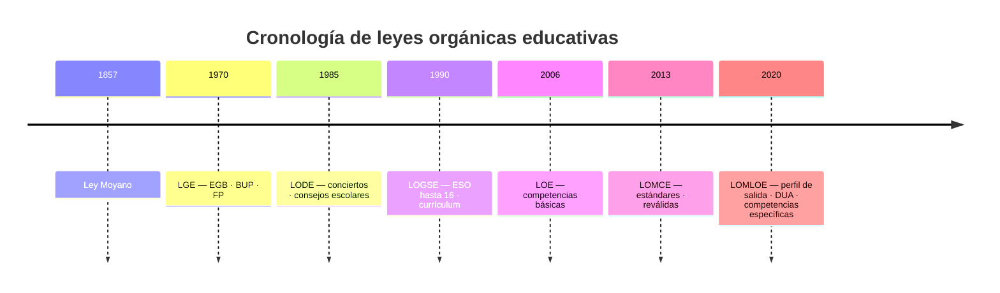

# Tema 1: Evolución histórica del Sistema Educativo Español desde sus referencias legislativas y la didáctica contemporánea

## Índice
1. [Introducción y Marco Teórico](#introducción-y-marco-teórico)
2. [Teorías de la Organización Escolar y Paradigmas Educativos](#1-teorías-de-la-organización-escolar-y-paradigmas-educativos)
3. [Teorías del Currículum y su Evolución](#2-teorías-del-currículum-y-su-evolución)
4. [Evolución Histórica del Sistema Educativo Español](#3-evolución-histórica-del-sistema-educativo-español)
5. [Resumen Comparativo de las Leyes Orgánicas](#4-resumen-comparativo-de-las-leyes-orgánicas-educativas-en-españa)
6. [Organización del Sistema Educativo en el Estado de las Autonomías](#5-organización-del-sistema-educativo-en-el-estado-de-las-autonomías)
7. [Implicaciones para la enseñanza de las Matemáticas](#6-implicaciones-para-la-enseñanza-de-las-matemáticas)
8. [Burocratización del trabajo docente: evolución histórica](#7-burocratización-del-trabajo-docente-evolución-histórica-y-hiperregulación)
9. [Bibliografía de Referencia](#bibliografía-de-referencia)

---

## Introducción y Marco Teórico

El análisis de la historia de la educación en España exige comprender cómo han interactuado, a lo largo de los siglos XIX, XX y XXI, la legislación educativa, las estructuras sociopolíticas y las teorías didácticas. El currículo y la organización escolar no son construcciones neutras, sino el resultado de luchas ideológicas, modelos económicos y concepciones epistemológicas sobre el conocimiento y el aprendizaje.

Para el futuro profesorado de Matemáticas de Educación Secundaria, este tema no es solo un recorrido histórico: es la base para entender por qué el sistema actual es como es, qué paradigmas informaron cada reforma y qué implicaciones tiene ello para la práctica de aula.

## 1. Teorías de la Organización Escolar y Paradigmas Educativos

### 1.1. Paradigma Racional-Tecnológico (Positivista)

- **Concepción de la realidad:** La realidad es objetiva, única, independiente del observador y gobernada por leyes naturales generalizables.
- **Finalidad del conocimiento:** Explicar, predecir y controlar. Búsqueda de regularidades y relaciones causa-efecto.
- **Rol del investigador/docente:** Técnico neutral que aplica conocimiento científico validado.
- **Metodología preferente:** Cuantitativa, experimental, tests estandarizados, análisis estadístico.
- **Bases históricas e intelectuales:** Positivismo de Comte, conductismo, teoría de sistemas, New Public Management.
- **Aplicación en la escuela:** Organización burocrática, objetivos operativos, evaluación por estándares, rendición de cuentas cuantitativa.

**Implicaciones para Matemáticas:** Enfoque en procedimientos correctos, ejercicios de respuesta única, evaluación sumativa estandarizada, currículo cerrado y secuenciado.

### 1.2. Paradigma Interpretativo-Constructivista

- **Concepción de la realidad:** La realidad es múltiple, construida socialmente y mediada por significados.
- **Finalidad del conocimiento:** Comprender e interpretar los significados que los actores atribuyen a sus acciones.
- **Rol del investigador/docente:** Intérprete y facilitador del aprendizaje significativo.
- **Metodología preferente:** Cualitativa (entrevistas, observación participante, estudios de caso).
- **Bases históricas e intelectuales:** Hermenéutica, fenomenología, constructivismo (Piaget, Vygotsky, Ausubel), interaccionismo simbólico.
- **Aplicación en la escuela:** Currículo abierto, atención a la diversidad, evaluación formativa, aprendizaje cooperativo.

**Implicaciones para Matemáticas:** Problemas abiertos, construcción de significados, error como oportunidad de aprendizaje, ZDP y andamiaje, sentido socioafectivo.

### 1.3. Paradigma Socio-Crítico

- **Concepción de la realidad:** La realidad está mediada por relaciones de poder, ideología e intereses.
- **Finalidad del conocimiento:** Emancipar; transformar las estructuras opresivas.
- **Rol del investigador/docente:** Intelectual transformador, agente de cambio social.
- **Metodología preferente:** Investigación-Acción participativa.
- **Bases históricas e intelectuales:** Escuela de Frankfurt (Habermas), Pedagogía Crítica (Freire, Apple, Giroux).
- **Aplicación en la escuela:** Micropolítica escolar, justicia social, inclusión, DUA, matemáticas como herramienta de ciudadanía.

**Implicaciones para Matemáticas:** Uso de datos reales sobre desigualdad, modelización de problemas sociales, análisis crítico de la información cuantitativa.

---

## 2. Teorías del Currículum y su Evolución

### 2.1. Concepto y Fuentes del Currículum

El currículum es el proceso intencional y sistemático mediante el cual se toman decisiones sobre los saberes culturales que se enseñan, su organización, la metodología y los criterios de evaluación (Magendzo, 1986). Se fundamenta en cinco fuentes principales: **Sociología, Psicología, Pedagogía, Epistemología/Disciplinas y Antropología**.

### 2.2. Tipologías y Enfoques

- **Currículum Prescriptivo (Oficial):** Plan explícito e intencionado regulado por las administraciones públicas.
- **Currículum Oculto:** Conjunto de aprendizajes no explícitos (normas, sesgos, valores, jerarquías) que se transmiten de forma implícita en la práctica diaria (Apple, 1979).
- **Evolución del término en España:** El término *currículum* se incorpora legalmente por primera vez con la **LOGSE (1990)**.

---

## 3. Evolución Histórica del Sistema Educativo Español

Recorrido desde la Ley Moyano (1857) hasta la LOMLOE (2020), pasando por la Segunda República, el franquismo, la LGE (1970) y las leyes orgánicas democráticas (LOECE, LODE, LOGSE, LOCE, LOE, LOMCE, LOMLOE).

> **Fichas detalladas por ley (1980–2020):**  
> [leyes-educativas/](../materiales/leyes-educativas/) — LOECE, LODE, LOGSE, LOCE, LOE, LOMCE, LOMLOE (contexto, ideología, pedagogía, críticas y paradigmas).  
> Esquema visual: [Línea temporal de leyes educativas](../materiales/linea-temporal-leyes-educativas.md).

---

## 4. Resumen Comparativo de las Leyes Orgánicas Educativas en España

| Ley | Año | Gobierno | Paradigma predominante | Aportaciones clave |
|-----|-----|----------|------------------------|--------------------|
| **Ley Moyano** | 1857 | Moderado | Positivista / Burocrático | Primera ley general. Centralización, primaria elemental obligatoria. |
| **LGE** | 1970 | Franquismo tardío | Positivista-tecnocrático | EGB, BUP, FP; objetivos operativos. |
| **LODE** | 1985 | PSOE | Socio-crítico / Participativo | Conciertos, consejos escolares, participación. |
| **LOGSE** | 1990 | PSOE | Interpretativo-Constructivista | ESO hasta 16; currículum; atención a la diversidad. |
| **LOCE** | 2002 | PP | Racional-tecnológico / Neoconservador | Itinerarios, cultura del esfuerzo (poca aplicación). |
| **LOE** | 2006 | PSOE | Interpretativo + competencias UE | Competencias básicas; Educación para la Ciudadanía. |
| **LOMCE** | 2013 | PP | Racional-tecnológico | Estándares, reválidas, itinerarios en 4.º ESO. |
| **LOMLOE** | 2020 | PSOE-UP | Socio-crítico / Inclusivo | Perfil de salida, DUA, competencias específicas. |

*Figura. Cronología orientativa de las principales leyes orgánicas educativas.*

> **Fichas detalladas por ley (1980–2020):**  
> [leyes-educativas/](../materiales/leyes-educativas/) — LOECE, LODE, LOGSE, LOCE, LOE, LOMCE, LOMLOE (contexto, ideología, pedagogía, críticas y paradigmas).  
> Esquema visual: [Línea temporal de leyes educativas](../materiales/linea-temporal-leyes-educativas.md).

---

## 5. Organización del Sistema Educativo en el Estado de las Autonomías

### 5.1. Reparto de Competencias (Art. 149.1.30 CE)

- **Porcentajes vigentes de enseñanzas mínimas** (según los Reales Decretos de desarrollo de la LOMLOE, p. ej. RD 157/2022 y RD 217/2022): 50 % en comunidades con lengua cooficial y 60 % en el resto, sobre el horario lectivo total.

### 5.2. Niveles de Concreción Curricular

Cuatro niveles: (1) Estado (enseñanzas mínimas), (2) Comunidad Autónoma, (3) Centro (PGA, programaciones didácticas), (4) Aula (adaptaciones, ACI/ACS cuando proceda).

---

## 6. Implicaciones para la enseñanza de las Matemáticas

La LOMLOE, al situarse predominantemente en el paradigma socio-crítico e inclusivo, exige al profesorado de Matemáticas:

- Trabajar el **sentido socioafectivo** de las matemáticas.
- Diseñar **situaciones de aprendizaje** competenciales.
- Aplicar el **DUA** y atender a la diversidad.
- Evaluar por **criterios y competencias específicas**, no solo por exámenes de procedimiento.

---

## 7. Burocratización del trabajo docente: evolución histórica e hiperregulación

Ninguna ley determina por sí sola todo el papeleo docente. La burocracia efectiva depende también de decretos de currículo, reglamentos, órdenes de evaluación, normativa autonómica, plataformas digitales e inspección.

> **Para profundizar:**  
> - [TALIS — ficha sintética](../materiales/talis-ficha-sintetica.md)  
> - [Burocratización del trabajo docente — análisis histórico](../materiales/burocratizacion-trabajo-docente-analisis-historico.md)

---

## Bibliografía de Referencia

- Apple, M. W. (1979). *Ideology and curriculum*. Routledge.
- Bernal, J. L., Cano, J. y Lorenzo, J. (2014). *Organización de los centros educativos: LOMCE y políticas neoliberales*. Mira Editores.
- Coll, C., y Martín, E. (2021). La LOMLOE: una oportunidad para la modernización curricular. *Avances en supervisión educativa*, 35, 1-22.
- Freire, P. (1968/1970). *Pedagogía del oprimido*. Siglo XXI.
- Giroux, H. A. (1983). *Theory and Resistance in Education*. Bergin & Garvey.
- Habermas, J. (1968). *Erkenntnis und Interesse*. Suhrkamp.
- Magendzo, A. (1986). *Curriculum y cultura en América Latina*. PIIE.
- OECD (2025). *Results from TALIS 2024: The State of Teaching*. OECD Publishing.
- Real Decreto 157/2022, de 1 de marzo. *BOE*, 52.
- Real Decreto 217/2022, de 29 de marzo. *BOE*, 76.
- Sáez, R. (2005). Bases metodológicas de la investigación educativa y paradigmas. *Revista Complutense de Educación*, 16(1), 307-337.
- Viñao, A. (2010). El sistema educativo español: evolución histórica. En F. Imbernón (Coord.), *Procesos y contextos educativos* (pp. 13-33). Graó.
