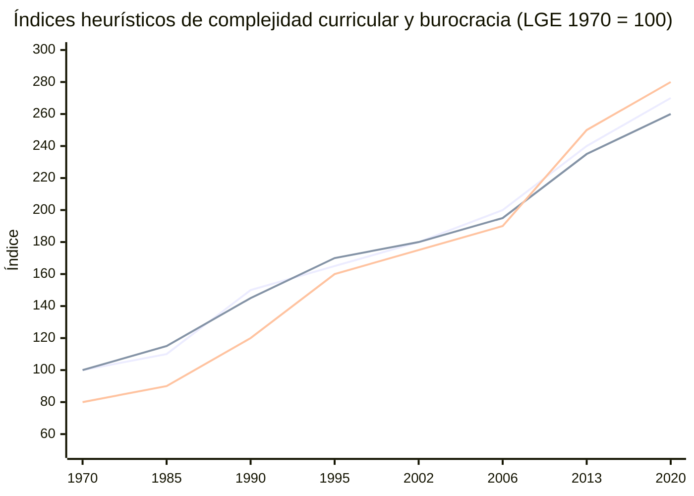

# Tema 1: Evolución histórica del Sistema Educativo Español desde sus referencias legislativas y la didáctica contemporánea

## Índice
1. [Introducción y Marco Teórico](#introducción-y-marco-teórico)
2. [Teorías de la Organización Escolar y Paradigmas Educativos](#1-teorías-de-la-organización-escolar-y-paradigmas-educativos)
3. [Teorías del Currículum y su Evolución](#2-teorías-del-currículum-y-su-evolución)
4. [Evolución Histórica del Sistema Educativo Español](#3-evolución-histórica-del-sistema-educativo-español)
5. [Resumen Comparativo de las Leyes Orgánicas](#4-resumen-comparativo-de-las-leyes-orgánicas-educativas-en-españa)
6. [Organización del Sistema Educativo en el Estado de las Autonomías](#5-organización-del-sistema-educativo-en-el-estado-de-las-autonomías)
7. [Implicaciones para la enseñanza de las Matemáticas](#6-implicaciones-para-la-enseñanza-de-las-matemáticas)
8. [Burocratización del trabajo docente: evolución histórica](#7-burocratización-del-trabajo-docente-evolución-histórica-y-hiperregulación)
9. [Bibliografía de Referencia](#bibliografía-de-referencia)

---

## Introducción y Marco Teórico

El análisis de la historia de la educación en España exige comprender cómo han interactuado, a lo largo de los siglos XIX, XX y XXI, la legislación educativa, las estructuras sociopolíticas y las teorías didácticas. El currículo y la organización escolar no son construcciones neutras, sino el resultado de luchas ideológicas, modelos económicos y concepciones epistemológicas sobre el conocimiento y el aprendizaje.

Para el futuro profesorado de Matemáticas de Educación Secundaria, este tema no es solo un recorrido histórico: permite interpretar por qué el currículo actual de Matemáticas (competencias específicas, saberes básicos, DUA, Perfil de salida) está configurado de una determinada manera y cómo las distintas tradiciones pedagógicas han influido en la forma de enseñar, evaluar y organizar la materia.

---

## 1. Teorías de la Organización Escolar y Paradigmas Educativos

La investigación educativa y el diseño de la organización escolar se estructuran tradicionalmente en torno a tres grandes paradigmas epistemológicos (Sáez, 2005; López-Medialdea et al., 2025):

### 1.1. Paradigma Racional-Tecnológico (Positivista)

- **Concepción de la realidad:** La realidad es objetiva, única, independiente del observador y gobernada por leyes naturales generalizables.
- **Finalidad de la investigación:** Predecir, medir y controlar la realidad educativa.
- **Metodología:** Hipotético-deductiva, cuantitativa, basada en modelos matemáticos y muestras representativas.
- **Aplicación en la escuela:**
  - Concibe la escuela como una organización burocrática (modelo de Max Weber) o una «fábrica» eficiente.
  - Busca la eficacia operativa mediante la estandarización, la división del trabajo y el control de resultados (evaluación cuantitativa).
  - *Referencias clave:* F. W. Taylor, R. W. Tyler.

**Implicaciones para Matemáticas:** Énfasis en objetivos conductuales medibles, secuencias lineales de algoritmos, taxonomías de Bloom/Tyler, evaluación estandarizada de resultados y control de la «eficacia» de la enseñanza a través de pruebas externas.

### 1.2. Paradigma Interpretativo-Simbólico (Constructivista / Fenomenológico)

- **Concepción de la realidad:** La realidad es dinámica, múltiple, holística y construida socialmente por los actores.
- **Finalidad de la investigación:** Describir, comprender e interpretar los fenómenos educativos en su propio contexto.
- **Metodología:** Inductiva, cualitativa, etnográfica y naturalista (entrevistas, observación participante).
- **Aplicación en la escuela:**
  - Analiza la cultura escolar, los significados, los valores compartidos y las relaciones interpersonales.
  - Fomenta la gestión participativa, el clima de centro seguro, la autonomía pedagógica y la evaluación formativa.
  - *Referencias clave:* J. Schwab, L. Stenhouse.

**Implicaciones para Matemáticas:** Resolución de problemas contextualizados, trabajo cooperativo, atención al proceso de razonamiento (no solo al producto), evaluación formativa del pensamiento matemático y construcción conjunta de significados en el aula.

### 1.3. Paradigma Socio-Crítico (Emancipador)

- **Concepción de la realidad:** La realidad es una construcción histórica mediada por la ideología, el poder y las estructuras de dominación. La verdad es intersubjetiva y dialógica.
- **Finalidad de la investigación:** Desenmascarar las injusticias, promover la concienciación crítica y transformar la realidad social hacia la equidad y los derechos humanos.
- **Metodología:** Investigación-Acción participativa (ciclos de diagnóstico, planificación, acción, observación y reflexión).
- **Bases históricas e intelectuales:**
  - *Escuela de Frankfurt (Jürgen Habermas, 1968, 1981):* Teoría Crítica, distinción de los intereses del conocimiento (técnico, práctico y emancipatorio) y racionalidad comunicativa.
  - *Pedagogía Crítica (Paulo Freire, 1968/1970; Michael Apple, 1979; Henry Giroux, 1983):* Crítica a la «educación bancaria», análisis del *currículo oculto* y concepción de los docentes como «intelectuales transformadores».
- **Aplicación en la escuela:**
  - Estudio de la *micropolítica escolar*: analiza las tensiones, pactos, alianzas informales y dinámicas de poder en los centros.
  - Orientación hacia la justicia social, la inclusión, la diversidad y el compromiso comunitario.

**Implicaciones para Matemáticas:** Uso de datos reales sobre desigualdad, modelización de problemas sociales, análisis crítico de la información cuantitativa, Diseño Universal para el Aprendizaje (DUA) y matemáticas como herramienta de ciudadanía y transformación social.

---

## 2. Teorías del Currículum y su Evolución

### 2.1. Concepto y Fuentes del Currículum

El currículum es el proceso intencional y sistemático mediante el cual se toman decisiones sobre los saberes culturales que se enseñan, su organización, la metodología y los criterios de evaluación (Magendzo, 1986). Se fundamenta en cinco fuentes principales: **Sociología, Psicología, Pedagogía, Epistemología/Disciplinas y Antropología**.

En el caso de las Matemáticas, la fuente epistemológica (naturaleza del conocimiento matemático) y la psicológica (cómo se aprende a razonar matemáticamente) adquieren un peso especial, junto con la sociológica (quién tiene acceso a qué matemáticas y con qué consecuencias sociales).

### 2.2. Tipologías y Enfoques

- **Currículum Prescriptivo (Oficial):** Plan explícito e intencionado regulado por las administraciones públicas.
- **Currículum Oculto:** Conjunto de aprendizajes no explícitos (normas, sesgos, valores, jerarquías) que se transmiten de forma implícita en la práctica diaria (Apple, 1979).
- **Evolución del término en España:**
  - Hasta 1990, el sistema se organizaba mediante «programas de estudio».
  - El término *currículum* se incorpora legalmente por primera vez con la **LOGSE (1990)**.

---

## 3. Evolución Histórica del Sistema Educativo Español

### 3.1. Antecedentes y Siglo XIX: Génesis del Sistema Liberal

- **A finales del S. XVIII:** Ausencia de un sistema educativo unificado (Viñao, 2010). Control eclesiástico, baja cualificación del magisterio y elevado analfabetismo.
- **Constitución de Cádiz (1812):** Sienta las bases del ideario liberal: educación básica obligatoria y gratuita, creación de la Dirección General de Estudios y superación de la censura.
- **Etapa Isabelina (1833-1868):** Consolidación del modelo moderado. Creación de los primeros Institutos de Bachillerato (1835) para las élites urbanas masculinas.
- **Ley de Instrucción Pública – Ley Moyano (1857):**
  - Primera ley orgánica general que regula el sistema educativo español hasta 1970.
  - Estructura centralizada y piramidal (Ministerio, Dirección General, Juntas Provinciales).
  - Red dual: enseñanza primaria elemental obligatoria (de 6 a 9 años, con gratuidad relativa) frente a enseñanza secundaria y superior reservada a las clases acomodadas.
  - *Paradigma dominante:* **Racional-Tecnológico / Burocrático**.

### 3.2. Renovación Pedagógica y la II República (1876-1939)

- **Institución Libre de Enseñanza – ILE (1876):** Fundada por Francisco Giner de los Ríos tras la expulsión de profesores universitarios por defender la libertad de cátedra. Promovió la europeización, el laicismo, la coeducación y el método científico activo. Colaboró activamente con el Estado mediante la Residencia de Estudiantes, la Junta para Ampliación de Estudios (JAE) y el Museo Pedagógico Nacional. Su influencia en la concepción activa del aprendizaje sigue siendo relevante para la didáctica de las Matemáticas.
- **II República (1931-1936):**
  - Escuela única, laica, gratuita y obligatoria en la primaria.
  - Plan masivo de construcciones escolares e institutos y ampliación de plazas de magisterio.
  - Creación del *Patronato de Misiones Pedagógicas* para llevar la cultura al medio rural.
  - Introducción de órganos democráticos (*Consejos Escolares*).
  - *Paradigma dominante:* **Interpretativo y Socio-Crítico**.

### 3.3. El Franquismo (1939-1975)

- **Primer Franquismo (1939-1959):** Depuración y represión del magisterio republicano, supresión de la coeducación, imposición del modelo nacional-católico. Subsidiariedad del Estado frente a la Iglesia y sistema altamente elitista y segregador (reválidas y exámenes de Estado).
- **Segundo Franquismo y Desarrollismo (1960-1975):**
  - Campaña de alfabetización y necesidad de adaptar la educación al crecimiento industrial.
  - **Ley General de Educación – LGE (1970):**
    - Diseña un sistema unitario y comprensivo que extiende la escolarización obligatoria y gratuita hasta los 14 años mediante la **EGB (Educación General Básica)**.
    - Estructura: EGB (6-14 años), BUP/COU o Formación Profesional (FP I y FP II).
    - Introduce la orientación académica, la tutoría y la evaluación continua.
    - *Paradigma dominante:* **Tecnocrático / Racional-Tecnológico**.

### 3.4. Transición Democrática y Etapa Constitucional

- **Constitución Española de 1978 (Artículo 27):**
  - Síntesis del pacto constitucional: equilibra el **derecho a la educación** (art. 27.1 y 27.5) con la **libertad de enseñanza** y de creación de centros (art. 27.1 y 27.6).
  - Reconoce la participación de la comunidad educativa (27.7), la gratuidad de la enseñanza obligatoria (27.4) y la autonomía universitaria.
- **LOECE (1980):** Primera regulación tras la Constitución (UCD).
- **LODE (1985):** Regula la red dual de centros (públicos y concertados), los convenios de concierto y crea los Consejos Escolares de Centro y de Estado.
- **LOGSE (1990):**
  - Extiende la escolaridad obligatoria hasta los 16 años (**ESO: Educación Secundaria Obligatoria**).
  - Introduce formalmente el concepto de **currículum** y adopta el marco psicopedagógico **constructivista** (Piaget, Vygotsky, Ausubel).
  - Introduce la atención a la diversidad, la comprensividad y la autonomía de centros (PEC, PCC).
- **LOCE (2002):** Ley centrada en la cultura del esfuerzo y evaluaciones externas; no llegó a aplicarse plenamente.
- **LOE (2006):** Introduce las **Competencias Clave** derivadas de las recomendaciones de la Unión Europea y la materia de Educación para la Ciudadanía.
- **LOMCE (2013):** Refuerzo de la evaluación externa (reválidas), estándares de aprendizaje evaluables atomizados e itinerarios tempranos. Caracterizada por un enfoque de eficacia y control de resultados.
- **LOMLOE (2020):**
  - Modernización curricular orientada a las competencias del siglo XXI (Coll y Martín, 2021).
  - Establece el **Perfil de Salida** de la enseñanza básica, **Competencias Específicas**, **Criterios de Evaluación** y **Saberes Básicos**.
  - Adopta de forma explícita el **Diseño Universal para el Aprendizaje (DUA)**, la inclusión, la equidad, la perspectiva de género y la educación para el desarrollo sostenible.
  - *Paradigma dominante:* **Socio-Crítico e Inclusivo**.

---

## 4. Resumen Comparativo de las Leyes Orgánicas Educativas en España

| Ley / Referencia | Año | Gobierno / Contexto | Paradigma Dominante | Hitos y Cambios Curriculares Clave |
| :--- | :--- | :--- | :--- | :--- |
| **Ley Moyano** | 1857 | Moderado | Positivista / Burocrático | Primera ley general. Centralización, primaria elemental obligatoria (6-9 años), estructuración por etapas. |
| **II República** | 1931 | Republicano-Socialista | Interpretativo / Crítico | Escuela laica, única, coeducativa. Misiones Pedagógicas y Consejos Escolares. |
| **LGE** | 1970 | Franquismo (Desarrollismo) | Tecnocrático / Racional | EGB unificada (6-14 años), BUP, FP. Introducción de la tutoría y orientación. |
| **LODE** | 1985 | PSOE | Participativo / Democrático | Regulación de conciertos educativos y creación de los Consejos Escolares. |
| **LOGSE** | 1990 | PSOE | Interpretativo-Constructivista | ESO hasta los 16 años. Concepto de *currículum*, atención a la diversidad y autonomía. |
| **LOE** | 2006 | PSOE | Competencial | Incorporación de las Competencias Clave (Marco Europeo) y equidad. |
| **LOMCE** | 2013 | PP | Eficacia / Control de resultados | Estándares de aprendizaje evaluables, itinerarios tempranos y pruebas externas. |
| **LOMLOE** | 2020 | PSOE-Unidas Podemos | Socio-Crítico / Inclusivo | Perfil de Salida, Competencias Específicas, DUA, inclusión y sostenibilidad. |

---

## 5. Organización del Sistema Educativo en el Estado de las Autonomías

### 5.1. Reparto de Competencias (Art. 149.1.30 CE)

- **Estado (Administración Central):** Ordenación general del sistema educativo, fijación de las enseñanzas mínimas, regulación de títulos y política general de becas.
  - **Porcentajes vigentes de enseñanzas mínimas** (según los Reales Decretos de desarrollo de la LOMLOE, p. ej. RD 157/2022 y RD 217/2022):
    - **50 %** del horario escolar en las Comunidades Autónomas con lengua cooficial.
    - **60 %** en las Comunidades Autónomas sin lengua cooficial.
  - (Nota: estos porcentajes actualizan los de la LOE original, que eran 55 % / 65 %.)
- **Comunidades Autónomas (ej. Aragón):** Desarrollo legislativo (decretos de currículo autonómicos), gestión y administración de centros, régimen de conciertos y políticas educativas propias.
- **Municipios:** Conservación y mantenimiento de centros de Educación Infantil y Primaria, vigilancia de la escolarización obligatoria y participación en Consejos Escolares.

### 5.2. Niveles de Concreción Curricular

1. **Primer Nivel (Administración Estatal y Autonómica):** Reales Decretos de Enseñanzas Mínimas y Decretos Autonómicos de Currículo.
2. **Segundo Nivel (Centro Educativo):** Proyecto Educativo de Centro (PEC) y Programaciones Didácticas aprobadas por los departamentos / claustro.
3. **Tercer Nivel (Aula / Docente):** Programación de Aula elaborada por cada profesor/a para su grupo de estudiantes.
4. **Cuarto Nivel (Individual):** Adaptaciones Curriculares Individualizadas (ACI) o Significativas (ACS) y aplicación de pautas DUA para el alumnado con necesidades específicas de apoyo educativo.

**Ejemplo aplicado a Matemáticas de 3.º de ESO (Aragón):**
- *Nivel 1:* RD 217/2022 (enseñanzas mínimas) + Decreto autonómico de currículo de Aragón → Competencias específicas, criterios de evaluación y saberes básicos de Matemáticas.
- *Nivel 2:* Programación Didáctica del Departamento de Matemáticas del centro (secuenciación, temporalización, criterios de calificación, atención a la diversidad).
- *Nivel 3:* Programación de Aula del profesor/a para su grupo concreto (situaciones de aprendizaje, recursos, instrumentos de evaluación).
- *Nivel 4:* ACI/ACS o medidas DUA para un alumno/a con dificultades específicas en el razonamiento algebraico o en la resolución de problemas.

---

## 6. Implicaciones para la enseñanza de las Matemáticas

El recorrido histórico y paradigmático tiene consecuencias directas para la práctica docente:

| Paradigma | Enfoque en el aula de Matemáticas | Evaluación | Ejemplo de situación de aprendizaje |
| :--- | :--- | :--- | :--- |
| **Racional-Tecnológico** | Secuencias algorítmicas, objetivos medibles, estandarización | Pruebas objetivas, estándares evaluables | Ejercicios de aplicación de fórmulas con resultado único |
| **Interpretativo** | Construcción de significados, trabajo cooperativo, proceso de razonamiento | Evaluación formativa, portafolios, rúbricas de proceso | Resolución de un problema abierto en pequeño grupo con discusión de estrategias |
| **Socio-Crítico** | Matemáticas para la justicia social, datos reales, DUA | Evaluación inclusiva, autoevaluación, proyectos | Análisis estadístico de datos de desigualdad salarial o huella ecológica |

La LOMLOE, al situarse predominantemente en el paradigma socio-crítico e inclusivo, exige al profesorado de Matemáticas:
- Diseñar situaciones de aprendizaje que desarrollen las competencias específicas y el Perfil de salida.
- Aplicar el DUA (múltiples formas de representación, de acción y expresión, y de implicación).
- Conectar los saberes básicos con problemas reales y con la educación para el desarrollo sostenible.
- Evaluar de forma continua, formativa e inclusiva, evitando que las diferencias de partida se conviertan en destinos educativos.

---

## 7. Burocratización del trabajo docente: evolución histórica e hiperregulación

> Análisis sintético. Versión completa y argumentada en  
> [materiales/burocratizacion-trabajo-docente-analisis-historico.md](../materiales/burocratizacion-trabajo-docente-analisis-historico.md).

Ninguna ley determina por sí sola todo el papeleo docente. La burocracia efectiva depende también de decretos de currículo, reglamentos, órdenes de evaluación, normativa autonómica, plataformas digitales e inspección. La comparación más útil no es «páginas de cada ley», sino **cuántas capas de planificación, evaluación y trazabilidad** se van sumando.

### 7.1. Índices heurísticos de complejidad (LGE 1970 = 100)

| Reforma | Año  | Complejidad curricular* | Exigencia burocrática* | Trazabilidad / evaluación* | Rasgo dominante |
|---------|------|-------------------------|------------------------|----------------------------|-----------------|
| LGE     | 1970 | 100                     | 100                    | 80                         | Programa + evaluación del alumno |
| LODE    | 1985 | 110                     | 115                    | 90                         | Participación y organización |
| LOGSE   | 1990 | 150                     | 145                    | 120                        | Currículo + proyectos + programación |
| LOPEG   | 1995 | 165                     | 170                    | 160                        | Evaluación de centros y profesorado |
| LOCE    | 2002 | 180                     | 180                    | 175                        | Autonomía + responsabilidad |
| LOE     | 2006 | 200                     | 195                    | 190                        | Competencias + programación |
| LOMCE   | 2013 | 240                     | 235                    | 250                        | Estándares evaluables |
| LOMLOE  | 2020 | 270                     | 260                    | 280                        | Competencias + situaciones + DUA + evaluación docente |

\* Índices orientativos, no estadísticas oficiales. Sirven para visualizar la tendencia relativa.

### 7.2. Evolución visual de la carga burocrática



```
Complejidad curricular (barra aproximada)

LGE 1970   ████████████████░░░░░░░░░░░░░░  100
LODE 1985  █████████████████░░░░░░░░░░░░░  110
LOGSE 1990 ███████████████████████░░░░░░░  150
LOPEG 1995 █████████████████████████░░░░░  165
LOCE 2002  ███████████████████████████░░░  180
LOE 2006   █████████████████████████████░  200
LOMCE 2013 ████████████████████████████████████  240
LOMLOE 2020████████████████████████████████████████  270
```

### 7.3. Tres grandes etapas

| Periodo   | Complejidad | Burocracia | Modelo del profesor              |
|-----------|-------------|------------|----------------------------------|
| 1970–1985 | 🟢 Baja     | 🟢 Baja    | Ejecutor / adaptador del programa |
| 1990–2006 | 🟡 Media-Alta | 🟡 Media-Alta | Diseñador curricular             |
| 2013–2020 | 🔴 Muy alta | 🔴 Muy alta | Gestor de un sistema competencial |

### 7.4. Transformación de la cadena documental

```
1970     Programa → enseñanza → evaluación del alumno

1990     Currículo → proyecto → programación → enseñanza

1995-06  + evaluación de centros, profesorado y sistema

2013     Competencias → criterios → estándares → resultados

2020     Competencias clave → perfil de salida → competencias específicas
         → criterios → saberes → situaciones de aprendizaje
         → instrumentos → evidencias → calificación
         → atención a la diversidad → evaluación de la práctica docente
```

### 7.5. La paradoja de la autonomía y el paradigma racional-tecnológico

Más autonomía curricular ha ido acompañada de **más responsabilidad de documentar** esa autonomía. El control directo puede disminuir mientras aumenta el control mediante procedimientos, indicadores y trazabilidad.

Esto conecta con el paradigma racional-tecnológico: la actividad docente tiende a convertirse en una cadena de especificaciones verificables (competencia → criterio → saber → situación → instrumento → evidencia). Tiene ventajas de transparencia y coordinación, pero también el riesgo de que lo fácilmente documentable adquiera más peso institucional que lo difícil de medir (el juicio profesional, la relación pedagógica, la adaptación improvisada).

**Dato de contexto (TALIS 2024):** el 64 % del profesorado de secundaria inferior en España declara que el exceso de trabajo administrativo es fuente de estrés «bastante» o «mucho», aunque el tiempo medio dedicado a tareas administrativas (2,6 h/semana) no es el más alto de la OCDE. El problema parece residir también en la *naturaleza* de las tareas y en cómo interfieren con la enseñanza.

> **Para profundizar:** análisis completo, etapas, fuentes normativas y hipótesis de trabajo en  
> [Burocratización del trabajo docente — análisis histórico](../materiales/burocratizacion-trabajo-docente-analisis-historico.md).

---

## Bibliografía de Referencia

- Apple, M. W. (1979). *Ideology and curriculum*. Routledge.
- Bernal, J. L., Cano, J. y Lorenzo, J. (2014). *Organización de los centros educativos: LOMCE y políticas neoliberales*. Mira Editores.
- Coll, C., y Martín, E. (2021). La LOMLOE: una oportunidad para la modernización curricular. *Avances en supervisión educativa*, 35, 1-22.
- Freire, P. (1968/1970). *Pedagogía del oprimido*. Siglo XXI.
- Giroux, H. A. (1983). *Theory and Resistance in Education: A Pedagogy for the Opposition*. Bergin & Garvey.
- Habermas, J. (1968). *Erkenntnis und Interesse* [Conocimiento e interés]. Suhrkamp.
- López-Medialdea, A., Dieste-Gracia, B. M., y Moreno-Pinillos, C. (2025). Teorías y modelos organizativos de centros educativos. En A. M. López Medialdea y M. T. Peart (Coords.), *La organización del centro escolar y los retos de una sociedad global y digital* (pp. 49-66). Graó.
- Magendzo, A. (1986). *Curriculum y cultura en América Latina*. PIIE.
- OECD (2024). *TALIS 2024 Results*. OECD Publishing.
- Real Decreto 157/2022, de 1 de marzo, por el que se establecen la ordenación y las enseñanzas mínimas de la Educación Primaria. *BOE*, 52.
- Real Decreto 217/2022, de 29 de marzo, por el que se establece la ordenación y las enseñanzas mínimas de la Educación Secundaria Obligatoria. *BOE*, 76.
- Sáez, R. (2005). Bases metodológicas de la investigación educativa y paradigmas. *Revista Complutense de Educación*, 16(1), 307-337.
- Viñao, A. (2010). El sistema educativo español: evolución histórica. En F. Imbernón (Coord.), *Procesos y contextos educativos* (pp. 13-33). Graó.
