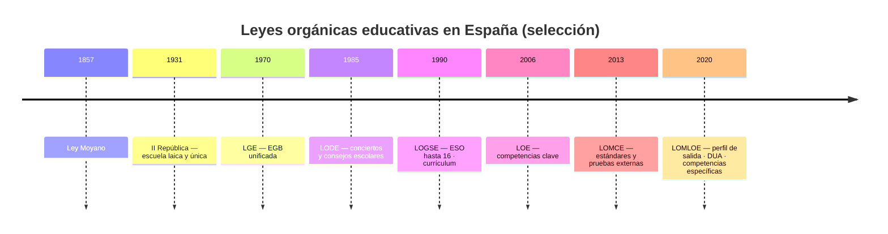
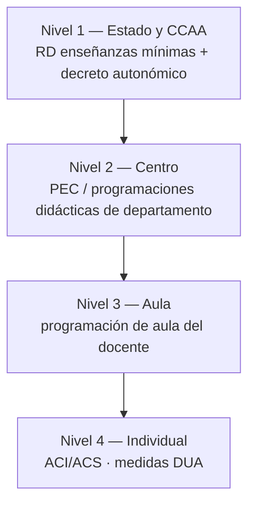
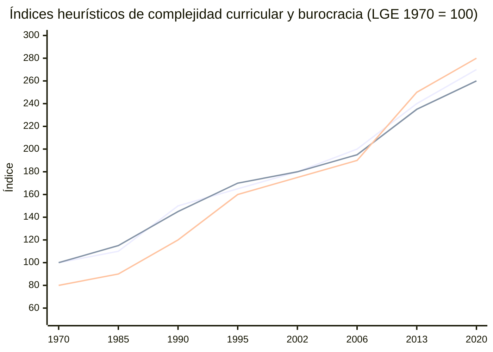

# Tema 1: Evolución histórica del Sistema Educativo Español desde sus referencias legislativas y la didáctica contemporánea

> **Nota de restauración:** este archivo se regenera con el contenido completo del tema y los diagramas Mermaid de la Fase 1 (cronología de leyes y niveles de concreción). Si faltara algún detalle, recuperar el commit anterior a PLACEHOLDER.

## Índice
1. [Introducción y Marco Teórico](#introducción-y-marco-teórico)
2. [Teorías de la Organización Escolar y Paradigmas Educativos](#1-teorías-de-la-organización-escolar-y-paradigmas-educativos)
3. [Teorías del Currículum y su Evolución](#2-teorías-del-currículum-y-su-evolución)
4. [Evolución Histórica del Sistema Educativo Español](#3-evolución-histórica-del-sistema-educativo-español)
5. [Resumen Comparativo de las Leyes Orgánicas](#4-resumen-comparativo-de-las-leyes-orgánicas-educativas-en-españa)
6. [Organización del Sistema Educativo en el Estado de las Autonomías](#5-organización-del-sistema-educativo-en-el-estado-de-las-autonomías)
7. [Implicaciones para la enseñanza de las Matemáticas](#6-implicaciones-para-la-enseñanza-de-las-matemáticas)
8. [Burocratización del trabajo docente: evolución histórica](#7-burocratización-del-trabajo-docente-evolución-histórica-y-hiperregulación)
9. [Bibliografía de Referencia](#bibliografía-de-referencia)

---

## Introducción y Marco Teórico

El análisis de la historia de la educación en España exige comprender cómo han interactuado legislación, estructuras sociopolíticas y teorías didácticas. Para el futuro profesorado de Matemáticas, este tema permite interpretar el currículo actual (competencias específicas, saberes básicos, DUA, Perfil de salida).

---

## 1. Teorías de la Organización Escolar y Paradigmas Educativos

### 1.1. Paradigma Racional-Tecnológico (Positivista)
Realidad objetiva; predecir y controlar; metodología cuantitativa; escuela como organización burocrática (Taylor, Tyler).

**Matemáticas:** objetivos medibles, algoritmos, evaluación estandarizada.

### 1.2. Paradigma Interpretativo-Simbólico
Realidad construida; comprender significados; metodología cualitativa (Schwab, Stenhouse).

**Matemáticas:** problemas contextualizados, proceso de razonamiento, evaluación formativa.

### 1.3. Paradigma Socio-Crítico
Realidad mediada por poder e ideología; transformar hacia la equidad (Habermas, Freire, Apple, Giroux).

**Matemáticas:** datos de desigualdad, DUA, ciudadanía.

---

## 2. Teorías del Currículum y su Evolución

Currículum = decisiones sobre saberes, organización, metodología y evaluación (Magendzo, 1986). Fuentes: sociología, psicología, pedagogía, epistemología, antropología.

- **Prescriptivo:** plan oficial.
- **Oculto:** aprendizajes implícitos (Apple, 1979).
- El término *currículum* entra en la norma con la **LOGSE (1990)**.

---

## 3. Evolución Histórica del Sistema Educativo Español

- **Ley Moyano (1857):** primera ley general; centralización; primaria elemental.
- **ILE (1876)** y **II República (1931):** renovación, laicismo, coeducación, consejos escolares.
- **LGE (1970):** EGB hasta 14 años; paradigma tecnocrático.
- **Constitución 1978 (art. 27):** derecho a la educación y libertad de enseñanza.
- **LODE (1985):** conciertos y consejos escolares.
- **LOGSE (1990):** ESO hasta 16; constructivismo; atención a la diversidad.
- **LOE (2006):** competencias clave.
- **LOMCE (2013):** estándares y pruebas externas.
- **LOMLOE (2020):** Perfil de salida, competencias específicas, DUA, inclusión.

---

## 4. Resumen Comparativo de las Leyes Orgánicas Educativas en España

| Ley / Referencia | Año | Paradigma Dominante | Hitos clave |
| :--- | :--- | :--- | :--- |
| **Ley Moyano** | 1857 | Positivista / Burocrático | Primera ley general |
| **II República** | 1931 | Interpretativo / Crítico | Escuela laica y única |
| **LGE** | 1970 | Tecnocrático / Racional | EGB unificada |
| **LODE** | 1985 | Participativo | Conciertos y consejos |
| **LOGSE** | 1990 | Interpretativo-Constructivista | ESO hasta 16; currículum |
| **LOE** | 2006 | Competencial | Competencias clave |
| **LOMCE** | 2013 | Eficacia / Control | Estándares; pruebas externas |
| **LOMLOE** | 2020 | Socio-Crítico / Inclusivo | Perfil de salida; DUA |

*Figura. Cronología orientativa de las principales leyes orgánicas educativas.*

---

## 5. Organización del Sistema Educativo en el Estado de las Autonomías

### 5.1. Reparto de Competencias (Art. 149.1.30 CE)

- **Estado:** ordenación general; enseñanzas mínimas (**50 %** con lengua cooficial; **60 %** sin ella, según RD de desarrollo LOMLOE).
- **CCAA:** desarrollo curricular y gestión de centros.
- **Municipios:** conservación de centros de infantil y primaria; escolarización.

### 5.2. Niveles de Concreción Curricular

*Figura. Cuatro niveles de concreción curricular (de lo general a lo individual).*

1. **Primer Nivel (Estado y CCAA):** RD de enseñanzas mínimas y decretos autonómicos.
2. **Segundo Nivel (Centro):** PEC y programaciones didácticas.
3. **Tercer Nivel (Aula):** programación de aula.
4. **Cuarto Nivel (Individual):** ACI/ACS y medidas DUA.

**Ejemplo (Matemáticas 3.º ESO, Aragón):** RD 217/2022 + decreto autonómico → programación de departamento → programación de aula → ACI/DUA si procede.

---

## 6. Implicaciones para la enseñanza de las Matemáticas

| Paradigma | Enfoque en el aula | Evaluación |
| :--- | :--- | :--- |
| **Racional-Tecnológico** | Algoritmos, objetivos medibles | Pruebas objetivas |
| **Interpretativo** | Significados, cooperación | Formativa, proceso |
| **Socio-Crítico** | Justicia social, DUA, datos reales | Inclusiva, proyectos |

La LOMLOE exige situaciones de aprendizaje competenciales, DUA y evaluación formativa e inclusiva.

---

## 7. Burocratización del trabajo docente: evolución histórica e hiperregulación

> Análisis sintético. Versión completa: [materiales/burocratizacion-trabajo-docente-analisis-historico.md](../materiales/burocratizacion-trabajo-docente-analisis-historico.md).

### 7.1. Índices heurísticos (LGE 1970 = 100)

| Reforma | Año | Complejidad curricular* | Exigencia burocrática* | Trazabilidad* |
|---------|------|-------------------------|------------------------|---------------|
| LGE | 1970 | 100 | 100 | 80 |
| LOGSE | 1990 | 150 | 145 | 120 |
| LOE | 2006 | 200 | 195 | 190 |
| LOMCE | 2013 | 240 | 235 | 250 |
| LOMLOE | 2020 | 270 | 260 | 280 |

\* Índices orientativos, no estadísticas oficiales.

### 7.2. Evolución visual de la carga burocrática

### 7.3. Tres grandes etapas

| Periodo | Complejidad | Modelo |
|---------|-------------|--------|
| 1970–1985 | Baja | Profesor ejecutor/adaptador |
| 1990–2006 | Media-alta | Profesor diseñador curricular |
| 2013–2020 | Muy alta | Profesor gestor del sistema competencial |

### 7.5. Paradoja de la autonomía
Más autonomía curricular puede generar más carga documental (competencia → criterio → saber → situación → evidencia).

---

## Bibliografía de Referencia

- Apple, M. W. (1979). *Ideology and Curriculum*.
- Coll, C., y Martín, E. (2021). La LOMLOE: una oportunidad para la modernización curricular.
- Freire, P. (1970). *Pedagogía del oprimido*.
- Real Decreto 217/2022 (ESO); Real Decreto 157/2022 (Primaria).
- Sáez, R. (2005). Bases metodológicas de la investigación educativa y paradigmas.

> **Importante:** la versión extensa previa del Tema 1 (paradigmas detallados, franquismo, ILE, etc.) está en el historial de git del repositorio (commits anteriores a la restauración). Si se necesita el texto íntegro original, recuperarlo desde el historial o desde la copia local de trabajo.
