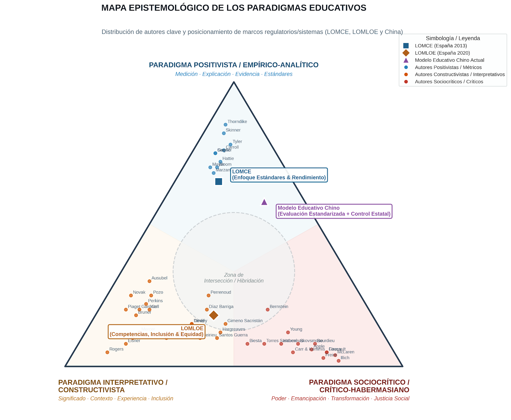

# Mapa epistemológico de los paradigmas educativos

**Asignatura:** Procesos y contextos educativos — Tema 1 (evolución del sistema y paradigmas).  
**Uso:** situar autores, LOMCE, LOMLOE y el modelo educativo chino en un mismo triángulo epistemológico (orientativo, no métrico).

*Distribución cualitativa de autores clave y posicionamiento de marcos regulatorios (LOMCE, LOMLOE) y del modelo chino actual. La posición de cada autor es una codificación orientativa, no una medición científica de sus teorías.*

---

## 1. Geometría del mapa

Tres vértices (paradigmas clásicos de investigación educativa):

| Vértice | Énfasis |
|---------|--------|
| **Positivista / empírico-analítico** | Medición · explicación · evidencia · estándares |
| **Interpretativo / constructivista** | Significado · contexto · experiencia · inclusión |
| **Sociocrítico / crítico-habermasiano** | Poder · emancipación · transformación · justicia social |

En el centro aparece una **zona de intersección / hibridación**: la mayor parte de los autores educativos no ocupan un vértice puro, sino franjas intermedias. Eso refuerza que los paradigmas funcionan mejor como **orientaciones epistemológicas** que como categorías cerradas.

---

## 2. Cómo leer el mapa (y qué no es)

- Es un **mapa epistemológico**, no una taxonomía rígida ni un ranking de “calidad” de autores.
- La colocación de cada nombre es **cualitativa** (lectura de la conversación formativa del Máster y de las tradiciones habituales en manuales de paradigmas).
- Autores “fronterizos” (p. ej. entre constructivismo y crítica, o entre evidencia y significado) son pedagógicamente los más interesantes: muestran hibridación real del campo.
- Un mismo autor puede desplazarse según la obra o el periodo; el punto resume una tendencia dominante de uso en formación del profesorado.

---

## 3. LOMCE, LOMLOE y modelo chino sobre el triángulo

Ninguno de los tres sistemas coincide con un vértice puro. Esa es precisamente la utilidad del gráfico.

| Modelo | Tendencia dominante | Lectura en el triángulo |
|--------|---------------------|-------------------------|
| **LOMCE** (España 2013) | Empírico-analítica | Más próxima al vértice positivista: estándares de aprendizaje evaluables, evaluaciones externas, comparabilidad y énfasis en rendimiento |
| **LOMLOE** (España 2020) | Interpretativa + sociocrítica (con restos de regulación por estándares) | Más hacia la zona central / lado interpretativo–inclusivo: competencias, inclusión, atención a la diversidad, dimensión social; **sin** abandonar del todo evaluación y estándares |
| **China actual** | Empírico-analítica + fuerte dirección institucional | Cerca del positivismo (evaluación estandarizada, control de resultados), con desplazamiento hacia la dimensión **sociopolítica / estatal** — no confundir con sociocrítica emancipadora |

### Matices importantes

**LOMCE.** La proximidad al polo empírico-analítico tiene respaldo textual: estándares evaluables, refuerzo de evaluaciones externas, búsqueda de objetividad y normalización de resultados.

**LOMLOE.** Acento explícito en inclusión, personalización y competencias; sigue incorporando evaluación y estándares. **No** es puramente interpretativa ni puramente sociocrítica.

**China.** No debe etiquetarse como “sociocrítica” solo por la fuerte intervención estatal. En autores como Freire, Bourdieu o Skovsmose, lo sociocrítico implica **analizar críticamente las relaciones de poder y orientar hacia la emancipación**. El sistema chino combina orientación nacional/estatal y tradición de evaluación competitiva; reformas recientes también introducen aprendizaje por proyectos, problemas contextualizados, pensamiento crítico y evaluación más integral. En el mapa: positivismo + control institucional, no emancipación crítica al estilo Freire.

---

## 4. Relación con otros materiales del repo

| Recurso | Relación |
|---------|----------|
| [Apunte Tema 1 — paradigmas y leyes](../apuntes/01-evolucion-historica-sistema-educativo-paradigmas.md) | Síntesis operativa de paradigmas y tabla de leyes |
| [Leyes educativas](leyes-educativas/) | Fichas LOECE→LOMLOE (sección paradigmas en cada una) |
| [Comparativa PISA 2025](leyes-educativas/comparativa-pisa-2025-y-sistemas-internacionales.md) | China y sistemas de alto rendimiento frente a España |
| [Comparativa de paradigmas en una tarea de mates](comparativa-paradigmas-tarea-matematicas.md) | Aplicación concreta al aula de Matemáticas |
| [Autores-pensadores](../../../09-bibliografia/autores-pensadores/) | Fichas individuales (Freire, Illich, Piaget, Skinner, etc.) |

---

## 5. Uso sugerido en el Máster

1. **Tema 1:** partir del triángulo antes de memorizar definiciones de paradigma.
2. **Debate LOMCE/LOMLOE:** situar cada ley en el mapa y discutir qué elementos de cada vértice conserva el aula de Matemáticas.
3. **Comparación internacional:** contrastar con PISA 2025 y el matiz China ≠ sociocrítica emancipadora.
4. **TFM / idea 16:** el margen docente se mueve dentro de un marco ya híbrido; el mapa ayuda a no reducir la LOMLOE a un solo eslogan.

---

## 6. Limitaciones y mejora editorial

- Densidad de nombres en algunas zonas: en versiones futuras se puede priorizar un subconjunto “núcleo Máster”.
- El mapa **no sustituye** la lectura de las leyes ni de los autores; orienta la conversación.
- Codificación **cualitativa**: no es una medición métrica de las teorías.

---

## Archivo gráfico

- [`img/mapa_epistemologico_modelos_educativos.png`](img/mapa_epistemologico_modelos_educativos.png) — mapa principal (autores + LOMCE / LOMLOE / China).

Fuente de trabajo: mapa generado en el proceso formativo del repositorio (codificación cualitativa de autores y marcos).
