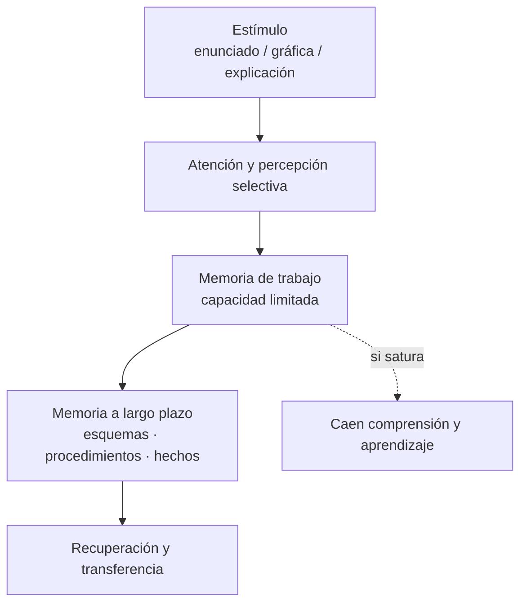

# Tema 4 · Procesamiento de la información y teorías cognoscitivas

**Asignatura:** Psicología del desarrollo y de la educación  
**Programa:** [tema 4](../programa.md)

---

## 1. Del conductismo a la mente que procesa

Las teorías **cognoscitivas** se interesan por lo que ocurre *entre* el estímulo y la respuesta: atención, memoria, esquemas, estrategias. En Matemáticas explican por qué dos alumnos oyen la misma explicación y construyen significados distintos.

---

## 2. Procesamiento de la información (modelo útil en el aula)

*Figura. Modelo simplificado de procesamiento de la información (útil para diseñar tareas de Matemáticas).*

| Componente | Implicación didáctica |
|------------|----------------------|
| **Atención** | Enunciados claros; menos ruido irrelevante; metas de la tarea explícitas |
| **Memoria de trabajo** | No sobrecargar con demasiados pasos nuevos a la vez; andamiaje; representaciones externas (tabla, esquema) |
| **Carga cognitiva** | Separar lo novel de lo automatizado; practicar hasta liberar recursos para el razonamiento |
| **Transferencia** | Variar contextos; pedir “¿en qué se parece a…?” |

---

## 2.1. Carga cognitiva (ampliación)

La **carga cognitiva** es la demanda que una tarea impone sobre la capacidad limitada de la memoria de trabajo. Si la supera, caen la comprensión, el rendimiento y la adquisición de lo nuevo.

| Tipo de carga | Significado | Qué hacer |
|---------------|-------------|----------|
| **Intrínseca** | Complejidad del propio contenido | Graduar y secuenciar; no eliminar el reto necesario |
| **Extrínseca** | Dificultad por una mala presentación | Clarificar consignas; quitar ruido |
| **Germana** | Esfuerzo útil para construir esquemas | Conectar con lo previo; reflexionar la estrategia |

**Idea clave:** reducir carga no es “bajar el nivel del currículo”, sino no gastar la memoria de trabajo en lo innecesario.

Ejemplos de ecuación $2(x+3)=14$ y de fracciones, checklist de diseño y formulación de examen:  
→ **[Material: carga cognitiva en Matemáticas](../materiales/carga-cognitiva-matematicas.md)**

---

## 3. Teorías cognoscitivas de referencia

| Enfoque | Idea central | Eco en Matemáticas |
|---------|--------------|---------------------|
| **Piaget** | Construcción por asimilación/acomodación; estadios | Manipulación y conflicto cognitivo; no solo transmisión |
| **Vygotsky** | Mediación social; ZDP | Andamiaje, lenguaje, pares |
| **Bruner** | Representaciones enactiva → icónica → simbólica; andamiaje | Secuencia concreto-pictórico-abstracto (CPA) |
| **Procesamiento de la información** | Límites de la memoria de trabajo; esquemas | Diseño de tareas y carga cognitiva |

---

## 4. Zona de desarrollo próximo y andamiaje

La **ZDP** (Vygotsky) es la distancia entre lo que el alumno puede hacer solo y lo que puede hacer con la ayuda de un mediador más experto (profesor o compañero).

El **andamiaje** (Bruner) es la ayuda temporal y ajustada que se retira progresivamente cuando el alumno gana autonomía.

→ **[Material: ZDP y andamiaje en Matemáticas](../materiales/zdp-andamiaje-matematicas.md)**

---

## 5. Puntos críticos de revisión (errores comunes)

| Error común | Corrección |
|-------------|------------|
| Confundir la **ZDP** con el “trabajo en equipo” sin mediación | La ZDP exige la **intervención activa de un mediador** (profesor o compañero más aventajado) mediante andamiaje, desvaneciendo progresivamente la ayuda. El grupo solo no garantiza aprendizaje en la ZDP. |
| Ignorar la limitación de la **memoria de trabajo** al diseñar problemas complejos | Diferenciar carga **intrínseca**, **extrínseca** y **germana**. Minimizar la extrínseca (consignas confusas, ruido visual, demasiados pasos simultáneos) y descomponer en pasos. |
| Pensar que “reducir carga cognitiva” = bajar el nivel del currículo | Se reduce sobre todo la carga *extrínseca* y se gestiona la intrínseca por secuenciación; la germana (construir esquemas) debe mantenerse. |
| Tratar el andamiaje como ayuda permanente | El andamiaje es **temporal**: se retira cuando el alumno puede transferir. Si no se retira, genera dependencia. |

---

## 6. Preguntas de repaso

1. Explica con un ejemplo de fracciones la diferencia entre carga intrínseca, extrínseca y germana.  
2. ¿Por qué “poner a los alumnos a trabajar en grupo” no equivale automáticamente a trabajar en la **zona de desarrollo próximo (ZDP)**?  
3. Diseña un andamiaje breve para la resolución de una ecuación de primer grado.

---

## Material relacionado

- **[Carga cognitiva en Matemáticas](../materiales/carga-cognitiva-matematicas.md)**  
- **[ZDP y andamiaje](../materiales/zdp-andamiaje-matematicas.md)**  
- [Tema 1 — Desarrollo en la adolescencia](01-desarrollo-adolescencia.md)  
- [Tema 5 — Motivación](05-motivacion-ensenanza-aprendizaje.md)  
