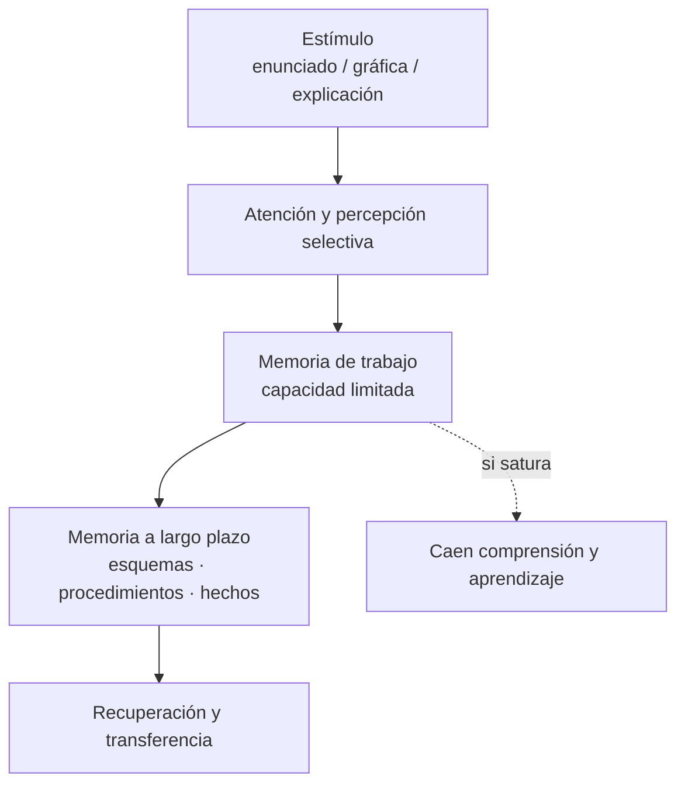

# Tema 4 · Procesamiento de la información y teorías cognoscitivas

**Asignatura:** Psicología del desarrollo y de la educación  
**Programa:** [tema 4](../programa.md)

**Viene de:** [Tema 3 — Conducta](03-teorias-conductuales-modificacion-conducta.md) · [Tema 2 — Diferencias](02-diferencias-individuales-problemas-adolescencia.md)  
**Continúa en:** [Tema 5 — Motivación](05-motivacion-ensenanza-aprendizaje.md)

> Este tema explica **cómo se procesa y se construye** el conocimiento matemático. Complementa al conductismo (hábitos y consecuencias) y prepara el terreno de la motivación (por qué se persiste o se evita).

---

## Por dónde leer (mapa del tema)

| Paso | Recurso | Para qué |
|------|---------|----------|
| **1** | Este apunte | Modelo de procesamiento, teorías, ZDP, FE, práctica |
| **2** | [Carga cognitiva](../materiales/carga-cognitiva-matematicas.md) | Intrínseca / extrínseca / germana; ejemplos |
| **3** | [ZDP y andamiaje](../materiales/zdp-andamiaje-matematicas.md) | Escalera de ayuda; retirada |
| **4** | [Funciones ejecutivas](../materiales/funciones-ejecutivas-matematicas.md) | Inhibición, planificación, flexibilidad |
| **5** | [Memoria, práctica y transferencia](../materiales/memoria-practica-transferencia-matematicas.md) | Recuperación, espaciado, intercalado |
| **6** | [Evidencia en psicología educativa](../materiales/evidencia-psicologia-educativa.md) | Qué está mejor apoyado; neuromitos |
| **7** | [Gestión del error](../materiales/gestion-del-error-matematicas.md) | Error como información para el esquema |
| **8** | [Tareas multinivel](../materiales/diseno-tareas-multinivel-matematicas.md) · [DUA](../../procesos-y-contextos-educativos/materiales/dua-diseno-universal-aprendizaje.md) | Mismo objetivo, distinto andamiaje |

---

## 1. Del conductismo a la mente que procesa

El Tema 3 se centra en **conductas observables** y consecuencias. Las teorías **cognoscitivas** se interesan por lo que ocurre *entre* el estímulo y la respuesta: atención, memoria de trabajo, esquemas, estrategias, mediación social.

En Matemáticas eso explica por qué dos alumnos oyen la misma explicación y construyen significados distintos: no solo “prestan más o menos atención”, sino que activan (o no) esquemas previos, saturan (o no) la memoria de trabajo y disponen (o no) de estrategias de control.

| Enfoque | Pregunta típica | Limitación si se usa solo |
|---------|-----------------|---------------------------|
| Conductual | ¿Qué refuerza esta conducta? | No explica la comprensión del concepto |
| Cognoscitivo | ¿Qué procesa y cómo lo organiza? | Puede olvidar clima, motivación y contexto social |

---

Esta evolución hacia el paradigma cognitivo-constructivista implica un giro desde la conducta externa hacia los procesos internos. Piaget fundamenta este cambio mediante los mecanismos de asimilación, acomodación y equilibrio, estructurando el desarrollo en estadios (sensoriomotor, preoperacional, operaciones concretas y formales). Por su parte, Ausubel enfatiza el aprendizaje significativo, donde los nuevos contenidos se vinculan de forma no arbitraria con los conocimientos previos a través de inclusores y organizadores. Bruner complementa esta visión con el aprendizaje por descubrimiento y el concepto de andamiaje, destacando la curiosidad y la competencia como motivos innatos del aprendiz. Finalmente, el constructivismo se ramifica en la vertiente cognitiva, centrada en el conflicto cognitivo, y la social, que prioriza el diálogo y la mediación.

## 2. Procesamiento de la información (modelo de aula)

```mermaid
flowchart TB
  E[Estímulo<br/>enunciado / gráfica / explicación] --> A[Atención y percepción selectiva]
  A --> MT[Memoria de trabajo<br/>capacidad limitada]
  MT --> MLP[Memoria a largo plazo<br/>esquemas · procedimientos · hechos]
  MLP --> R[Recuperación y transferencia]
  MT -.->|si satura| X[Caen comprensión y aprendizaje]
```

*Figura. Modelo simplificado de procesamiento de la información (útil para diseñar tareas de Matemáticas).*

| Componente | Implicación didáctica |
|------------|----------------------|
| **Atención** | Enunciados claros; menos ruido irrelevante; meta de la tarea explícita |
| **Memoria de trabajo** | No sobrecargar con demasiados pasos nuevos a la vez; andamiaje; representaciones externas (tabla, esquema) |
| **Memoria a largo plazo** | Construir esquemas (no solo hechos sueltos); conectar con lo previo |
| **Recuperación** | Practicar evocar, no solo re-leer; variar contextos |
| **Transferencia** | “¿En qué se parece a…?”; problemas isomorfos con distinta superficie |

**Idea clave:** comprender en el momento de la explicación **no garantiza** que el esquema quede disponible la semana siguiente. Entre la memoria de trabajo y el aprendizaje duradero hacen falta codificación, consolidación y **práctica de recuperación**.

---

El procesamiento sigue una secuencia lógica: recepción, selección, interpretación, almacenamiento y recuperación. En este proceso, la **atención** es clave para seleccionar y mantener el foco, mientras que la **memoria** gestiona la codificación, consolidación y recuperación de la información. Con el desarrollo adolescente, el procesamiento se vuelve más planificado y eficaz. Ante las demandas del aula, el docente puede gestionar las corrientes atencionales y los modos de reacción (reactivo o proactivo) para combatir la fatiga mediante el movimiento, el cambio de actividades, el uso del humor, la sorpresa, el trabajo en parejas o grupos, y la implementación de momentos de «enseñanza desconectada».

## 3. Carga cognitiva

La **carga cognitiva** es la demanda que una tarea impone sobre la capacidad limitada de la memoria de trabajo. Si la supera, caen la comprensión, el rendimiento y la adquisición de lo nuevo.

| Tipo de carga | Significado | Qué hacer |
|---------------|-------------|----------|
| **Intrínseca** | Complejidad del propio contenido (elementos e interacciones) | Graduar y secuenciar; no eliminar el reto necesario |
| **Extrínseca** | Dificultad por mala presentación o ruido | Clarificar consignas; quitar datos irrelevantes al inicio |
| **Germana** | Esfuerzo útil para construir esquemas | Conectar con lo previo; reflexionar la estrategia |

**Reducir carga no es “bajar el nivel del currículo”**, sino no gastar la memoria de trabajo en lo innecesario para poder dedicarla a comprender.

**Ejemplo rápido:** resolver $2(x+3)=14$ es baja carga si las operaciones y la idea de ecuación están automatizadas; es alta carga si a la vez se están construyendo paréntesis, igualdad, enteros y la secuencia de pasos.

→ Detalle y más ejemplos: **[Carga cognitiva en Matemáticas](../materiales/carga-cognitiva-matematicas.md)**

---

## 4. Teorías cognoscitivas de referencia

| Enfoque | Idea central | Eco en Matemáticas | Precaución |
|---------|--------------|---------------------|------------|
| **Piaget** | Construcción por estadios; operaciones formales | Potencial de abstracción en ESO/Bachillerato | No asumir pensamiento formal uniforme ni automático |
| **Vygotsky** | Mediación social; ZDP; lenguaje | Ayuda temporal de docente o iguales más expertos | ZDP ≠ “poner en grupo” sin mediación |
| **Bruner** | Modos de representación; andamiaje; currículo en espiral | Revisitar conceptos con más formalización | La espiral exige plan, no solo repetir lo mismo |
| **Ausubel** | Aprendizaje significativo vs. memorístico | Anclar lo nuevo en esquemas previos (organizadores) | Significativo no es “solo descubrir sin guía” |

### 4.1. Piaget en el aula de mates (recordatorio del Tema 1)

El pensamiento formal (hipotético-deductivo) **no** aparece de golpe ni en todos los dominios a la vez. Un alumno puede razonar con soltura en geometría visual y bloquearse en álgebra simbólica. El error frecuente es tratar el “estadio” como etiqueta fija del alumno.

### 4.2. Ausubel: significativo vs. memorístico

| Aprendizaje | Rasgo | Riesgo en mates |
|-------------|-------|-----------------|
| **Memorístico** | Se retiene poco conectado a esquemas previos | Procedimientos frágiles; olvido rápido |
| **Significativo** | Se integra en la estructura cognitiva existente | Requiere activar lo previo y dar sentido |

Activar lo previo (pregunta, problema ancla, organizador breve) no es “perder tiempo”: es condición de aprendizaje duradero.

### 4.3. Bruner: representaciones y espiral

Secuencia orientativa de representaciones: **enactiva** (hacer) → **icónica** (imagen, diagrama) → **simbólica** (notación). En Secundaria se puede entrar por distintos puntos, pero saltar demasiado pronto a lo solo simbólico satura a quien aún no tiene el esquema.

El **currículo en espiral** revisita ideas con más profundidad (p. ej. proporcionalidad en 1.º, 2.º, 3.º ESO con lenguajes cada vez más formales).

---

## 5. Zona de desarrollo próximo y andamiaje

### 5.1. Tres niveles

| Nivel | Qué puede hacer el alumno |
|-------|---------------------------|
| **Real / actual** | Solo, sin ayuda |
| **ZDP** | Con mediación (docente, par, material, pistas) |
| **Más allá** | Ni siquiera con ayuda razonable *hoy* |

Enseñar solo en el nivel actual aburre; solo más allá genera ansiedad y abandono. El trabajo fértil está en la **ZDP**.

### 5.2. Andamiaje: principios

1. **Ajuste:** la ayuda es la mínima necesaria.  
2. **Temporalidad:** se retira cuando aparece autonomía.  
3. **Foco:** sobre la estrategia o el significado, no solo el resultado.  
4. **Mediación:** preguntas, representaciones, modelos parciales, trabajo con pares.

Andamiaje ≠ “dárselo hecho” ni “bajar el criterio para siempre”.

### 5.3. Escalera de ayuda (síntesis)

| Escalón | Qué hace el docente |
|---------|---------------------|
| 0 | Consigna clara + tiempo de lucha productiva |
| 1 | Pregunta metacognitiva (“¿qué te piden?”) |
| 2 | Pista de representación (tabla, recta, esquema) |
| 3 | Modelo parcial (primer paso; el resto el alumno) |
| 4 | Co-resolución guiada |
| 5 | Mini-lección del esquema + ítem paralelo |

Regla: subir de escalón solo si el anterior no bastó; bajar en cuanto el alumno avance.

→ Ficha completa: **[ZDP y andamiaje](../materiales/zdp-andamiaje-matematicas.md)**

---

## 6. Funciones ejecutivas y diseño de problemas

Las **funciones ejecutivas** (inhibición, memoria de trabajo, flexibilidad, planificación) siguen madurando en la adolescencia y se apoyan con **diseño**, no solo con “concéntrate más”.

| Función | Ejemplo en mates | Ajuste de aula |
|---------|------------------|----------------|
| **Inhibición** | No lanzarse al primer número del enunciado | “Subraya la pregunta; lista lo que piden” |
| **Memoria de trabajo** | Mantener datos mientras se opera | Tabla de datos; menos pasos nuevos a la vez |
| **Flexibilidad** | Cambiar de estrategia si una vía falla | Comparar dos métodos; “¿otra representación?” |
| **Planificación** | Ordenar submetas en un problema rico | Datos → plan → resolución → revisión |

Perfiles de TDAH u otras neurodivergencias suelen requerir más andamiaje **externo** de estas funciones (Tema 2).

→ **[Funciones ejecutivas](../materiales/funciones-ejecutivas-matematicas.md)** · [Neurodivergencia](../materiales/neurodivergencia-aula-matematicas.md)

---

## 7. Memoria, práctica y transferencia

### 7.1. Del “lo entendí en clase” al aprendizaje duradero

| Práctica | Idea | Matemáticas |
|----------|------|-------------|
| **Recuperación** | Evocar sin mirar la solución | Cerrar el cuaderno; intentar; corregir el error |
| **Espaciada** | Distribuir repasos en el tiempo | Calentamiento con ítems de semanas anteriores |
| **Intercalada** | Alternar tipos de problemas | Mezclar formatos, no 20 clones seguidos |
| **Ejemplos resueltos → incompletos → autónomos** | De la explicación a la autonomía | Modelado → huecos → práctica sola |
| **Acumulativa** | Volver a lo “ya dado” | Mini-pruebas que incluyen unidades previas |

### 7.2. Transferencia

| Tipo | Idea | Ejemplo |
|------|------|--------|
| **Cercana** | Mismo principio, formato parecido | Otra ecuación del mismo tipo |
| **Lejana** | Otro contexto o representación | De la ecuación al problema verbal o a la gráfica |

Sin variación, el éxito en el libro no implica éxito en un problema nuevo.

### 7.3. Instrucción guiada y descubrimiento

Para **novatos**, el ejemplo resuelto y la práctica guiada suelen reducir carga extrínseca frente al descubrimiento sin orientación. El problema abierto gana valor cuando hay **esquemas previos**. No identificar enseñanza explícita con “solo memorizar”, ni descubrimiento con aprendizaje automático.

→ **[Memoria, práctica y transferencia](../materiales/memoria-practica-transferencia-matematicas.md)** · [Evidencia](../materiales/evidencia-psicologia-educativa.md)

---

## 8. Error, esquemas y feedback (puente)

El error no es solo “fallo de conducta”: es información sobre el **esquema** que el alumno está usando. Gestionarlo bien (sin ridículo, con foco en estrategia) alimenta la carga germana y protege la identidad académica (Temas 1–2 y 5).

→ [Gestión del error](../materiales/gestion-del-error-matematicas.md) · [Feedback efectivo](../materiales/feedback-efectivo-matematicas.md)

---

## 9. Ejemplo integrado de aula

**Situación:** 3.º ESO. Primera sesión de sistemas de ecuaciones (sustitución). La docente explica en la pizarra un ejemplo completo, reparte 10 sistemas idénticos en estructura y pide trabajo individual en silencio. A los diez minutos, un tercio de la clase está bloqueado; varios copian del compañero; dos abandonan y hablan.

| Lectura cognitiva | Ajuste |
|-------------------|--------|
| **Carga intrínseca alta** (nuevo método + álgebra + dos ecuaciones) | Secuenciar: un sistema ya “montado” con un solo paso nuevo |
| **Carga extrínseca** (enunciados densos, sin tabla de datos) | Extraer datos; plantilla datos → plan → resolución |
| **Poca activación de lo previo** | Calentamiento: despejar en una ecuación |
| **Solo práctica masiva de clones** | Tras 3 ítems guiados, variar un contexto (problema breve) |
| **Andamiaje binario** (todo o nada) | Escalera: pregunta → pista de despeje → modelo del primer despeje |
| **Conducta de abandono** (Tema 3) | Puede ser evitación por saturación; moldear el primer paso, no resolver por ellos |

**Diseño alternativo (esbozo):** (1) recuperación de despejar; (2) ejemplo resuelto comentado; (3) ejemplo incompleto; (4) un sistema en pareja con checklist; (5) un ítem individual; (6) cierre con “¿qué harías si…?” (flexibilidad).

---

## 10. Puntos críticos de revisión (errores comunes)

| Error común | Corrección |
|-------------|------------|
| Confundir la **ZDP** con el “trabajo en equipo” sin mediación | La ZDP exige **mediador** y andamiaje que se retira |
| Ignorar la **memoria de trabajo** al diseñar problemas | Diferenciar carga intrínseca / extrínseca / germana |
| “Reducir carga” = bajar el nivel del currículo | Se reduce sobre todo la *extrínseca*; se secuencia la intrínseca |
| Andamiaje permanente | Es **temporal**; si no se retira, genera dependencia |
| “No tiene funciones ejecutivas” como etiqueta | Observar barreras, diseñar apoyos, coordinar; no diagnosticar |
| “Si lo entendió en clase, ya está aprendido” | Hace falta **recuperación** y práctica **espaciada** |
| Solo ejercicios idénticos al ejemplo | Mejora el rendimiento inmediato; debilita la **transferencia** |
| Descubrimiento sin guía para novatos | Suele saturar; mejor ejemplo resuelto → autonomía progresiva |

---

## 11. Checklist de observación (practicum)

- [ ] ¿Cuántos elementos *nuevos* introduce a la vez la tarea?  
- [ ] ¿Hay ruido en el enunciado (carga extrínseca)?  
- [ ] ¿Se activa lo previo antes de lo nuevo?  
- [ ] ¿Qué escalón de andamiaje se usa y se retira?  
- [ ] ¿La práctica es solo masiva de clones o hay intercalado/espaciado?  
- [ ] ¿Se pide recuperación (evocar) o solo re-lectura del cuaderno?  
- [ ] ¿El error se usa para ajustar el esquema o solo para puntuar?

---

## 12. Actividades orientativas

1. Explica con un ejemplo de fracciones la diferencia entre carga intrínseca, extrínseca y germana.  
2. ¿Por qué “poner a trabajar en grupo” no equivale automáticamente a trabajar en la ZDP?  
3. Diseña un andamiaje breve (escalera) para una ecuación de primer grado.  
4. Pon un ejemplo de apoyo a la **planificación** o a la **inhibición** en un problema multi-paso.  
5. Diseña un calentamiento de 5 minutos con **práctica de recuperación** e **intercalado** de un tema de hace dos semanas.  
6. Diferencia transferencia cercana y lejana con un ejemplo de funciones o ecuaciones.  
7. Reescribe una tarea “todo o nada” en secuencia ejemplo resuelto → incompleto → autónomo.

---

## 13. Conceptos para repasar

| Concepto | Idea clave |
|----------|------------|
| Memoria de trabajo | Capacidad limitada; cuello de botella del aprendizaje |
| Carga intrínseca / extrínseca / germana | Complejidad del contenido / ruido de presentación / esfuerzo útil de esquema |
| ZDP | Lo que se puede hacer con mediación y aún no en solitario |
| Andamiaje | Ayuda temporal, ajustada y retirable |
| Funciones ejecutivas | Inhibición, flexibilidad, planificación (+ MT) |
| Práctica de recuperación | Evocar para consolidar |
| Espaciado / intercalado | Distribuir en el tiempo / mezclar tipos |
| Transferencia | Aplicar el principio en formato o contexto nuevo |
| Aprendizaje significativo (Ausubel) | Integrar lo nuevo en esquemas previos |

---

## 14. Relación con otros temas y asignaturas

| Tema / material | Relación |
|-----------------|----------|
| Tema 1 | Pensamiento formal; no etiquetar estadios |
| Tema 2 | FE, neurodivergencia, ansiedad como saturación |
| Tema 3 | Abandono y evitación tras saturación; moldeado del inicio |
| Tema 5 | Competencia percibida tras tareas bien dimensionadas |
| Diseño curricular | Exigencia cognitiva de SA y problemas |
| Procesos · DUA | Representaciones múltiples = menos confusión lengua/capacidad |

---

## Material relacionado

- **[Carga cognitiva en Matemáticas](../materiales/carga-cognitiva-matematicas.md)**  
- **[Memoria, práctica y transferencia](../materiales/memoria-practica-transferencia-matematicas.md)**  
- **[ZDP y andamiaje](../materiales/zdp-andamiaje-matematicas.md)**  
- **[Funciones ejecutivas en Matemáticas](../materiales/funciones-ejecutivas-matematicas.md)**  
- **[Evidencia en psicología educativa](../materiales/evidencia-psicologia-educativa.md)**  
- [Gestión del error](../materiales/gestion-del-error-matematicas.md)  
- [Feedback efectivo](../materiales/feedback-efectivo-matematicas.md)  
- [Diseño de tareas multinivel](../materiales/diseno-tareas-multinivel-matematicas.md)  
- [Tema 1 — Desarrollo](01-desarrollo-adolescencia.md)  
- [Tema 5 — Motivación](05-motivacion-ensenanza-aprendizaje.md)

---

*Apunte orientativo para el Máster de Profesorado · especialidad Matemáticas. Complementa la guía docente; no la sustituye.*

<!-- CANONICO_INICIO: sintetico-canonico-psicologia-del-desarrollo-y-de-la-educacion.md::sec-9 -->
## Sincronizado desde el canónico — 9. Procesamiento de la información

> Fuente: `asignaturas/1erTrimestre/psicologia-del-desarrollo-y-de-la-educacion/sinteticos/sintetico-canonico-psicologia-del-desarrollo-y-de-la-educacion.md`

El modelo del procesamiento de la información surge en los años sesenta por dos razones: el descontento con las explicaciones conductistas y el desarrollo de la informática después de la Segunda Guerra Mundial. La analogía entre ordenador y mente resultó muy fértil: ambos recogen información, la procesan, la almacenan, la recuperan y la utilizan cuando hace falta; el cerebro haría las veces de hardware y los procesos mentales las de software. Con este cambio de perspectiva, el vocabulario de la conducta operante, el reforzamiento, la contingencia o la extinción va siendo sustituido por el de procesamiento, codificación, almacenamiento y esquema. El aprendizaje pasa a entenderse como recepción, representación y retención de información en la memoria y como recuperación de esta cuando se necesita. La prueba de Turing —un evaluador que se comunica por teclado con una persona y con una máquina sin saber cuál es cuál— se convirtió en la formulación clásica de esa analogía. En los modelos cognitivos, y más adelante con el constructivismo de los años sesenta y setenta, la persona deja de ser un receptor pasivo: lo que aprende no es una copia de lo que se le transmite, sino una construcción que parte de lo que ya sabe y de la activación de sus propios procesos mentales.

Antes de llegar a la memoria intervienen dos procesos básicos. La **atención** actúa como un filtro que selecciona, en función de la intensidad de los estímulos y de los intereses y motivaciones de cada persona, qué información merece ser procesada; se desconoce si el filtro actúa antes o después de la percepción. Se distingue entre atención **selectiva** (elegir qué estímulos son relevantes e ignorar los demás, como ocurre con el tictac de un reloj que deja de oírse), atención **dividida** (prestar atención a varias cosas a la vez, como escuchar y tomar notas) y atención **sostenida** o vigilancia (mantener el foco durante un tiempo prolongado). La multitarea es un caso especialmente relevante de atención dividida: como la capacidad atencional es limitada, repartirla entre varias tareas interfiere en la relevante y disminuye su eficacia, sobre todo cuando las tareas son simultáneas y complejas; en cambio, combinar tareas simples y automatizadas apenas produce interferencia. En el aula conviene ordenar las instrucciones en secuencias breves, alternar momentos de atención y descanso y no exigir al mismo tiempo escucha, copia y resolución de consignas complejas.

La **percepción** es la atribución de significado a los estímulos captados por los receptores sensoriales: es la puerta de entrada de toda la información y la base de los demás procesos mentales. Su interpretación no es pura, porque intervienen los conocimientos previos, las expectativas y el contexto; un mismo grafema puede leerse como letra o como número según lo que lo rodee. La Psicología de la Gestalt mostró a principios del siglo XX que la percepción no es un caos de formas, colores y líneas, sino que se organiza en totalidades unitarias: se distinguen los estímulos del fondo y se agrupan por proximidad, similitud y cierre. La atención está estrechamente ligada a la emoción: la sorpresa abre la ventana atencional y provoca curiosidad, por lo que introducir novedad e incongruencia en la enseñanza facilita el aprendizaje. En la adolescencia el procesamiento se vuelve más planificado y eficaz, y aparecen corrientes atencionales y dos modos de reacción, reactivo y proactivo. Contra la fatiga atencional ayudan el movimiento de quien enseña, los descansos, la variación de actividades, recursos y disposición, el trabajo en grupos y parejas, la sorpresa y el humor.

La **memoria** es la facultad que permite retener información a lo largo del tiempo y ocupa un lugar central en la explicación del aprendizaje. Dos marcos teóricos la explican. Los modelos **multialmacén** describen un flujo de información por varios almacenes sucesivos —registro sensorial, memoria a corto plazo y memoria a largo plazo—, con transformaciones en cada tránsito; Broadbent (1958) describió las fases de entrada por canales, filtro atencional, procesamiento en la memoria a corto plazo y conservación en la de largo plazo. Los modelos de **niveles de procesamiento** sostienen, en cambio, que no hay almacenes independientes, sino un flujo único cuya retención depende de la profundidad con que se elabora la información: cuanto más profundo es el procesamiento, mejor se recuerda. El grado de intencionalidad, la atención, el análisis, el tipo de tarea y el tiempo dedicado determinan esa profundidad.

| Almacén o proceso | Características | Estrategias didácticas |
|---|---|---|
| Registro sensorial | Información visual (icónica) durante milésimas de segundo y auditiva (ecoica) hasta cuatro segundos | Captar la atención antes de dar la consigna; apoyar lo oral en apoyos visuales |
| Memoria a corto plazo | Capacidad de 7 ± 2 elementos (Miller, 1956) y retención de hasta unos 30 segundos | Agrupamiento y repaso; fragmentar las instrucciones |
| Memoria de trabajo | Parte activa de la memoria a corto plazo donde se procesa lo que se está usando en cada momento | Resolver en voz alta, externalizar pasos y encadenar operaciones |
| Memoria a largo plazo | Capacidad y duración sin límites prácticos; acervo de conocimiento acumulado | Elaboración, imágenes y organización; relacionar con conocimientos previos |

La memoria de trabajo no es un almacén uniforme: comprende un **bucle fonológico**, que mantiene la información verbal mediante el repaso mental, y una **agenda visoespacial**, que procesa y manipula el material visual y espacial; ambas explican por qué cuesta más retener palabras largas que cifras breves y por qué resolver un problema en la mente exige combinar ambas vías. En el plano fisiológico, el aprendizaje se asocia con la **potenciación a largo plazo**, formación de nuevas conexiones sinápticas que tiene lugar durante el sueño; la actividad física favorece la liberación del factor neurotrófico BDNF, que refuerza la neuroplasticidad. La neurociencia actual ha desplazado la idea de funciones cognitivas aisladas en zonas concretas por la de **redes neuronales** conectadas con nodos centrales.

La probabilidad de que la información pase de la memoria a corto plazo a la de largo plazo depende del tiempo que permanezca en la primera y de la forma en que se codifique. Tres estrategias mejoran la retención: la **elaboración** (relacionar la información nueva con los conocimientos previos, traducirla con palabras propias, dar ejemplos, explicarla a otra persona, dibujar un esquema o aplicarla a problemas nuevos), las **imágenes** (construir una representación mental de lo que se aprende) y la **organización** (presentar el material estructurado, porque es más fácil aprender y recordar una lista ordenada que una sucesión de fragmentos). La pérdida de información de la memoria a largo plazo puede deberse a decaimiento por el paso del tiempo, a interferencia de otros contenidos —por eso conviene repasar en último lugar la materia del examen más próximo— o a un fallo en la recuperación por falta de indicios eficaces: reconocer en una prueba de opción múltiple es más fácil que recordar en una pregunta de desarrollo, precisamente porque los reactivos ofrecen pistas.

**Esquema de repaso.** Sensación → percepción → atención → memoria de trabajo → memoria a largo plazo → recuperación y uso. Atención: selectiva, dividida, sostenida. Memoria: multialmacén frente a niveles de procesamiento. Codificación: elaboración, imágenes, organización. Olvido: decaimiento, interferencia y fallo de recuperación.
<!-- CANONICO_FIN: sintetico-canonico-psicologia-del-desarrollo-y-de-la-educacion.md::sec-9 -->

<!-- CANONICO_INICIO: sintetico-canonico-psicologia-del-desarrollo-y-de-la-educacion.md::sec-10 -->
## Sincronizado desde el canónico — 10. Teorías cognoscitivas

> Fuente: `asignaturas/1erTrimestre/psicologia-del-desarrollo-y-de-la-educacion/sinteticos/sintetico-canonico-psicologia-del-desarrollo-y-de-la-educacion.md`

Frente al conductismo, el cambio es interno: lo decisivo no es solo la conducta observable, sino lo que ocurre entre estímulo y respuesta. **Piaget**: asimilación, acomodación, equilibrio y estadios (sensoriomotor 0-2, preoperacional 2-7, operaciones concretas 7-11, formales 11+). **Ausubel**: aprendizaje significativo, relación no arbitraria con los conocimientos previos e inclusores y organizadores que permiten anclar lo nuevo. **Bruner**: descubrimiento, andamiaje y dos motivos innatos —curiosidad y competencia—, con especial atención a la forma de representar el conocimiento. Con el constructivismo cognitivo el conflicto cognitivo se convierte en motor del cambio, mientras que el constructivismo social introduce el diálogo y la mediación de otras personas. La evolución del paradigma conductista al cognitivo-constructivista no supone añadir contenidos, sino cambiar la pregunta central: ya no se pregunta solo qué conducta se refuerza, sino qué procesos mentales se activan y cómo se construye el significado.
<!-- CANONICO_FIN: sintetico-canonico-psicologia-del-desarrollo-y-de-la-educacion.md::sec-10 -->
