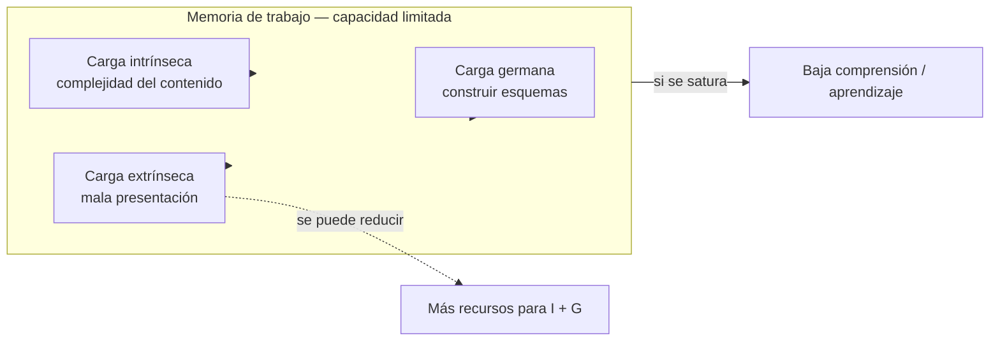

# Carga cognitiva en Matemáticas

**Asignatura:** Psicología del desarrollo y de la educación  
**Temas relacionados:** [4 — Procesamiento](../apuntes/04-procesamiento-informacion-teorias-cognitivas.md)

---

## 1. Idea central

La **memoria de trabajo** tiene capacidad limitada. Si la demanda de la tarea la satura, caen la comprensión, el rendimiento y el aprendizaje de lo nuevo.

*Figura. Los tres tipos de carga compiten por la misma memoria de trabajo. Prioridad: recortar la extrínseca.*

---

## 2. Tres tipos de carga

| Tipo | Qué es | Qué hacer en mates |
|------|--------|---------------------|
| **Intrínseca** | Complejidad del contenido y de sus interacciones | Secuenciar; no eliminar el reto necesario |
| **Extrínseca** | Dificultad por mala presentación (ruido, consignas confusas, demasiados pasos a la vez) | Clarificar; limpiar el enunciado; un foco por fase |
| **Germana** | Esfuerzo útil para construir esquemas | Conectar con lo previo; reflexionar la estrategia |

**Reducir carga ≠ bajar el nivel del currículo.** Se reduce sobre todo la *extrínseca*.

---

## 3. Ejemplos rápidos

**Ecuación** $2(x+3)=14$: si se introducen a la vez distributiva, despeje y comprobación sin apoyo, la intrínseca + extrínseca saturan. Mejor: un objetivo por momento (expandir → despejar → sustituir).

**Fracciones:** exigir a la vez significado de denominador, equivalencias, común denominador y el algoritmo de suma satura la memoria de trabajo.

---

## 4. Checklist de diseño

- [ ] ¿La consigna es inequívoca?
- [ ] ¿Hay datos o adornos que no aportan al objetivo?
- [ ] ¿Los pasos nuevos son pocos a la vez?
- [ ] ¿Lo rutinario está suficientemente automatizado?
- [ ] ¿Queda espacio mental para la estrategia (carga germana)?

---

## Lecturas y enlaces

- [Tema 4](../apuntes/04-procesamiento-informacion-teorias-cognitivas.md)  
- [Funciones ejecutivas](funciones-ejecutivas-matematicas.md)  
- [ZDP y andamiaje](zdp-andamiaje-matematicas.md)  
