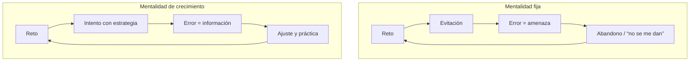

# Mindset y atribuciones causales en el aula de Matemáticas

**Asignatura:** Psicología del desarrollo y de la educación  
**Temas relacionados:** [5 — Motivación](../apuntes/05-motivacion-ensenanza-aprendizaje.md) · [2 — Diferencias individuales](../apuntes/02-diferencias-individuales-problemas-adolescencia.md)

---

## 1. Por qué importa en Matemáticas

Las Matemáticas son un dominio donde el error es frecuente, visible y a menudo interpretado como señal de “capacidad”. Las creencias del alumnado sobre *por qué* triunfa o fracasa condicionan la persistencia, la elección de estrategias y la identidad académica (“se me dan / no se me dan”).

---

## 2. Teoría de la atribución (Weiner)

Las causas que el alumno atribuye al éxito o al fracaso se organizan en tres dimensiones:

| Dimensión | Polos | Ejemplo típico en mates |
|-----------|-------|-------------------------|
| **Locus** | Interno ↔ Externo | “No entendí la estrategia” vs. “el examen era trampa” |
| **Estabilidad** | Estable ↔ Inestable | “Nunca se me han dado” vs. “esta unidad no la preparé bien” |
| **Controlabilidad** | Controlable ↔ Incontrolable | Esfuerzo y estrategia (controlable) vs. “talento innato” (percibido como incontrolable) |

### Atribuciones adaptativas vs. desadaptativas

| Atribución del fracaso | Efecto probable | Orientación docente |
|------------------------|-----------------|---------------------|
| Capacidad fija (“no sirvo”) | Indefensión, evitación | Reorientar a estrategia y práctica |
| Esfuerzo insuficiente | Puede motivar, si es realista | Ayudar a planificar el esfuerzo |
| Estrategia inadecuada | Aprendizaje de mejora | Enseñar y modelar estrategias |
| Dificultad de la tarea / mala suerte | Puede proteger la autoestima a corto plazo, pero no enseña | Combinar con análisis de qué sí controla el alumno |

**Objetivo:** que el alumno atribuya el éxito y el fracaso, de forma creciente, a factores **internos, inestables y controlables** (esfuerzo + estrategia).

---

## 3. Mentalidad fija y mentalidad de crecimiento (Dweck)

| | Mentalidad fija (*fixed*) | Mentalidad de crecimiento (*growth*) |
|--|--------------------------|--------------------------------------|
| **Creencia** | La inteligencia/habilidad matemática es un rasgo estable | La habilidad se desarrolla con práctica, estrategia y tiempo |
| **Ante el reto** | Evitación (proteger la imagen de “capaz”) | Aceptación del reto como oportunidad de aprender |
| **Ante el error** | Amenaza; vergüenza; abandono | Información; ajuste de estrategia |
| **Feedback que la refuerza** | “Eres muy inteligente”, “qué rápido lo has hecho” | “La estrategia que has usado te ha permitido…”, “¿qué probarías distinto?” |

*Figura. Dos ciclos ante el reto y el error en Matemáticas (Dweck). El feedback docente puede empujar hacia uno u otro.*

### En el aula de Matemáticas

- Evitar mensajes del tipo “los de ciencias / los de letras” o “tú no eres de mates”.
- Normalizar el error como parte del razonamiento (pizarra de errores útiles, corrección entre iguales con criterio).
- Valorar el proceso: representación, ensayo, comprobación, explicación.
- Ofrecer retos graduados para que el éxito sea atribuible al esfuerzo y a la estrategia, no solo a la “facilidad”.

---

## 4. Ansiedad matemática y atribuciones

La ansiedad matemática no es solo “falta de estudio”. Es un fenómeno afectivo-cognitivo que:

- ocupa recursos de la **memoria de trabajo**;
- empuja a la **evitación** de la materia;
- se retroalimenta con atribuciones de incapacidad fija.

**Intervención combinada:**
1. Tareas graduadas y andamiaje (éxitos tempranos atribuibles a estrategia).
2. Feedback de proceso (no solo de resultado).
3. Reducción de amenaza evaluativa (ensayos, rúbricas claras, posibilidad de mejora).
4. Coordinación tutorial / orientación cuando la ansiedad sea intensa o generalizada.

---

## 5. Frases de feedback: de fijas a de crecimiento

| Evitar (refuerza fixed) | Preferir (refuerza growth) |
|-------------------------|----------------------------|
| “Eres un crack en mates” | “Has usado bien la representación; eso te ha permitido ver el patrón” |
| “Esto es fácil” | “Este tipo de problema se resuelve bien cuando descomponemos los pasos” |
| “No se te dan las mates” | “En esta unidad la estrategia de… te está funcionando; sigamos practicándola” |
| “Otro suspenso, siempre igual” | “¿Qué parte controlaste y qué cambiarías en el próximo intento?” |

---

## 6. Checklist rápido para el docente de Matemáticas

- [ ] ¿Mis comentarios elogian el proceso y la estrategia, no solo el resultado o la velocidad?
- [ ] ¿Ofrezco oportunidades de reintento o mejora que hagan creíble la atribución al esfuerzo?
- [ ] ¿Evito etiquetas de “talento” fijo (en positivo o en negativo)?
- [ ] ¿El error se trata como información y no como vergüenza pública?
- [ ] ¿Hay tareas de dificultad graduada para que el éxito sea atribuible a la estrategia?

---

## Lecturas y enlaces

- [Tema 5 — Motivación](../apuntes/05-motivacion-ensenanza-aprendizaje.md)  
- [Carga cognitiva](carga-cognitiva-matematicas.md) (la ansiedad ocupa memoria de trabajo)  
- [ZDP y andamiaje](zdp-andamiaje-matematicas.md)  
