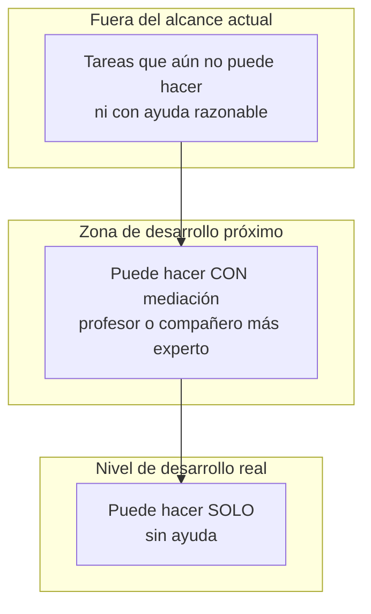

# ZDP y andamiaje en Matemáticas

**Asignatura:** Psicología del desarrollo y de la educación  
**Temas relacionados:** [4 — Procesamiento y cognición](../apuntes/04-procesamiento-informacion-teorias-cognitivas.md)

---

## 1. Zona de desarrollo próximo (Vygotsky)

La **ZDP** es la distancia entre lo que el alumno puede hacer **solo** y lo que puede hacer **con la ayuda** de un mediador más experto (profesor o compañero).

*Figura. Tres zonas: solo / ZDP / fuera de alcance. El andamiaje opera en la ZDP y se retira hacia la autonomía.*

No es un “nivel bajo” permanente ni un sinónimo de trabajo en grupo sin mediación.

---

## 2. Andamiaje (Bruner)

Ayuda **temporal y ajustada** que se ofrece en la ZDP y se **retira** cuando el alumno gana autonomía. Si no se retira, genera dependencia.

Ejemplos en Matemáticas:

- Modelar el plan en voz alta y luego pedir solo el primer paso.
- Plantilla de pasos → palabras clave → margen en blanco.
- Preguntas guía (“¿qué te piden?”, “¿qué datos usas?”) que el alumno interioriza.

---

## 3. En el aula de Matemáticas

| Situación | En la ZDP | Fuera de la ZDP |
|-----------|-----------|-----------------|
| Ecuación de primer grado con andamiaje de pasos | Sí, si con ayuda planifica y resuelve | Si ni con ayuda sostiene el objetivo |
| Problema multi-paso sin ninguna guía ni esquema previo | Solo si ya domina el tipo | A menudo fuera: satura y abandona |
| Trabajo en grupo sin roles ni mediación | No garantiza ZDP | Puede ser solo yuxtaposición |

---

## 4. Checklist de andamiaje

- [ ] ¿La tarea está un poco por encima de lo que hace solo, no muy por encima?
- [ ] ¿La ayuda es específica (plan, representación, pregunta) y no “hazlo tú”?
- [ ] ¿Tengo un plan para retirar la ayuda a lo largo de la unidad?
- [ ] ¿El éxito final es cada vez más atribuible al alumno?

---

## Lecturas y enlaces

- [Tema 4 — Procesamiento](../apuntes/04-procesamiento-informacion-teorias-cognitivas.md)  
- [Carga cognitiva](carga-cognitiva-matematicas.md)  
- [Funciones ejecutivas](funciones-ejecutivas-matematicas.md)  
