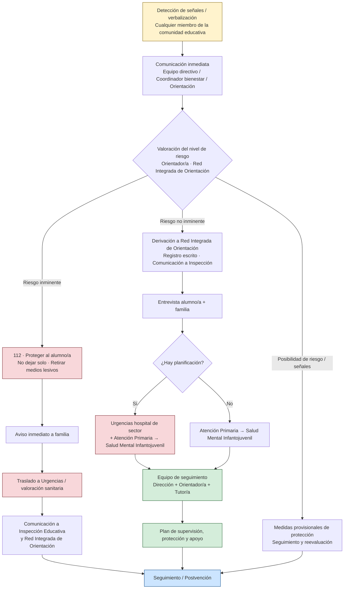

# Suicidio juvenil, redes sociales y rol del docente

**Ficha de apoyo para el Máster de Profesorado (especialidad Matemáticas)**  
**Asignatura de referencia:** Psicología del desarrollo y de la educación — Tema 2 (problemas frecuentes / riesgos)  
**También útil para:** Educación emocional · Sociedad, familia y procesos grupales

> **Aviso de uso.** Este material orienta la **detección temprana, la derivación y el clima de aula**. No sustituye protocolos de centro ni formación clínica. El docente de Matemáticas **no diagnostica ni hace terapia**. Ante riesgo, se activa el protocolo del centro (tutoría, orientación, jefatura, familia según procedimiento).

---

## 1. Por qué importa en Secundaria

La conducta suicida en la adolescencia es un fenómeno **multicausal**. No depende de un único desencadenante. En España, el suicidio es una de las principales causas de muerte externa entre adolescentes y jóvenes; las cifras de **ideación** e **intentos** han crecido de forma preocupante en la última década, con un repunte post-pandemia especialmente visible en consultas y líneas de ayuda.

El centro educativo es un lugar de **detección** y de **protección**: muchos adolescentes no piden ayuda por sí mismos. El profesorado puede observar cambios y activar redes de apoyo; no puede (ni debe) asumir el papel de profesional de salud mental.

---

## 2. Redes sociales: riesgo, no causalidad simple

La evidencia **no** permite afirmar que “las redes causan el suicidio”. Sí permite afirmar que:

| Aspecto | Hallazgos orientativos |
|---------|------------------------|
| **Uso problemático** | Asociación con mayor malestar emocional, ansiedad y depresión cuando el uso es intensivo, pasivo o centrado en comparación social |
| **Ciberacoso** | Factor de riesgo claro; el acoso (online u offline) es uno de los predictores ambientales más consistentes de ideación y conducta suicida |
| **Comparación e imagen** | Especial impacto en adolescentes (identidad y autoestima en construcción); mayor vulnerabilidad reportada en chicas en varios estudios |
| **Contenidos de riesgo** | Búsqueda o exposición reiterada a contenidos de autolesión o desesperanza es señal de alarma; el contagio social es un riesgo real |
| **Lado protector** | Las redes también pueden ofrecer apoyo entre pares, información de ayuda y sensación de pertenencia cuando el uso es activo y saludable |

**Lectura para el docente:** las RRSS **amplifican** vulnerabilidades previas (soledad, acoso, problemas familiares, trastornos del estado de ánimo). El uso problemático refuerza el malestar cuando ya existe; no es, por sí solo, la explicación completa.

---

## 3. Factores de riesgo y de protección (mapa escolar)

### Factores de riesgo frecuentes (no exhaustivo)

- Historia de autolesión o intentos previos  
- Trastornos del estado de ánimo, ansiedad grave, consumo problemático  
- Acoso / ciberacoso  
- Aislamiento social, soledad no deseada  
- Conflictos familiares graves, maltrato  
- Fracaso o presión escolar intensa sin apoyo  
- Exposición reiterada a contenidos de riesgo online  
- Pertenencia a colectivos con mayor discriminación (p. ej. LGTBI+ en contextos hostiles)

### Factores protectores que el centro puede reforzar

- **Apoyo social** percibido (adultos de referencia, pares)  
- **Pertenencia** al grupo-clase y al centro  
- **Resiliencia** y habilidades de afrontamiento  
- Clima de aula seguro (error no ridiculizado, límites claros)  
- Sueño y hábitos razonables (las RRSS nocturnas erosionan ambos)  
- Acceso real a ayuda (saber a quién y cómo pedirla)

---

## 4. Señales de alarma observables en el centro

El docente **registra conductas y cambios**, no etiqueta:

- Caída brusca del rendimiento o de la asistencia  
- Aislamiento respecto al grupo; retirada de actividades  
- Comentarios de desesperanza, inutilidad o “no estar”  
- Cambios intensos de humor, irritabilidad o apatía sostenida  
- Preocupación reiterada por contenidos online de riesgo (si se verbaliza)  
- Autolesiones visibles o alusiones a hacerse daño  
- Regalo de objetos significativos o despedidas veladas  

**Ninguna señal aislada “demuestra” riesgo.** Un patrón de cambio + contexto de vulnerabilidad sí justifica **activar el protocolo**, no improvisar una conversación terapéutica en el pasillo.

---

## 5. Qué hace (y qué no hace) el docente de Matemáticas

| Sí | No |
|----|-----|
| Observar y anotar cambios de forma discreta | Diagnosticar o “confirmar” ideación |
| Escuchar con calma si el alumno se abre | Prometer secreto absoluto si hay riesgo para la vida |
| Activar tutoría / orientación / protocolo de centro | Improvisar terapia o “hablarlo solo entre nosotros” |
| Cuidar el clima de aula (pertenencia, error productivo) | Minimizar (“es una tontería”, “busca atención”) |
| Conocer los recursos de ayuda y el protocolo autonómico/centro | Investigar por su cuenta en redes del alumno |
| Coordinarse con el equipo | Cargar en solitario con la responsabilidad clínica |

**Principio:** prevenir (clima, pertenencia) → intervenir en lo ordinario (límite, escucha breve) → **derivar** (protocolo).

En Matemáticas, el clima de error, el feedback de proceso y la evitación de etiquetas (“no eres de mates”) son acciones cotidianas que refuerzan factores protectores de autoestima y pertenencia, sin convertir la clase en un espacio terapéutico.

---

## 6. Protocolos de derivación (marco Aragón y común)

En Aragón el documento de referencia es la **Guía “Prevención, detección e intervención en casos de ideación suicida en el ámbito educativo. Guía para centros escolares. Protocolo de actuación inmediata”** (Gobierno de Aragón, 2021), elaborada en el seno del Observatorio Aragonés por la Convivencia y contra el Acoso Escolar (Educación + Sanidad + orientación + Colegio Profesional de Psicología). Forma parte de la Estrategia de prevención del suicidio en Aragón y se alinea con la **LOPIVI** (Ley Orgánica 8/2021), que obliga a las administraciones educativas a regular protocolos ante suicidio y autolesión.

Otras comunidades tienen protocolos análogos (Canarias 2024, Madrid actualizado 2026, Andalucía, La Rioja, etc.). El docente debe conocer **el de su centro** (quién lo activa, qué se registra, a quién se comunica).

### Esquema del flujo de derivación

### Secuencia básica de actuación y derivación

1. **Detección y comunicación inmediata**  
   Cualquier miembro de la comunidad educativa (profesorado, alumnado, familias, personal no docente) que observe señales de alerta o reciba una verbalización debe comunicarlo **de inmediato al equipo directivo** (o a la persona coordinadora de bienestar y protección / orientador/a). Se deja constancia escrita (modelo de comunicación al equipo directivo).

2. **Valoración inicial del nivel de riesgo** (prioritariamente orientador/a o Red Integrada de Orientación)  
   - **Riesgo inminente**: intento en curso, amenaza inmediata, acceso a medios letales, plan concreto y cercano.  
   - **Riesgo no inminente**: ideación con o sin planificación, pero no inmediata.  
   - Posibilidad de riesgo / señales de alerta.

3. **Actuaciones según nivel y derivación**

   **Riesgo inminente**  
   - Llamar al **112**.  
   - Proteger al alumno/a (no dejarle solo/a; retirar posibles medios lesivos).  
   - Avisar a la familia de forma inmediata.  
   - Traslado a urgencias / valoración sanitaria.  
   - Comunicación a Inspección Educativa y a la Red Integrada de Orientación.

   **Riesgo no inminente**  
   - Notificación al equipo directivo → derivación a la **Red Integrada de Orientación Educativa**.  
   - Comunicación a Inspección de Educación y al Equipo de Orientación Educativa en Convivencia Escolar (registro escrito).  
   - Entrevista con el alumno/a y con la familia (pautas en anexos de la guía).  
   - **Derivación sanitaria**:  
     - Con planificación (aunque no inmediata) → Urgencias del hospital de sector + Atención Primaria para derivación a **Unidad de Salud Mental Infantojuvenil**.  
     - Sin planificación → Atención Primaria → Unidad de Salud Mental Infantojuvenil.  
   - Constitución de un **equipo de seguimiento** (dirección + orientador/a + tutor/a como mínimo).  
   - Elaboración de un **Plan de supervisión, protección y apoyo**.

4. **Otras derivaciones posibles**  
   - Servicios Sociales (desprotección o necesidad de apoyo familiar).  
   - Si la familia no autoriza y existe riesgo para el menor, se puede derivar por **interés superior del menor** (Ley de Protección Jurídica del Menor).  
   - En Aragón existe la **Unidad de Salud Mental en el ámbito educativo** (equipo especializado que interviene en centros, con especial peso en IES).

5. **Seguimiento y postvención**  
   - Plan individualizado de protección y seguimiento en el centro, coordinado con Salud Mental y familia.  
   - Tras intento o suicidio consumado: protocolo de postvención (apoyo al grupo-clase, duelo, evitar contagio, comunicación responsable).

### Qué hace el docente en la cadena de derivación

- **Observa y registra** de forma discreta.  
- **Escucha** con calma si el alumno se abre; **no** promete secreto absoluto cuando hay riesgo para la vida.  
- **Activa** de inmediato el protocolo del centro (tutoría / orientación / dirección).  
- **No** diagnostica, no investiga por su cuenta en redes del alumno y no improvisa terapia.  
- Participa en el plan de protección y seguimiento una vez activado el protocolo.  
- Conoce los recursos de ayuda (024, 112) y el documento de actuación del centro.

> **Recordatorio:** el centro educativo detecta, protege y deriva. La valoración clínica y el tratamiento corresponden a Sanidad. El interés superior del menor prevalece sobre la negativa familiar cuando hay riesgo.

---

## 7. Recursos de ayuda (España)

| Recurso | Uso |
|---------|-----|
| **024** | Línea de ayuda a la conducta suicida (nacional, gratuita, 24 h, confidencial). También para allegados. |
| **112** | Emergencias si hay riesgo inminente |
| **Teléfono de la Esperanza** | 717 003 717 |
| **ANAR** (menores) | 900 20 20 10 |
| **Protocolo del centro** | Documento de actuación ante riesgo suicida (tutoría, orientación, familia, coordinación con salud) |
| **Guía Aragón 2021** | Prevención, detección e intervención en casos de ideación suicida en el ámbito educativo (Observatorio Aragonés por la Convivencia) |
| **Otras guías autonómicas** | Canarias 2024, Madrid (actualizado), Asturias, Andalucía, La Rioja, etc. |

El docente debe **conocer el protocolo de su centro** (dónde está, quién lo activa, qué se registra). No sustituye a Sanidad; lo coordina con ella.

---

## 8. Comunicación responsable (brevísimo)

- Evitar detalles sensacionalistas o descripción de métodos en conversaciones de aula o en materiales.  
- Hablar de **pedir ayuda**, de **factores de protección** y de que el malestar puede tratarse.  
- Si un caso afecta al centro: seguir el protocolo de comunicación interna; no alimentar rumores en redes.

---

## 9. Para llevar al aula de Matemáticas (síntesis)

1. El suicidio juvenil es **multicausal**; las RRSS pueden amplificar riesgo (ciberacoso, comparación, privación de sueño) y también ofrecer apoyo.  
2. El rol del profesor de Matemáticas es **observar, cuidar el clima y derivar**, no tratar.  
3. Factores protectores cotidianos: pertenencia, feedback de proceso, error no ridiculizado, adulto de referencia accesible.  
4. Ante señales de alarma: **activar el protocolo del centro** (comunicación inmediata a dirección/orientación) + recursos (024, 112).  
5. Conocer la secuencia de derivación (riesgo inminente → 112; no inminente → orientación + Atención Primaria / Salud Mental Infantojuvenil) forma parte de la competencia profesional docente.

---

## Material relacionado

- Tema 2 — Diferencias individuales y problemas frecuentes (apuntes de Psicología)  
- Tema 1 — Desarrollo evolutivo en la adolescencia (identidad, autoestima)  
- Neurodivergencia en el aula de Matemáticas (materiales de Psicología)  
- Educación emocional (optativa)  
- Ventana de Johari aplicada a la docencia de Matemáticas (habilidades comunicativas)

---

## Referencias orientativas (selección)

- Gobierno de Aragón (2021). *Prevención, detección e intervención en casos de ideación suicida en el ámbito educativo. Guía para centros escolares. Protocolo de actuación inmediata*. Observatorio Aragonés por la Convivencia y contra el Acoso Escolar.  
- LOPIVI (Ley Orgánica 8/2021, de 4 de junio) — art. 34 (protocolos de actuación ante suicidio y autolesión).  
- Línea 024 (Ministerio de Sanidad) — servicio de ayuda a la conducta suicida.  
- INE — estadísticas de defunciones por causa (suicidios).  
- Protocolos autonómicos actualizados: Canarias (2024), Comunidad de Madrid (actualizado), Asturias, Andalucía, La Rioja, etc.  
- Observatorio Social Fundación ”la Caixa” / Parc Sanitari Sant Joan de Déu — estudios sobre ideación y conductas en jóvenes estudiantes.  
- Revisiones sistemáticas recientes sobre factores de riesgo/protección en adolescencia (acoso, trastornos del estado de ánimo, apoyo familiar y social).  
- Informes sobre uso problemático de redes y salud mental juvenil (asociación, no causalidad simple).

---

*Material elaborado para el repositorio del Máster de Profesorado de Matemáticas. Uso libre con atribución. Ante una crisis personal, contacta con el 024 o con los servicios de urgencias.*
