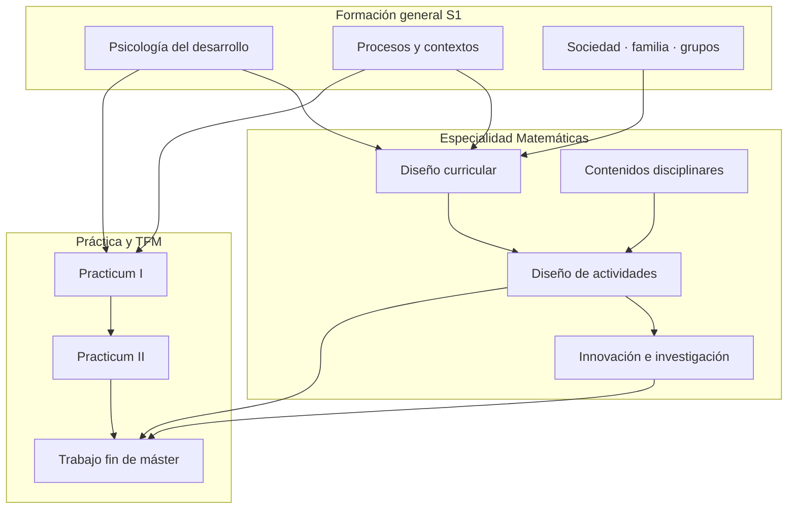

# Máster Universitario en Profesorado — Matemáticas

Repositorio de trabajo del **Máster Universitario en Profesorado de Educación Secundaria**, especialidad **Matemáticas** (marco **LOMLOE** / currículo de Aragón).

Cuaderno digital de estudio y base reutilizable (REA) para la enseñanza de Matemáticas en ESO y Bachillerato.

**Mapa de estructura y reglas de ubicación:** [MANIFEST.md](MANIFEST.md)



## Estructura

| Carpeta | Contenido |
|---------|-----------|
| `00-administracion/` | Matrícula, calendario, trámites |
| `01-asignaturas/` | Asignaturas + **`practicum/`** (trabajo anonimizado I/II) |
| `02-apuntes/` | Índice general y **transversales con contenido** (DUA, evaluación, IA…) — [índice](02-apuntes/INDICE.md) |
| `03-materiales/` | Materiales reutilizables |
| `04-pbl-abp/` | SA / ABP |
| `05-python-jupyter/` | Python didáctico + notebooks |
| `06-inteligencia-artificial/` | IA en educación |
| `07-evaluacion/` | Instrumentos y rúbricas |
| `08-podcasts/` | Guiones e índices |
| `09-bibliografia/` | Autores-pensadores |
| `10-proyectos/` | Proyectos integradores |
| `99-archivo/` | Histórico / scripts one-shot |

**Criterio:** apuntes de asignatura → `01-asignaturas/…/apuntes/`. No hay carpetas vacías de “psicología/matemáticas/sociología” bajo `02-apuntes/`.

## Asignaturas obligatorias

| Periodo | Asignatura |
|---|---|
| S1 | Psicología · Procesos · Sociedad-familia-grupos · Practicum I · Diseño curricular |
| S2 | Contenidos disciplinares · Diseño de actividades · Innovación e investigación |
| Anual | Practicum II · TFM |

## Cómo usar este repositorio

1. **Estudiar / navegar:** abre los `README.md` e `INDICE.md` de cada carpeta; los apuntes viven en Markdown.
2. **Programación didáctica y currículo:** empieza por [Diseño curricular](01-asignaturas/diseno-curricular-e-instruccional-de-matematicas/).
3. **Situaciones de aprendizaje:** [04-pbl-abp/](04-pbl-abp/).
4. **Notebooks de aula:** [05-python-jupyter/](05-python-jupyter/) (local con Jupyter/VS Code, o **Google Colab** desde los enlaces de esa carpeta).
5. **Clonar:**
   ```bash
   git clone https://github.com/computerphysicslab/master-profesorado-matematicas.git
   ```
6. **Dependencias Python** (solo si ejecutas notebooks en local): `numpy`, `matplotlib` suelen bastar; el resto se indica en cada notebook.

**Stack del proyecto:** Markdown + (sitio) Just the Docs/Jekyll · Mermaid · notebooks Jupyter · recursos abiertos. No hay pipeline LaTeX obligatorio en este repo.

## Licencia

**[CC BY-SA 4.0](LICENSE)** para materiales pedagógicos y, por defecto, scripts/notebooks del propio repo.  
Recursos de terceros: su propia licencia. Textos oficiales (BOE, órdenes): se citan, no se redistribuyen como obra original.

## Contribuir (notas breves)

- Respeta la ubicación de archivos del [MANIFEST](MANIFEST.md).
- No subas trabajos personales, credenciales ni artefactos de compilación (véase `.gitignore`).
- Prefiere Markdown enlazado a PDFs binarios pesados cuando sea posible.
