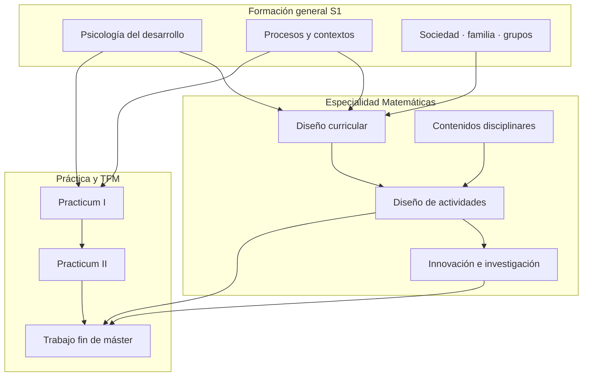

# Máster Universitario en Profesorado — Matemáticas

Repositorio personal de trabajo del **Máster Universitario en Profesorado de Educación Secundaria**, especialidad **Matemáticas**.

**Mapa de estructura y reglas de ubicación:** [MANIFEST.md](MANIFEST.md)

## Estructura

| Carpeta | Contenido |
|---------|-----------|
| `00-administracion/` | Matrícula, calendario, trámites |
| `01-asignaturas/` | Asignaturas + **`practicum/`** (trabajo anonimizado I/II) |
| `02-apuntes/` | Índice general y **transversales con contenido** (DUA, evaluación, IA…) — [índice](02-apuntes/INDICE.md) |
| `03-materiales/` | Materiales reutilizables |
| `04-pbl-abp/` | SA / ABP |
| `05-python-jupyter/` | Python didáctico + notebooks |
| `06-inteligencia-artificial/` | IA en educación |
| `07-evaluacion/` | Instrumentos y rúbricas |
| `08-podcasts/` | Guiones e índices |
| `09-bibliografia/` | Autores-pensadores |
| `10-proyectos/` | Proyectos integradores |
| `99-archivo/` | Histórico / scripts one-shot |

**Criterio:** apuntes de asignatura → `01-asignaturas/…/apuntes/`. No hay carpetas vacías de “psicología/matemáticas/sociología” bajo `02-apuntes/`.

## Asignaturas obligatorias

| Periodo | Asignatura |
|---|---|
| S1 | Psicología · Procesos · Sociedad-familia-grupos · Practicum I · Diseño curricular |
| S2 | Contenidos disciplinares · Diseño de actividades · Innovación e investigación |
| Anual | Practicum II · TFM |

## Objetivo

Cuaderno digital de trabajo del máster y base reutilizable para la enseñanza de Matemáticas en Secundaria y Bachillerato.

## Licencia

**[CC BY-SA 4.0](LICENSE)**. Recursos de terceros: su propia licencia.
